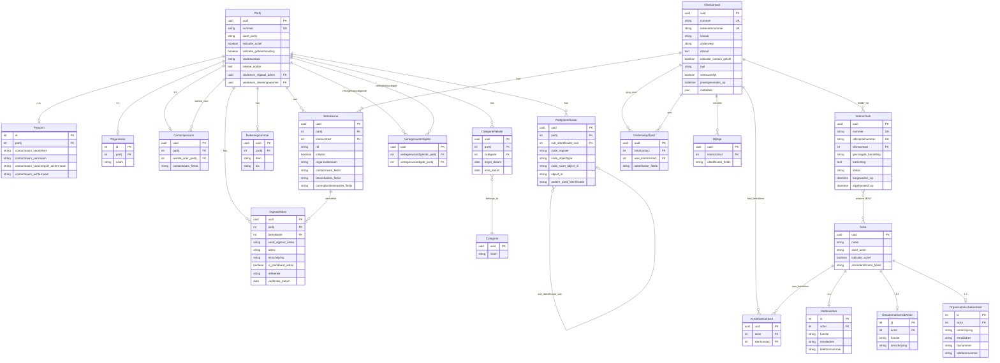

# Complete Data Model Relationships

```mermaid
erDiagram
    Partij {
        uuid uuid PK
        string nummer UK
        string soort_partij
        boolean indicatie_actief
        boolean indicatie_geheimhouding
        string voorkeurstaal
        text interne_notitie
        uuid voorkeurs_digitaal_adres FK
        uuid voorkeurs_rekeningnummer FK
    }

    Persoon {
        int id PK
        int partij FK
        string contactnaam_voorletters
        string contactnaam_voornaam
        string contactnaam_voorvoegsel_achternaam
        string contactnaam_achternaam
    }

    Organisatie {
        int id PK
        int partij FK
        string naam
    }

    Contactpersoon {
        uuid uuid PK
        int partij FK
        int werkte_voor_partij FK
        string contactnaam_fields
    }

    PartijIdentificator {
        uuid uuid PK
        int partij FK
        int sub_identificator_van FK
        string code_register
        string code_objecttype
        string code_soort_object_id
        string object_id
        string andere_partij_identificator
    }

    DigitaalAdres {
        uuid uuid PK
        int partij FK
        int betrokkene FK
        string soort_digitaal_adres
        string adres
        string omschrijving
        boolean is_standaard_adres
        string referentie
        date verificatie_datum
    }

    Rekeningnummer {
        uuid uuid PK
        int partij FK
        string iban
        string bic
    }

    Categorie {
        uuid uuid PK
        string naam
    }

    CategorieRelatie {
        uuid uuid PK
        int partij FK
        int categorie FK
        date begin_datum
        date eind_datum
    }

    Vertegenwoordigden {
        uuid uuid PK
        int vertegenwoordigende_partij FK
        int vertegenwoordigde_partij FK
    }

    Klantcontact {
        uuid uuid PK
        string nummer UK
        string referentienummer UK
        string kanaal
        string onderwerp
        text inhoud
        boolean indicatie_contact_gelukt
        string taal
        boolean vertrouwelijk
        datetime plaatsgevonden_op
        json metadata
    }

    Betrokkene {
        uuid uuid PK
        int partij FK
        int klantcontact FK
        string rol
        boolean initiator
        string organisatienaam
        string contactnaam_fields
        string bezoekadres_fields
        string correspondentieadres_fields
    }

    Actor {
        uuid uuid PK
        string naam
        string soort_actor
        boolean indicatie_actief
        string actoridentificator_fields
    }

    Medewerker {
        int id PK
        int actor FK
        string functie
        string emailadres
        string telefoonnummer
    }

    GeautomatiseerdeActor {
        int id PK
        int actor FK
        string functie
        string omschrijving
    }

    OrganisatorischeEenheid {
        int id PK
        int actor FK
        string omschrijving
        string emailadres
        string faxnummer
        string telefoonnummer
    }

    ActorKlantcontact {
        uuid uuid PK
        int actor FK
        int klantcontact FK
    }

    InterneTaak {
        uuid uuid PK
        string nummer UK
        string referentienummer UK
        int klantcontact FK
        string gevraagde_handeling
        text toelichting
        string status
        datetime toegewezen_op
        datetime afgehandeld_op
    }

    Onderwerpobject {
        uuid uuid PK
        int klantcontact FK
        int was_klantcontact FK
        string identificator_fields
    }

    Bijlage {
        uuid uuid PK
        int klantcontact FK
        string identificator_fields
    }

    Partij ||--o| Persoon : "1:1"
    Partij ||--o| Organisatie : "1:1"
    Partij ||--o| Contactpersoon : "1:1"
    Contactpersoon }o--|| Partij : "werkte_voor"
    Partij ||--o{ PartijIdentificator : "has"
    PartijIdentificator }o--o| PartijIdentificator : "sub_identificator_van"
    Partij ||--o{ DigitaalAdres : "has"
    Partij ||--o{ Rekeningnummer : "has"
    Partij ||--o{ CategorieRelatie : "has"
    CategorieRelatie }o--|| Categorie : "belongs_to"
    Partij ||--o{ Vertegenwoordigden : "vertegenwoordigende"
    Partij ||--o{ Vertegenwoordigden : "vertegenwoordigde"
    Partij ||--o{ Betrokkene : "was"
    Klantcontact ||--o{ Betrokkene : "had"
    Klantcontact ||--o{ Onderwerpobject : "ging_over"
    Klantcontact ||--o{ Onderwerpobject : "was"
    Klantcontact ||--o{ Bijlage : "omvatte"
    Klantcontact ||--o{ ActorKlantcontact : "had_betrokken"
    Actor ||--o{ ActorKlantcontact : "was_betrokken"
    Actor ||--o| Medewerker : "1:1"
    Actor ||--o| GeautomatiseerdeActor : "1:1"
    Actor ||--o| OrganisatorischeEenheid : "1:1"
    Klantcontact ||--o{ InterneTaak : "leidde_tot"
    InterneTaak }o--o{ Actor : "actoren M2M"
    Betrokkene ||--o{ DigitaalAdres : "verstrekte"
```
