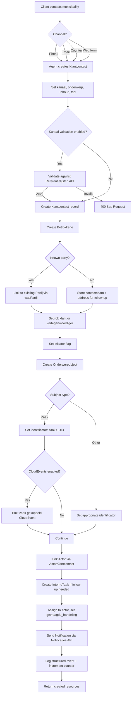
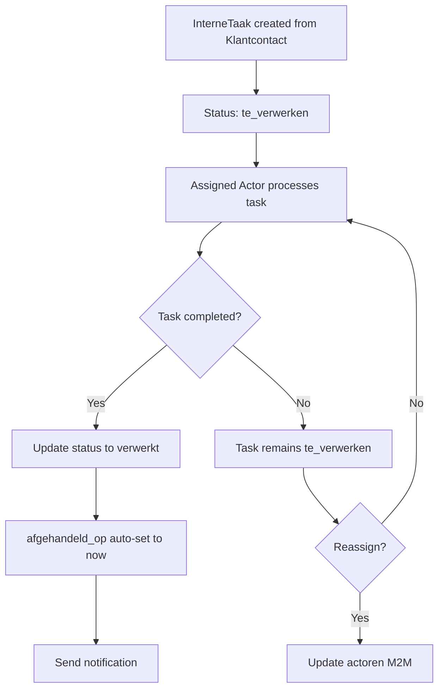
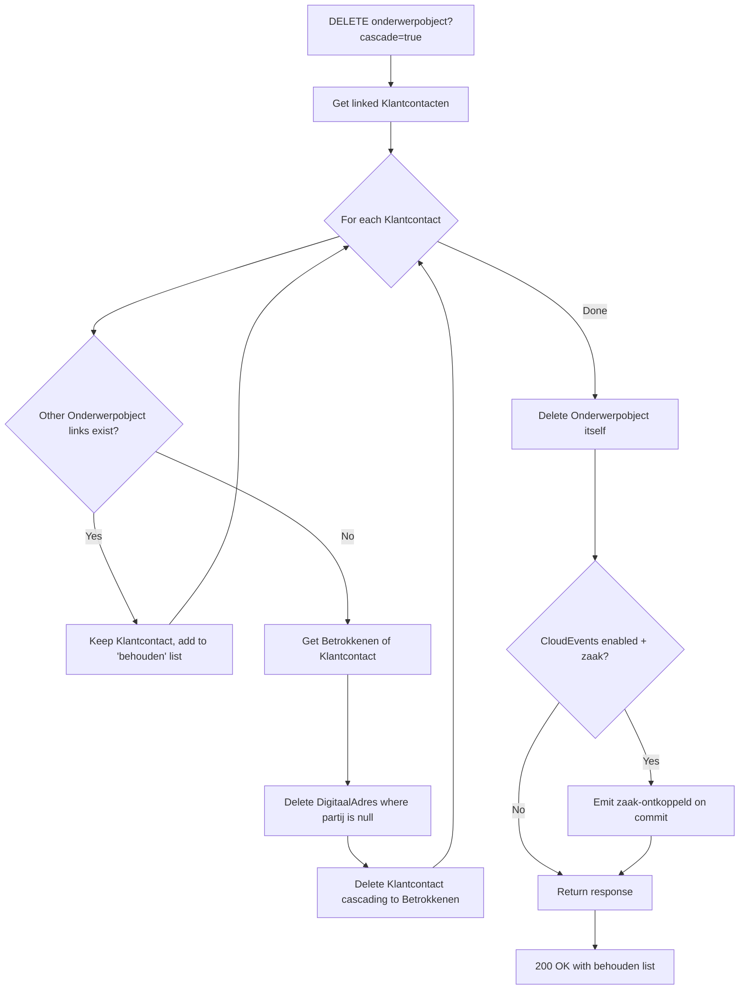

# Klantcontact Lifecycle

## Contact Registration Flow

```mermaid
flowchart TD
    A[Client contacts municipality] --> B{Channel?}
    B -->|Phone| C[Agent creates Klantcontact]
    B -->|Email| C
    B -->|Counter| C
    B -->|Web form| C

    C --> D[Set kanaal, onderwerp, inhoud, taal]
    D --> E{Kanaal validation enabled?}
    E -->|Yes| F[Validate against Referentielijsten API]
    F -->|Valid| G[Create Klantcontact record]
    F -->|Invalid| ERR1[400 Bad Request]
    E -->|No| G

    G --> H[Create Betrokkene]
    H --> I{Known party?}
    I -->|Yes| J[Link to existing Partij via wasPartij]
    I -->|No| K[Store contactnaam + address for follow-up]
    J --> L[Set rol: klant or vertegenwoordiger]
    K --> L
    L --> M[Set initiator flag]

    M --> N[Create Onderwerpobject]
    N --> O{Subject type?}
    O -->|Zaak| P[Set identificator: zaak UUID]
    O -->|Other| Q[Set appropriate identificator]
    P --> R{CloudEvents enabled?}
    R -->|Yes| S[Emit zaak-gekoppeld CloudEvent]
    R -->|No| T[Continue]
    Q --> T
    S --> T

    T --> U[Link Actor via ActorKlantcontact]
    U --> V[Create InterneTaak if follow-up needed]
    V --> W[Assign to Actor, set gevraagde_handeling]

    W --> X[Send Notification via Notificaties API]
    X --> Y[Log structured event + increment counter]
    Y --> Z[Return created resources]
```

## Task Follow-up Flow

```mermaid
flowchart TD
    A[InterneTaak created from Klantcontact] --> B[Status: te_verwerken]
    B --> C[Assigned Actor processes task]
    C --> D{Task completed?}
    D -->|Yes| E[Update status to verwerkt]
    E --> F[afgehandeld_op auto-set to now]
    F --> G[Send notification]
    D -->|No| H[Task remains te_verwerken]
    H --> I{Reassign?}
    I -->|Yes| J[Update actoren M2M]
    I -->|No| C
```

## Onderwerpobject Cascade Delete

```mermaid
flowchart TD
    A[DELETE onderwerpobject?cascade=true] --> B[Get linked Klantcontacten]
    B --> C{For each Klantcontact}
    C --> D{Other Onderwerpobject links exist?}
    D -->|Yes| E[Keep Klantcontact, add to 'behouden' list]
    D -->|No| F[Get Betrokkenen of Klantcontact]
    F --> G[Delete DigitaalAdres where partij is null]
    G --> H[Delete Klantcontact cascading to Betrokkenen]
    H --> C
    E --> C
    C -->|Done| I[Delete Onderwerpobject itself]
    I --> J{CloudEvents enabled + zaak?}
    J -->|Yes| K[Emit zaak-ontkoppeld on commit]
    J -->|No| L[Return response]
    K --> L
    L --> M[200 OK with behouden list]
```
