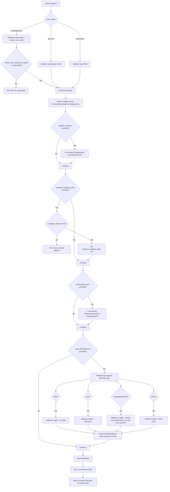
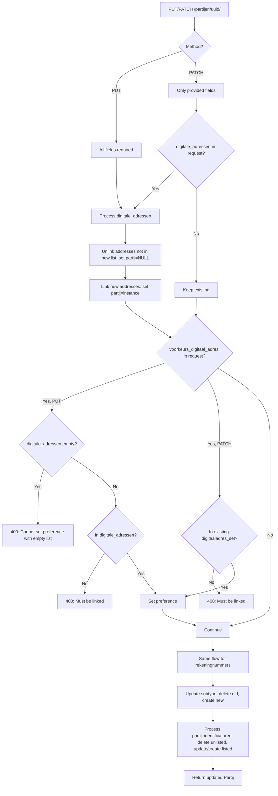
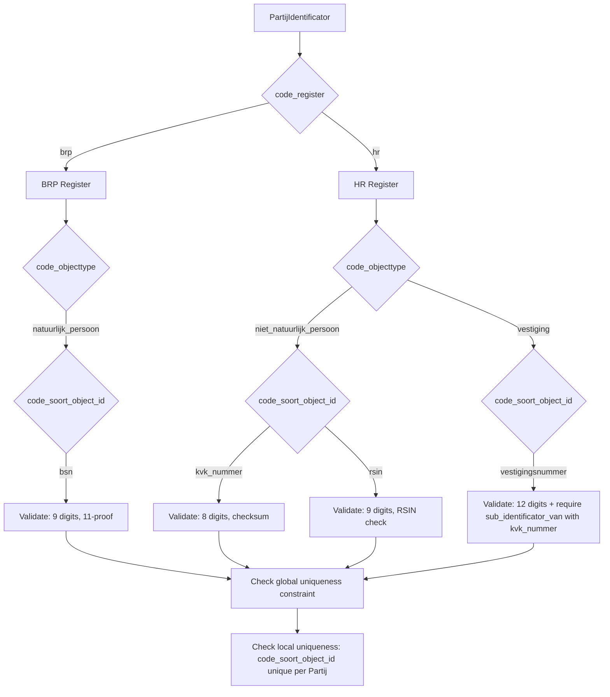

# Partij Management Flow

## Party Creation (Polymorphic)

```mermaid
flowchart TD
    A[POST /partijen/] --> B{soort_partij?}
    B -->|persoon| C[Validate contactnaam fields]
    B -->|organisatie| D[Validate naam field]
    B -->|contactpersoon| E[Validate contactnaam + werkte_voor_partij]

    E --> F{werkte_voor_partij.soort_partij == organisatie?}
    F -->|No| ERR[400: Must be organisatie]
    F -->|Yes| G[Create Partij base]
    C --> G
    D --> G

    G --> H[Create subtype record: Persoon/Organisatie/Contactpersoon]

    H --> I{digitale_adressen provided?}
    I -->|Yes| J[Link existing DigitaalAdres by setting partij FK]
    I -->|No| K[Continue]
    J --> K

    K --> L{voorkeurs_digitaal_adres provided?}
    L -->|Yes| M{In digitale_adressen list?}
    M -->|No| ERR2[400: Must be linked address]
    M -->|Yes| N[Set voorkeurs_digitaal_adres FK]
    L -->|No| O[Continue]
    N --> O

    O --> P{rekeningnummers provided?}
    P -->|Yes| Q[Link existing Rekeningnummer by setting partij FK]
    P -->|No| R[Continue]
    Q --> R

    R --> S{partij_identificatoren provided?}
    S -->|Yes| T[Validate each against BRP/HR rules]
    T --> U{BSN?}
    U -->|Yes| V[Validate 9 digits + 11-proof]
    T --> W{KvK?}
    W -->|Yes| X[Validate 8 digits + checksum]
    T --> Y{Vestigingsnummer?}
    Y -->|Yes| Z[Validate 12 digits + require sub_identificator_van with kvk_nummer]
    T --> AA{RSIN?}
    AA -->|Yes| AB[Validate 9 digits + RSIN check]
    V --> AC[Create PartijIdentificator with uniqueness check]
    X --> AC
    Z --> AC
    AB --> AC
    S -->|No| AD[Continue]
    AC --> AD

    AD --> AE[Send notification]
    AE --> AF[Log + increment counter]
    AF --> AG[Return created Partij with all related data]
```

## Party Update (PUT vs PATCH)

```mermaid
flowchart TD
    A[PUT/PATCH /partijen/uuid/] --> B{Method?}

    B -->|PUT| C[All fields required]
    C --> D[Process digitale_adressen]
    D --> E[Unlink addresses not in new list: set partij=NULL]
    E --> F[Link new addresses: set partij=instance]

    B -->|PATCH| G[Only provided fields]
    G --> H{digitale_adressen in request?}
    H -->|Yes| D
    H -->|No| I[Keep existing]

    F --> J{voorkeurs_digitaal_adres in request?}
    I --> J
    J -->|Yes, PUT| K{digitale_adressen empty?}
    K -->|Yes| ERR1[400: Cannot set preference with empty list]
    K -->|No| L{In digitale_adressen?}
    L -->|No| ERR2[400: Must be linked]
    L -->|Yes| M[Set preference]

    J -->|Yes, PATCH| N{In existing digitaaladres_set?}
    N -->|No| ERR3[400: Must be linked]
    N -->|Yes| M

    J -->|No| O[Continue]
    M --> O

    O --> P[Same flow for rekeningnummers]
    P --> Q[Update subtype: delete old, create new]
    Q --> R[Process partij_identificatoren: delete unlisted, update/create listed]
    R --> S[Return updated Partij]
```

## PartijIdentificator Validation Hierarchy

```mermaid
flowchart TD
    A[PartijIdentificator] --> B{code_register}
    B -->|brp| C[BRP Register]
    C --> D{code_objecttype}
    D -->|natuurlijk_persoon| E{code_soort_object_id}
    E -->|bsn| F[Validate: 9 digits, 11-proof]

    B -->|hr| G[HR Register]
    G --> H{code_objecttype}
    H -->|niet_natuurlijk_persoon| I{code_soort_object_id}
    I -->|kvk_nummer| J[Validate: 8 digits, checksum]
    I -->|rsin| K[Validate: 9 digits, RSIN check]
    H -->|vestiging| L{code_soort_object_id}
    L -->|vestigingsnummer| M[Validate: 12 digits + require sub_identificator_van with kvk_nummer]

    F --> N[Check global uniqueness constraint]
    J --> N
    K --> N
    M --> N
    N --> O[Check local uniqueness: code_soort_object_id unique per Partij]
```
