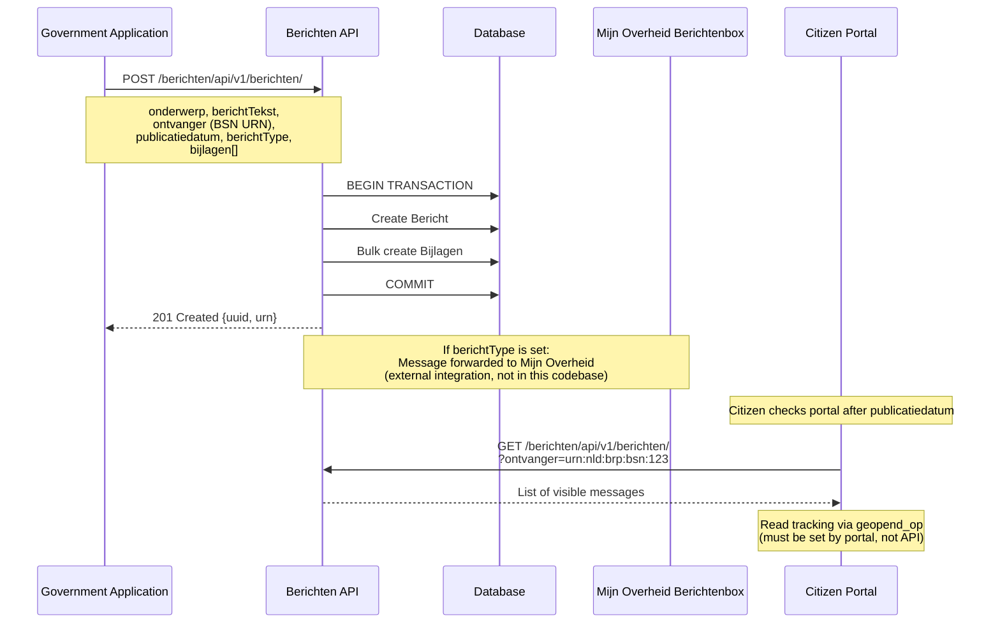
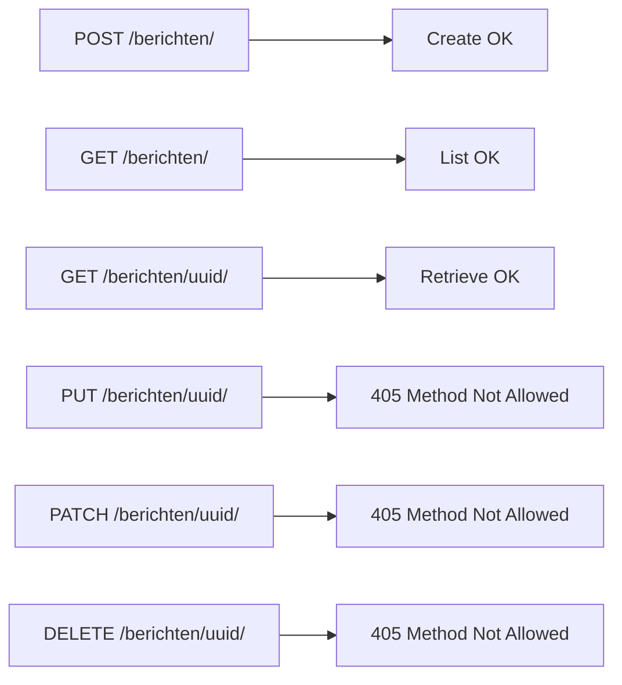

# Berichten Business Logic Flow

## Message Creation and Delivery



## Message Visibility Logic

```mermaid
flowchart TD
    A[Bericht Created] --> B{publicatiedatum <= now?}
    B -->|No| C[Not yet visible]
    B -->|Yes| D{berichtType set?}

    D -->|Yes| E[Visible in Portal +<br/>Forwarded to Mijn Overheid]
    D -->|No| F[Visible in Portal only]

    E --> G{Bijlagen with<br/>is_bericht_type_bijlage = true?}
    G -->|Yes| H[Skip these bijlagen<br/>for Mijn Overheid<br/>(already in template)]
    G -->|No| I[Forward all bijlagen<br/>(max 1 PDF for MO)]
```

## API Immutability


