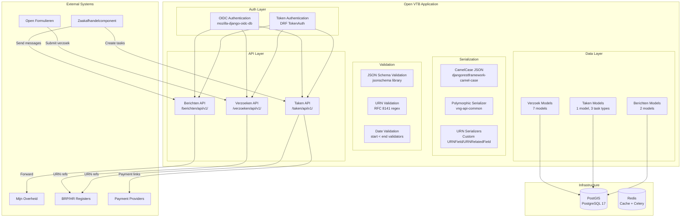
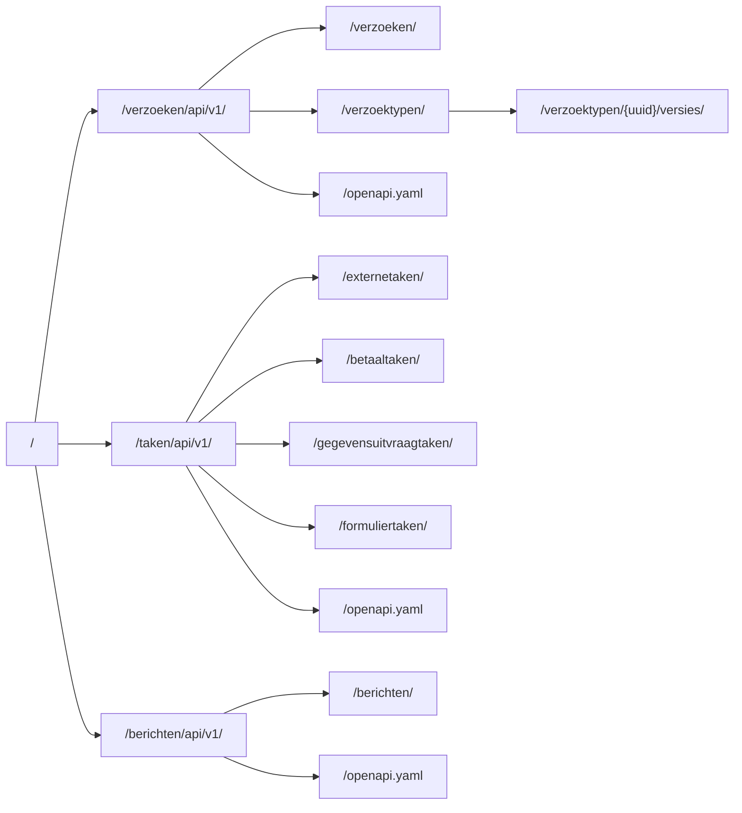
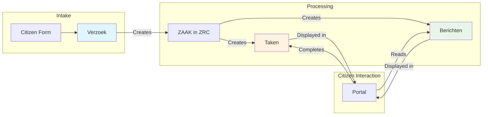

# Open VTB System Architecture

## Component Architecture

```mermaid
graph TB
    subgraph "Open VTB Application"
        subgraph "API Layer"
            VA[Verzoeken API<br/>/verzoeken/api/v1/]
            TA[Taken API<br/>/taken/api/v1/]
            BA[Berichten API<br/>/berichten/api/v1/]
        end

        subgraph "Auth Layer"
            OIDC[OIDC Authentication<br/>mozilla-django-oidc-db]
            TOKEN[Token Authentication<br/>DRF TokenAuth]
        end

        subgraph "Serialization"
            CC[CamelCase JSON<br/>djangorestframework-camel-case]
            PS[Polymorphic Serializer<br/>vng-api-common]
            URN[URN Serializers<br/>Custom URNField/URNRelatedField]
        end

        subgraph "Validation"
            JS[JSON Schema Validation<br/>jsonschema library]
            UV[URN Validation<br/>RFC 8141 regex]
            DV[Date Validation<br/>start < end validators]
        end

        subgraph "Data Layer"
            VM[Verzoek Models<br/>7 models]
            TM[Taken Models<br/>1 model, 3 task types]
            BM[Berichten Models<br/>2 models]
        end
    end

    subgraph "Infrastructure"
        PG[(PostGIS<br/>PostgreSQL 17)]
        RD[(Redis<br/>Cache + Celery)]
    end

    subgraph "External Systems"
        OF[Open Formulieren]
        ZAC[Zaakafhandelcomponent]
        MO[Mijn Overheid]
        BRP[BRP/HR Registers]
        PP[Payment Providers]
    end

    OF -->|Submit verzoek| VA
    ZAC -->|Create tasks| TA
    ZAC -->|Send messages| BA
    VA -->|URN refs| BRP
    TA -->|URN refs| BRP
    BA -->|Forward| MO
    TA -->|Payment links| PP

    OIDC --> VA
    OIDC --> TA
    OIDC --> BA
    TOKEN --> VA
    TOKEN --> TA
    TOKEN --> BA

    VM --> PG
    TM --> PG
    BM --> PG
```

## API URL Structure

```mermaid
graph LR
    ROOT["/"] --> V["/verzoeken/api/v1/"]
    ROOT --> T["/taken/api/v1/"]
    ROOT --> B["/berichten/api/v1/"]

    V --> VZ["/verzoeken/"]
    V --> VT["/verzoektypen/"]
    VT --> VTV["/verzoektypen/{uuid}/versies/"]

    T --> ET["/externetaken/"]
    T --> BT["/betaaltaken/"]
    T --> GT["/gegevensuitvraagtaken/"]
    T --> FT["/formuliertaken/"]

    B --> BR["/berichten/"]

    V --> VS["/openapi.yaml"]
    T --> TS["/openapi.yaml"]
    B --> BS["/openapi.yaml"]
```

## Data Flow Between Components

```mermaid
flowchart LR
    subgraph "Intake"
        CF[Citizen Form] --> VZ[Verzoek]
    end

    subgraph "Processing"
        VZ -->|Creates| ZK[ZAAK in ZRC]
        ZK -->|Creates| TK[Taken]
        ZK -->|Creates| BER[Berichten]
    end

    subgraph "Citizen Interaction"
        TK -->|Displayed in| PO[Portal]
        BER -->|Displayed in| PO
        PO -->|Completes| TK
        PO -->|Reads| BER
    end

    style VZ fill:#e1f5fe
    style TK fill:#fff3e0
    style BER fill:#e8f5e9
```
