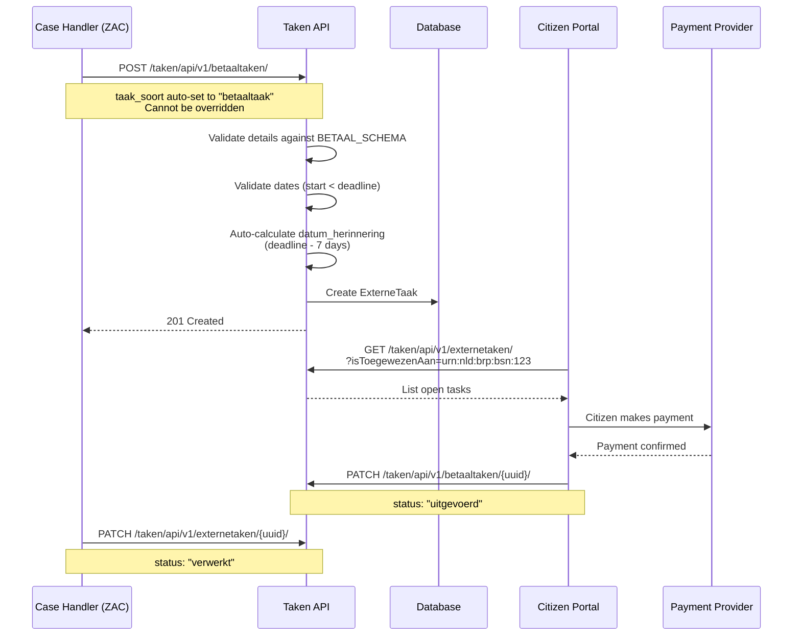
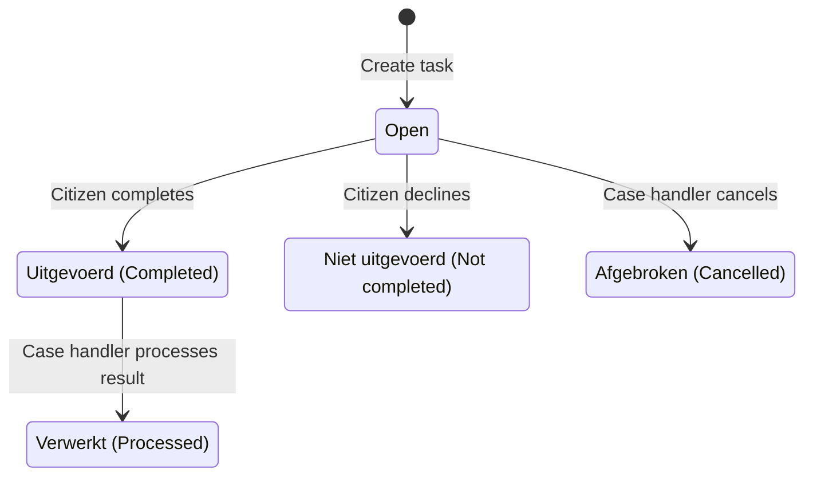
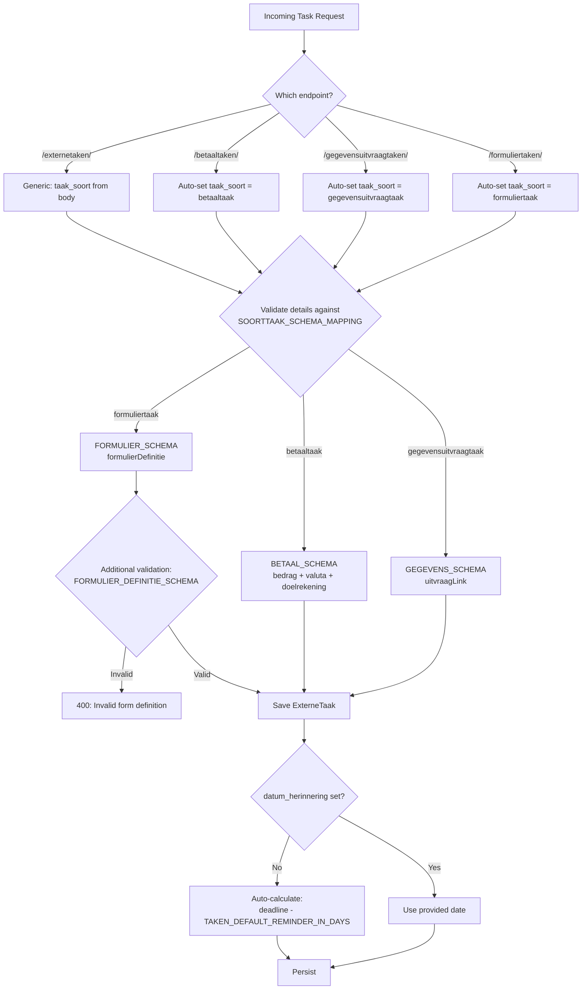
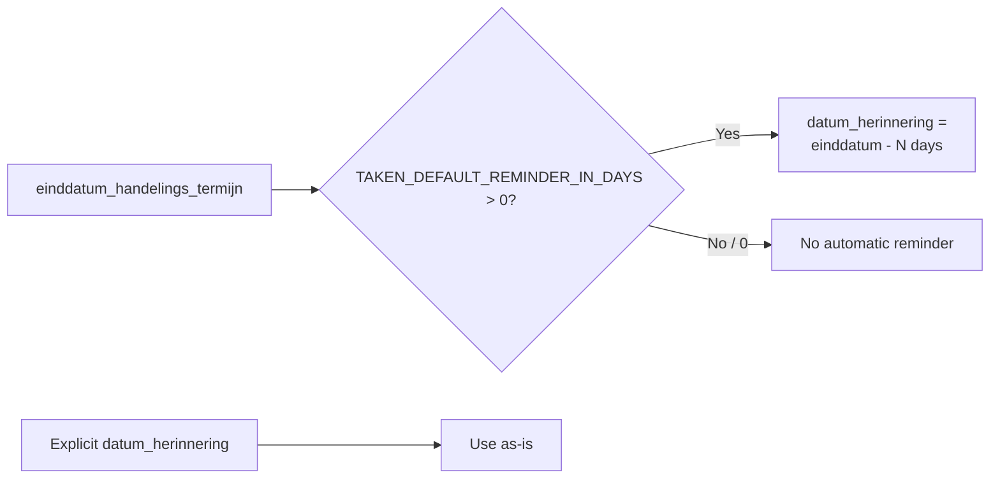

# Taken Business Logic Flow

## Task Creation and Lifecycle

```mermaid
sequenceDiagram
    participant ZAC as Case Handler (ZAC)
    participant API as Taken API
    participant DB as Database
    participant Portal as Citizen Portal
    participant Payment as Payment Provider

    ZAC->>API: POST /taken/api/v1/betaaltaken/
    Note over ZAC,API: taak_soort auto-set to "betaaltaak"<br/>Cannot be overridden

    API->>API: Validate details against BETAAL_SCHEMA
    API->>API: Validate dates (start < deadline)
    API->>API: Auto-calculate datum_herinnering<br/>(deadline - 7 days)
    API->>DB: Create ExterneTaak
    API-->>ZAC: 201 Created

    Portal->>API: GET /taken/api/v1/externetaken/<br/>?isToegewezenAan=urn:nld:brp:bsn:123
    API-->>Portal: List open tasks

    Portal->>Payment: Citizen makes payment
    Payment-->>Portal: Payment confirmed

    Portal->>API: PATCH /taken/api/v1/betaaltaken/{uuid}/
    Note over Portal,API: status: "uitgevoerd"

    ZAC->>API: PATCH /taken/api/v1/externetaken/{uuid}/
    Note over ZAC,API: status: "verwerkt"
```

## Task Status State Machine

```mermaid
stateDiagram-v2
    [*] --> open: Create task
    open --> uitgevoerd: Citizen completes
    open --> niet_uitgevoerd: Citizen declines
    open --> afgebroken: Case handler cancels
    uitgevoerd --> verwerkt: Case handler processes result

    open: Open
    uitgevoerd: Uitgevoerd (Completed)
    niet_uitgevoerd: Niet uitgevoerd (Not completed)
    afgebroken: Afgebroken (Cancelled)
    verwerkt: Verwerkt (Processed)
```

## Polymorphic Task Routing

```mermaid
flowchart TD
    A[Incoming Task Request] --> B{Which endpoint?}

    B -->|/externetaken/| C[Generic: taak_soort from body]
    B -->|/betaaltaken/| D[Auto-set taak_soort = betaaltaak]
    B -->|/gegevensuitvraagtaken/| E[Auto-set taak_soort = gegevensuitvraagtaak]
    B -->|/formuliertaken/| F[Auto-set taak_soort = formuliertaak]

    C --> G{Validate details against<br/>SOORTTAAK_SCHEMA_MAPPING}
    D --> G
    E --> G
    F --> G

    G -->|betaaltaak| H[BETAAL_SCHEMA<br/>bedrag + valuta + doelrekening]
    G -->|gegevensuitvraagtaak| I[GEGEVENS_SCHEMA<br/>uitvraagLink]
    G -->|formuliertaak| J[FORMULIER_SCHEMA<br/>formulierDefinitie]

    J --> K{Additional validation:<br/>FORMULIER_DEFINITIE_SCHEMA}
    K -->|Invalid| L[400: Invalid form definition]
    K -->|Valid| M[Save ExterneTaak]
    H --> M
    I --> M

    M --> N{datum_herinnering set?}
    N -->|No| O[Auto-calculate:<br/>deadline - TAKEN_DEFAULT_REMINDER_IN_DAYS]
    N -->|Yes| P[Use provided date]
    O --> Q[Persist]
    P --> Q
```

## Reminder Calculation

```mermaid
flowchart LR
    A[einddatum_handelings_termijn] --> B{TAKEN_DEFAULT_REMINDER_IN_DAYS > 0?}
    B -->|Yes| C[datum_herinnering =<br/>einddatum - N days]
    B -->|No / 0| D[No automatic reminder]
    E[Explicit datum_herinnering] --> F[Use as-is]
```
