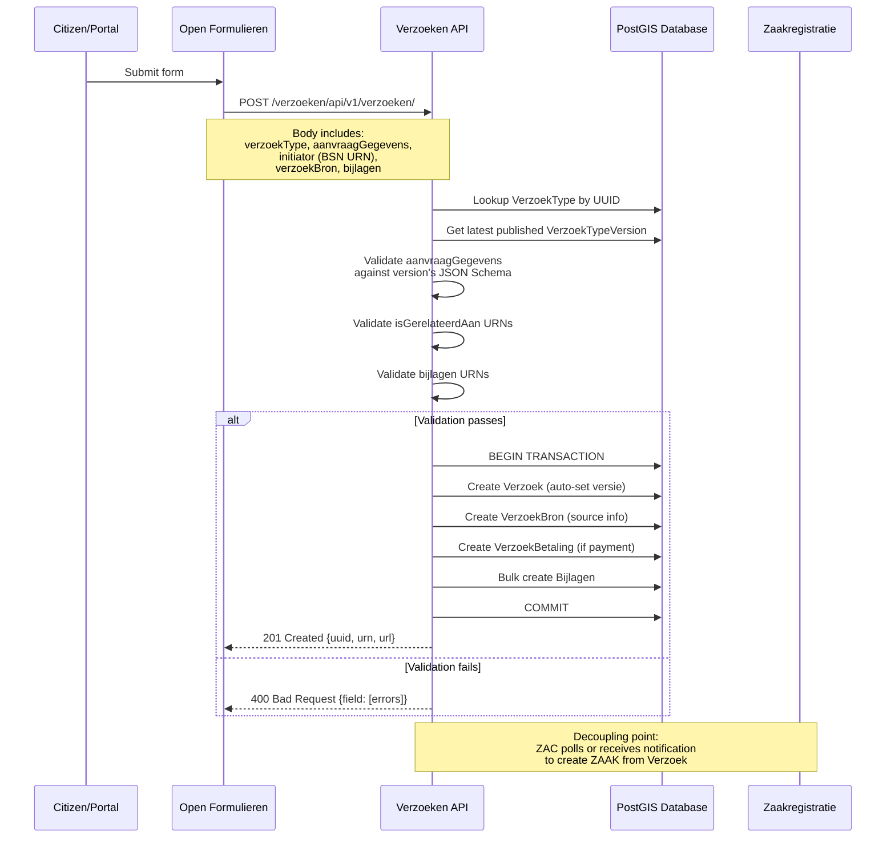
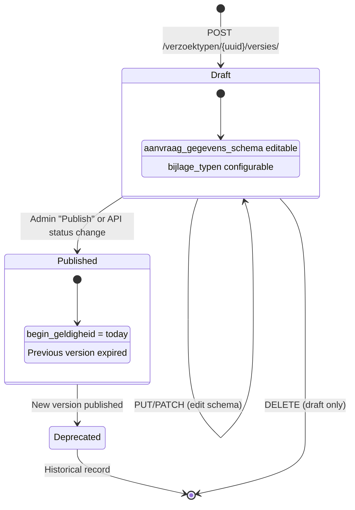
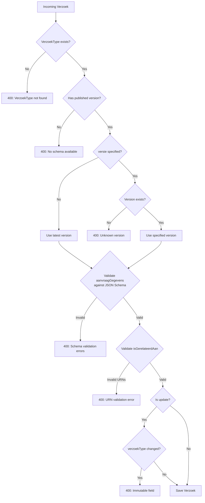

# Verzoeken Business Logic Flow

## Request Intake Flow

```mermaid
sequenceDiagram
    participant Citizen as Citizen/Portal
    participant OF as Open Formulieren
    participant API as Verzoeken API
    participant DB as PostGIS Database
    participant ZRC as Zaakregistratie

    Citizen->>OF: Submit form
    OF->>API: POST /verzoeken/api/v1/verzoeken/
    Note over OF,API: Body includes:<br/>verzoekType, aanvraagGegevens,<br/>initiator (BSN URN),<br/>verzoekBron, bijlagen

    API->>DB: Lookup VerzoekType by UUID
    API->>DB: Get latest published VerzoekTypeVersion
    API->>API: Validate aanvraagGegevens<br/>against version's JSON Schema
    API->>API: Validate isGerelateerdAan URNs
    API->>API: Validate bijlagen URNs

    alt Validation passes
        API->>DB: BEGIN TRANSACTION
        API->>DB: Create Verzoek (auto-set versie)
        API->>DB: Create VerzoekBron (source info)
        API->>DB: Create VerzoekBetaling (if payment)
        API->>DB: Bulk create Bijlagen
        API->>DB: COMMIT
        API-->>OF: 201 Created {uuid, urn, url}
    else Validation fails
        API-->>OF: 400 Bad Request {field: [errors]}
    end

    Note over API,ZRC: Decoupling point:<br/>ZAC polls or receives notification<br/>to create ZAAK from Verzoek
```

## VerzoekType Version Lifecycle

```mermaid
stateDiagram-v2
    [*] --> Draft: POST /verzoektypen/{uuid}/versies/
    Draft --> Draft: PUT/PATCH (edit schema)
    Draft --> Published: Admin "Publish" or API status change
    Published --> Deprecated: New version published
    Draft --> [*]: DELETE (draft only)
    Deprecated --> [*]: Historical record

    state Published {
        [*] --> Active
        Active: begin_geldigheid = today
        Active: Previous version expired
    }

    state Draft {
        [*] --> Editing
        Editing: aanvraag_gegevens_schema editable
        Editing: bijlage_typen configurable
    }
```

## Request Validation Chain

```mermaid
flowchart TD
    A[Incoming Verzoek] --> B{VerzoekType exists?}
    B -->|No| E[400: VerzoekType not found]
    B -->|Yes| C{Has published version?}
    C -->|No| F[400: No schema available]
    C -->|Yes| D{versie specified?}
    D -->|No| G[Use latest version]
    D -->|Yes| H{Version exists?}
    H -->|No| I[400: Unknown version]
    H -->|Yes| J[Use specified version]
    G --> K{Validate aanvraagGegevens<br/>against JSON Schema}
    J --> K
    K -->|Invalid| L[400: Schema validation errors]
    K -->|Valid| M{Validate isGerelateerdAan}
    M -->|Invalid URNs| N[400: URN validation error]
    M -->|Valid| O{Is update?}
    O -->|Yes| P{verzoekType changed?}
    P -->|Yes| Q[400: Immutable field]
    P -->|No| R[Save Verzoek]
    O -->|No| R
```
