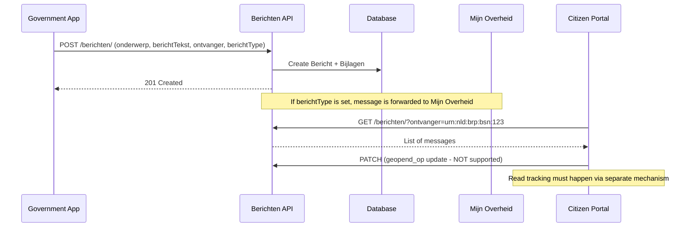

# Berichten (Messages)

## Purpose

The Berichten component is a message registry for citizen-government communication. Messages can be sent to citizen portals and optionally forwarded to the national "Mijn Overheid" berichtenbox. It tracks publication dates, read status, and supports attachments via URN references. The API is intentionally limited: create + read-only (no update/delete).

This competes with Pipelinq's communication/notification features.

## Architecture

- Create + Read-only ViewSet (`CreateModelMixin + ReadOnlyModelViewSet`)
- No update or delete operations by design (audit trail)
- Markdown support for local portals, plain text for Mijn Overheid
- Bericht type code determines routing to Mijn Overheid berichtenbox
- Attachments limited to 1 PDF for Mijn Overheid

## Data Model

| Model | Field | Type | Description |
|---|---|---|---|
| **Bericht** | uuid | UUID4 | Unique identifier |
| | onderwerp | CharField(50) | Subject line |
| | bericht_tekst | TextField(4000) | Message body (Markdown for portals, plain for Mijn Overheid) |
| | publicatiedatum | DateTimeField | Visible from (default: now) |
| | referentie | CharField(25) | Sender reference / internal reference |
| | ontvanger | URNField(255) | Recipient URN (BSN, KvK) |
| | geopend_op | DateTimeField | Opened timestamp (portal only, not Mijn Overheid) |
| | bericht_type | CharField(8) | Template code for Mijn Overheid (if set, forwarded there) |
| | handelings_perspectief | CharField(50) | Expected action (lezen, naleveren, invullen) |
| | einddatum_handelings_termijn | DateTimeField | Action deadline |
| **Bijlage** | uuid | UUID4 | Unique identifier |
| | bericht | FK -> Bericht | Parent message |
| | informatie_object | URNField(255) | URN to document |
| | omschrijving | CharField(40) | Short description |
| | is_bericht_type_bijlage | Boolean | Part of Mijn Overheid template (skip forwarding) |

## API Endpoints

| Method | Path | Description |
|---|---|---|
| GET | `/berichten/api/v1/berichten/` | List all messages |
| POST | `/berichten/api/v1/berichten/` | Create a message |
| GET | `/berichten/api/v1/berichten/{uuid}/` | Retrieve message |

No PUT, PATCH, or DELETE -- messages are immutable by design.

## Business Logic

## Pipelinq Comparison

| Aspect | Open VTB | Pipelinq |
|---|---|---|
| Message storage | Dedicated Bericht model | Not yet built-in |
| Immutability | Create + read only (no update/delete) | N/A |
| Mijn Overheid | Built-in forwarding via bericht_type | Not applicable |
| Read tracking | geopend_op field | Not yet built-in |
| Scheduled publish | publicatiedatum field | Not yet built-in |
| Attachments | URN references with PDF-only for Mijn Overheid | N/A |

### Already in Pipelinq
- None directly comparable (Pipelinq does not have a dedicated messaging component)

### Not yet in Pipelinq
- **Citizen messaging** with subject, body, recipient
- **Scheduled publication** (publicatiedatum)
- **Read tracking** (geopend_op)
- **Mijn Overheid integration** routing
- **Immutable message audit trail**
- **Action perspective and deadline** on messages
- **Attachment management** with template-aware forwarding logic
