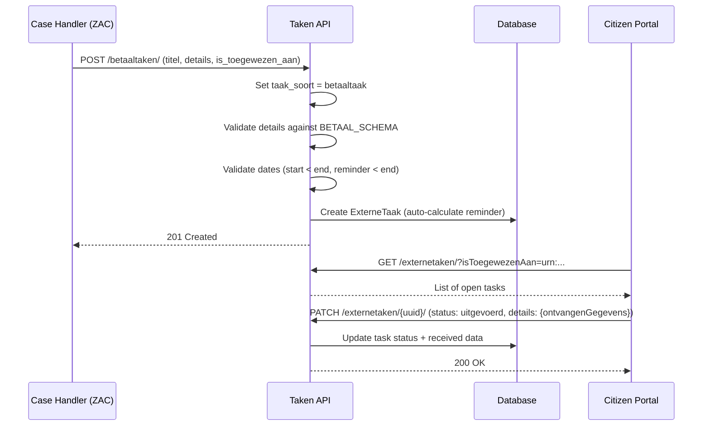

# Taken (Tasks)

## Purpose

The Taken component manages "external tasks" (externe taken) -- follow-up actions assigned by a case handling component (ZAC) to citizens or businesses. Tasks appear in citizen portals ("mijn-omgeving") and can be one of three types: payment tasks, data-request tasks, or form tasks. Each task type has a dedicated JSON schema and polymorphic serialization.

This competes with Pipelinq's task tracking and pipeline stage management.

## Architecture

- Single model (`ExterneTaak`) with a `taak_soort` discriminator field
- Polymorphic serialization via `vng_api_common.polymorphism.PolymorphicSerializer`
- Dedicated ViewSets per task type (filter queryset by `taak_soort`)
- JSON Schema validation for task-type-specific `details` field
- Automatic reminder date calculation (configurable days before deadline)

## Data Model

| Model | Field | Type | Description |
|---|---|---|---|
| **ExterneTaak** | uuid | UUID4 | Unique identifier |
| | titel | CharField(100) | Task title (shown in portal) |
| | status | CharField(20) | open / uitgevoerd / niet_uitgevoerd / afgebroken / verwerkt |
| | startdatum | DateField | Start date (default: today) |
| | handelings_perspectief | CharField(100) | Action perspective (lezen, naleveren, invullen) |
| | einddatum_handelings_termijn | DateField | Deadline |
| | datum_herinnering | DateField | Reminder date (auto-calculated) |
| | toelichting | TextField(4000) | Task description |
| | taak_soort | CharField(20) | betaaltaak / gegevensuitvraagtaak / formuliertaak |
| | details | JSONField | Task-type-specific data (validated by schema) |
| | is_toegewezen_aan | URNField(255) | Assigned to person/org (BSN, KvK) |
| | wordt_behandeld_door | URNField(255) | Handled by employee |
| | hoort_bij | URNField(255) | Belongs to case (ZAAK) |
| | heeft_betrekking_op | URNField(255) | Related product |

### Task Types (taak_soort) and their Details Schemas

**betaaltaak** (Payment Task):
- `bedrag` (string, decimal format, required)
- `valuta` (string, EUR only, required)
- `transactieomschrijving` (string, max 80, required)
- `doelrekening` (object, required):
  - `naam` (string, max 200)
  - `code` (string, max 100)
  - `iban` (string, IBAN format)
  - At least one of naam/code/iban required

**gegevensuitvraagtaak** (Data Request Task):
- `uitvraagLink` (URI, required)
- `voorinvullenGegevens` (object, arbitrary key-value)
- `ontvangenGegevens` (object, arbitrary key-value)

**formuliertaak** (Form Task):
- `formulierDefinitie` (object, required) -- FormIO-compatible:
  - `components` (array of objects with label/key/type + optional values/fileTypes/format/enableTime/decimalLimit/data)
- `voorinvullenGegevens` (object, arbitrary key-value)
- `ontvangenGegevens` (object, arbitrary key-value)

### Status Lifecycle
- `open` -> `uitgevoerd` (completed) / `niet_uitgevoerd` (not completed) / `afgebroken` (cancelled)
- `uitgevoerd` -> `verwerkt` (processed by case handler)

## API Endpoints

| Method | Path | Description |
|---|---|---|
| GET | `/taken/api/v1/externetaken/` | List all tasks |
| POST | `/taken/api/v1/externetaken/` | Create task |
| GET | `/taken/api/v1/externetaken/{uuid}/` | Retrieve task |
| PUT | `/taken/api/v1/externetaken/{uuid}/` | Full update |
| PATCH | `/taken/api/v1/externetaken/{uuid}/` | Partial update |
| DELETE | `/taken/api/v1/externetaken/{uuid}/` | Delete task |
| GET/POST/PUT/PATCH/DELETE | `/taken/api/v1/betaaltaken/...` | Payment tasks only |
| GET/POST/PUT/PATCH/DELETE | `/taken/api/v1/gegevensuitvraagtaken/...` | Data request tasks only |
| GET/POST/PUT/PATCH/DELETE | `/taken/api/v1/formuliertaken/...` | Form tasks only |

### Validation Rules
- `startdatum` must be before `einddatum_handelings_termijn`
- `datum_herinnering` must be before `einddatum_handelings_termijn`
- `details` validated against task-type-specific JSON schema
- FormulierTaak: `formulierDefinitie` additionally validated against FORMULIER_DEFINITIE_SCHEMA
- `taak_soort` is auto-set when using type-specific endpoints (cannot be overridden)
- Reminder date auto-calculated: `einddatum - TAKEN_DEFAULT_REMINDER_IN_DAYS` (default 7)

## Business Logic

## Pipelinq Comparison

| Aspect | Open VTB | Pipelinq |
|---|---|---|
| Task model | Single ExterneTaak with polymorphic details | Pipeline stages |
| Task types | 3 fixed types (betaal, gegevensuitvraag, formulier) | Configurable stage types |
| Status tracking | 5 fixed statuses | Configurable per pipeline |
| Assignment | URN-based (is_toegewezen_aan, wordt_behandeld_door) | User-based |
| Deadlines | einddatum_handelings_termijn + auto-reminder | Not yet built-in |
| Form definition | FormIO-compatible JSON schema | Not yet built-in |
| Payment tasks | Built-in with IBAN/amount/currency | Not yet built-in |
| Case linking | URN to ZAAK (hoort_bij) | Object relations in OpenRegister |

### Already in Pipelinq
- Task/stage management
- Status tracking
- User assignment
- CRUD operations on tasks

### Not yet in Pipelinq
- **Payment task type** with IBAN validation, amount, currency, transaction description
- **Data request tasks** with external form links and pre-fill data
- **Form task type** with FormIO-compatible form definitions
- **Automatic reminder calculation** (configurable days before deadline)
- **Deadline tracking** with date validation
- **Action perspective** (handelings_perspectief: what the citizen should do)
- **URN-based assignment** to external persons/organizations
- **Case and product linking** via URN
- **Polymorphic API** with type-specific endpoints
