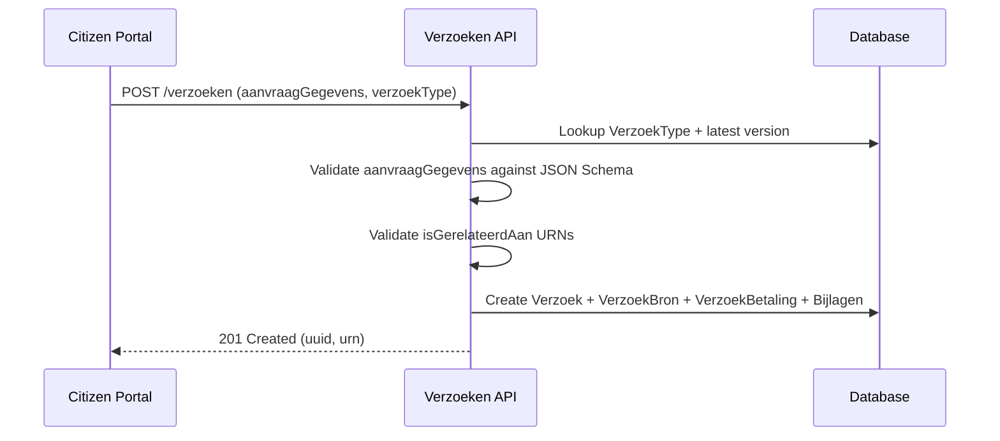

# Verzoeken (Requests)

## Purpose

The Verzoeken component is the core request/intake registry of Open VTB. It decouples form submissions (from portals, Open Formulieren, etc.) from the case registry (zaakregister). A "verzoek" captures the citizen's request data, validates it against a versioned JSON schema, and links it to related cases/products via URNs.

This is the **primary competitor feature** to Pipelinq's lead/request management pipeline.

## Architecture

- **Framework**: Django 5.2 + Django REST Framework + vng-api-common
- **Database**: PostGIS (PostgreSQL with spatial extensions)
- **API style**: REST with camelCase JSON output (djangorestframework-camel-case)
- **Auth**: OIDC (mozilla-django-oidc-db) + Token Authentication
- **Versioning**: URL-based (`/verzoeken/api/v1/...`)
- **Schema docs**: drf-spectacular generating OpenAPI 3.x, served via ReDoc

## Data Model

| Model | Field | Type | Description |
|---|---|---|---|
| **VerzoekType** | uuid | UUID4 | Unique identifier |
| | naam | CharField(100) | Name of the request type |
| | omschrijving | TextField(4000) | Internal description |
| | aangemaakt_op | DateField (auto) | Created date |
| | gewijzigd_op | DateField (auto) | Modified date |
| **VerzoekTypeVersion** | verzoek_type | FK -> VerzoekType | Parent type |
| | versie | PositiveSmallInt | Version number (auto-increment) |
| | status | CharField(20) | draft / published / deprecated |
| | aanvraag_gegevens_schema | JSONField | JSON Schema for validation |
| | begin_geldigheid | DateField | Published date (set on publish) |
| | einde_geldigheid | DateField | Expiry (set when next version publishes) |
| | aangemaakt_op | DateField (auto) | Created date |
| | gewijzigd_op | DateField (auto) | Modified date |
| **Verzoek** | uuid | UUID4 | Unique identifier |
| | verzoek_type | FK -> VerzoekType (PROTECT) | Request type |
| | versie | PositiveSmallInt | Schema version used |
| | geometrie | GeometryField | Point/Line/Polygon location |
| | aanvraag_gegevens | JSONField | The actual request data |
| | initiator | URNField(255) | URN to person/org (BSN, KvK) |
| | is_gerelateerd_aan | JSONField (list) | URN refs to ZAAK or PRODUCT |
| | kanaal | CharField(200) | Intake channel |
| | verzoek_informatie_object | URNField(255) | URN to the request document |
| | verzoek_taal | CharField(2) | Language code (default "nl") |
| **VerzoekBron** | verzoek | OneToOne -> Verzoek | Source application |
| | naam | CharField(100) | Source app name |
| | kenmerk | CharField(255) | Source submission ID |
| **VerzoekBetaling** | verzoek | OneToOne -> Verzoek | Payment info |
| | provider_kenmerk | CharField(100) | PSP / payment provider ID |
| | bedrag | Decimal(10,2) | Amount |
| | valuta | CharField(20) | Currency (EUR only) |
| | voltooid | Boolean | Payment completed |
| | transactie_datum | DateTime | Transaction timestamp |
| | transactie_referentie | CharField(100) | Transaction reference |
| **Bijlage** | uuid | UUID4 | Unique identifier |
| | verzoek | FK -> Verzoek | Parent request |
| | informatie_object | URNField(255) | URN to document |
| **BijlageType** | uuid | UUID4 | Unique identifier |
| | verzoek_type_versie | FK -> VerzoekTypeVersion | Parent version |
| | informatie_objecttype | URNField(255) | URN to document type |
| | omschrijving | TextField | Description |

### Key Relations
- VerzoekType 1:N VerzoekTypeVersion (versioned schemas)
- VerzoekType 1:N Verzoek (PROTECT delete)
- Verzoek 1:1 VerzoekBron (source info)
- Verzoek 1:1 VerzoekBetaling (payment info)
- Verzoek 1:N Bijlage (attachments)
- VerzoekTypeVersion 1:N BijlageType (expected attachment types)

## API Endpoints

| Method | Path | Description |
|---|---|---|
| GET | `/verzoeken/api/v1/verzoeken/` | List all requests |
| POST | `/verzoeken/api/v1/verzoeken/` | Create a request |
| GET | `/verzoeken/api/v1/verzoeken/{uuid}/` | Retrieve request |
| PUT | `/verzoeken/api/v1/verzoeken/{uuid}/` | Full update |
| PATCH | `/verzoeken/api/v1/verzoeken/{uuid}/` | Partial update |
| DELETE | `/verzoeken/api/v1/verzoeken/{uuid}/` | Delete request |
| GET | `/verzoeken/api/v1/verzoektypen/` | List request types |
| POST | `/verzoeken/api/v1/verzoektypen/` | Create request type |
| GET | `/verzoeken/api/v1/verzoektypen/{uuid}/` | Retrieve type |
| PUT | `/verzoeken/api/v1/verzoektypen/{uuid}/` | Update type |
| PATCH | `/verzoeken/api/v1/verzoektypen/{uuid}/` | Partial update type |
| DELETE | `/verzoeken/api/v1/verzoektypen/{uuid}/` | Delete type |
| GET | `/verzoeken/api/v1/verzoektypen/{uuid}/versies/` | List versions |
| POST | `/verzoeken/api/v1/verzoektypen/{uuid}/versies/` | Create version |
| GET | `/verzoeken/api/v1/verzoektypen/{uuid}/versies/{v}/` | Get version |
| PUT | `/verzoeken/api/v1/verzoektypen/{uuid}/versies/{v}/` | Update version |
| PATCH | `/verzoeken/api/v1/verzoektypen/{uuid}/versies/{v}/` | Partial update |
| DELETE | `/verzoeken/api/v1/verzoektypen/{uuid}/versies/{v}/` | Delete (draft only) |

### Validation Rules
- `aanvraag_gegevens` is validated against the JSON schema of the selected VerzoekType version
- `verzoek_type` is immutable after creation (IsImmutableValidator)
- VerzoekType must have at least one version before a Verzoek can reference it
- Only draft versions can be edited or deleted
- `is_gerelateerd_aan` items must match URN pattern `^urn:.*$`

## Business Logic

## Pipelinq Comparison

| Aspect | Open VTB | Pipelinq |
|---|---|---|
| Request intake | VerzoekType with versioned JSON schemas | Pipeline stages with configurable schemas |
| Schema validation | JSON Schema (Draft 2020-12) | OpenRegister schema validation |
| Versioning | Integer versions with publish/deprecate lifecycle | Schema versioning via OpenRegister |
| Attachments | URN references to external document store | File objects stored in OpenRegister |
| Payment tracking | Built-in VerzoekBetaling model | Not yet built-in |
| Geo-location | PostGIS GeometryField | Not yet built-in |
| Source tracking | VerzoekBron (app name + submission ID) | Pipeline source metadata |

### Already in Pipelinq
- Request/lead intake and management
- Type/schema-based validation
- Attachment handling (via OpenRegister objects)
- API-first architecture
- UUID-based identification

### Not yet in Pipelinq
- **Payment tracking** (VerzoekBetaling with provider, amount, transaction reference)
- **Geo-location** on requests (PostGIS geometry field)
- **Source application tracking** (VerzoekBron model)
- **Versioned request type schemas** with publish/deprecate lifecycle
- **URN-based cross-system referencing** (RFC 8141 compliant)
- **Immutable fields** after creation (verzoek_type cannot change)
- **Language field** on requests (verzoek_taal)
- **Channel tracking** (kanaal - which intake channel was used)
