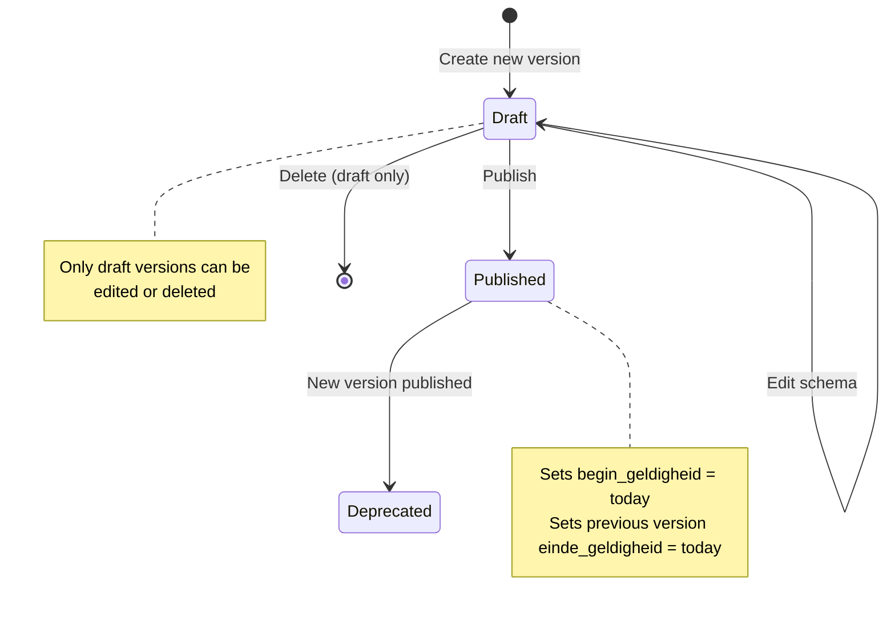

# VerzoekType Versioning

## Purpose

Open VTB implements a full version lifecycle for request types (VerzoekType). Each type can have multiple versions, each with its own JSON Schema for validating request data. Versions follow a draft -> published -> deprecated lifecycle, ensuring that existing requests remain valid against their original schema while new submissions use the latest published schema.

## Architecture

- VerzoekTypeVersion is a separate model with FK to VerzoekType
- Version numbers are auto-incremented integers
- Only one version can be "published" at a time (previous becomes expired)
- Draft versions can be edited/deleted; published/deprecated cannot
- Admin interface provides "Publish" and "New Version" buttons
- API enforces lifecycle rules via validators

## Data Model

See Verzoeken spec for full model. Key versioning fields:
- `versie` (auto-increment integer)
- `status` (draft / published / deprecated)
- `aanvraag_gegevens_schema` (JSONField -- the JSON Schema)
- `begin_geldigheid` (set automatically on publish)
- `einde_geldigheid` (set automatically when newer version publishes)

## Business Logic

### Publish Logic (model.save):
1. Check if status changed to "published"
2. Set `begin_geldigheid = today`
3. Find previous version, set its `einde_geldigheid = today`
4. Save

### Version Number Generation:
- Query max version for the VerzoekType
- Increment by 1

### Admin Actions:
- "Publish" button: sets last version status to published
- "New Version" button: clones last version with incremented number, status=draft

## Pipelinq Comparison

| Aspect | Open VTB | Pipelinq |
|---|---|---|
| Schema versioning | Integer versions with lifecycle | Schema versions in OpenRegister |
| Lifecycle states | draft -> published -> deprecated | No formal lifecycle |
| Validity periods | begin/einde_geldigheid dates | No validity periods |
| Admin workflow | Publish/New Version buttons | Manual schema management |

### Already in Pipelinq
- Schema-based validation via OpenRegister

### Not yet in Pipelinq
- **Formal version lifecycle** (draft/published/deprecated)
- **Validity period tracking** (begin/einde_geldigheid)
- **Admin publish/new-version workflow**
- **Immutability of published schemas**
- **Auto-expiry of previous versions**
