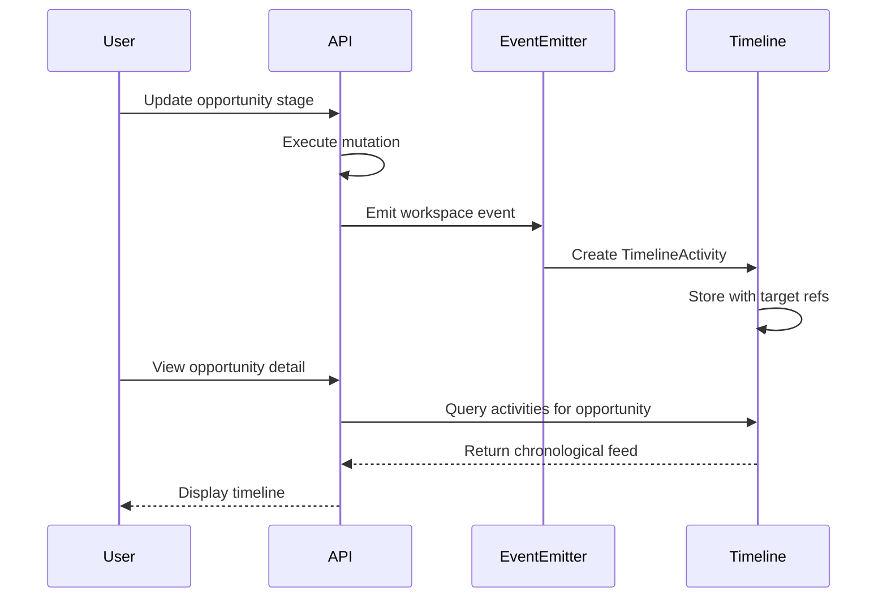

# Activity Tracking & Timeline

## Overview

Twenty provides comprehensive activity tracking through three mechanisms: timeline activities (audit log), notes, and tasks. Together these form the activity feed visible on any record's detail page, providing a chronological history of interactions and to-dos.

## Timeline Activities

The `TimelineActivity` entity is the central audit log:

### Properties
- `happensAt` — When the activity occurred
- `name` — Activity type/name (e.g., "created", "updated", "email.sent")
- `properties` — JSON payload with activity-specific data
- `linkedRecordCachedName` — Cached name of the related record (for display)
- `linkedRecordId` / `linkedObjectMetadataId` — Reference to related record

### Polymorphic Targets
Timeline activities are linked to records via typed target fields:
- `targetPerson` / `targetPersonId`
- `targetCompany` / `targetCompanyId`
- `targetOpportunity` / `targetOpportunityId`
- `targetNote` / `targetNoteId`
- `targetTask` / `targetTaskId`
- `targetWorkflow` / `targetWorkflowId`
- `targetWorkflowVersion` / `targetWorkflowVersionId`
- `targetWorkflowRun` / `targetWorkflowRunId`
- `targetDashboard` / `targetDashboardId`
- `custom` / `targetCustom` — For custom objects

### Actor Tracking
Every activity records which workspace member performed it via `workspaceMember` / `workspaceMemberId`.

### Activity Flow

## Notes

### Entity Model
- `title` — Note title
- `bodyV2` — Rich text content (BlockNote format, RichTextMetadata)
- `position` — Sort order

### Note Targets (Polymorphic)
Notes use a target/join pattern to link to any entity:
- `NoteTarget` entity with typed references to Company, Person, Opportunity, etc.
- A single note can be linked to multiple records (many-to-many via targets)

### Lifecycle Hooks
Post-query hooks handle cascading operations:
- `NoteDeleteOne/Many` — Cleanup on deletion
- `NoteRestoreOne/Many` — Restoration from soft-delete

## Tasks

### Entity Model
- `title` — Task title
- `bodyV2` — Rich text description (BlockNote format)
- `dueAt` — Due date
- `status` — Task status (configurable string)
- `assignee` / `assigneeId` — Assigned workspace member

### Task Targets (Polymorphic)
Same target pattern as notes — tasks can be linked to any entity.

### Task vs Note Distinction
- **Tasks** have `dueAt`, `status`, and `assignee` — they represent actionable items
- **Notes** are purely informational, no status or assignment

## Activity Types Tracked

Based on the timeline and module structure, Twenty tracks:

1. **Record CRUD** — Creation, updates, deletions of any object
2. **Email activity** — Messages sent/received (via messaging module)
3. **Calendar activity** — Events created/updated (via calendar module)
4. **Workflow runs** — Workflow execution results
5. **Note/Task creation** — When notes or tasks are linked to a record
6. **Custom activities** — Via custom objects and the timeline API

## Search & Filtering

Both notes and tasks are searchable:
- Notes: title + bodyV2 content indexed
- Tasks: title + bodyV2 content indexed
- Timeline activities: name field indexed

## Frontend Integration

The frontend `activities` module provides:
- Timeline feed component on record detail pages
- Note editor with rich text (BlockNote)
- Task management with due dates and status
- Activity filtering by type
- Chronological and reverse-chronological ordering

## Pipelinq Comparison

| Aspect | Twenty | Pipelinq |
|--------|--------|----------|
| Audit log | TimelineActivity entity | OpenRegister object versioning |
| Notes | Rich text with polymorphic targets | Not yet implemented |
| Tasks | With due dates, status, assignee | Not yet implemented |
| Polymorphic linking | Target entities (join pattern) | Object relations |
| Rich text editor | BlockNote (JSON format) | Not yet determined |
| Email in timeline | Native (via messaging sync) | Not yet implemented |
| Calendar in timeline | Native (via calendar sync) | Not yet implemented |
| Activity feed UI | Built-in timeline component | Not yet implemented |

## Key Takeaway

Twenty's activity tracking provides a unified chronological view of all interactions with a CRM record. The combination of automated audit logging (timeline activities) with manual annotations (notes and tasks) gives users a complete picture. The polymorphic target pattern is elegant but creates many join columns on the timeline entity. Pipelinq could achieve similar functionality by leveraging OpenRegister's audit logging and adding note/task schemas.
