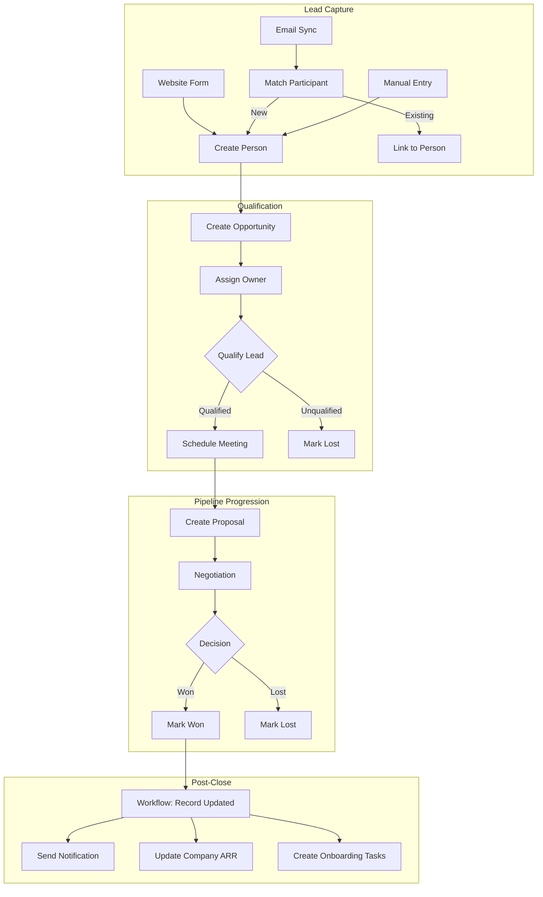
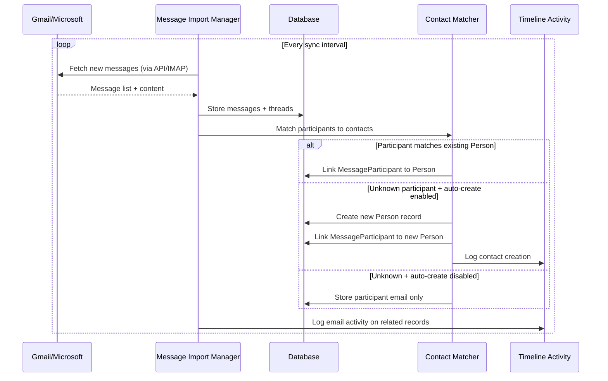
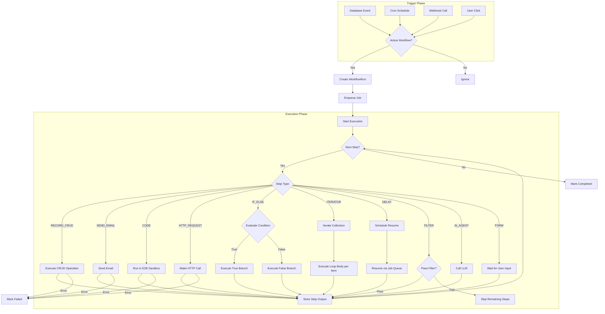
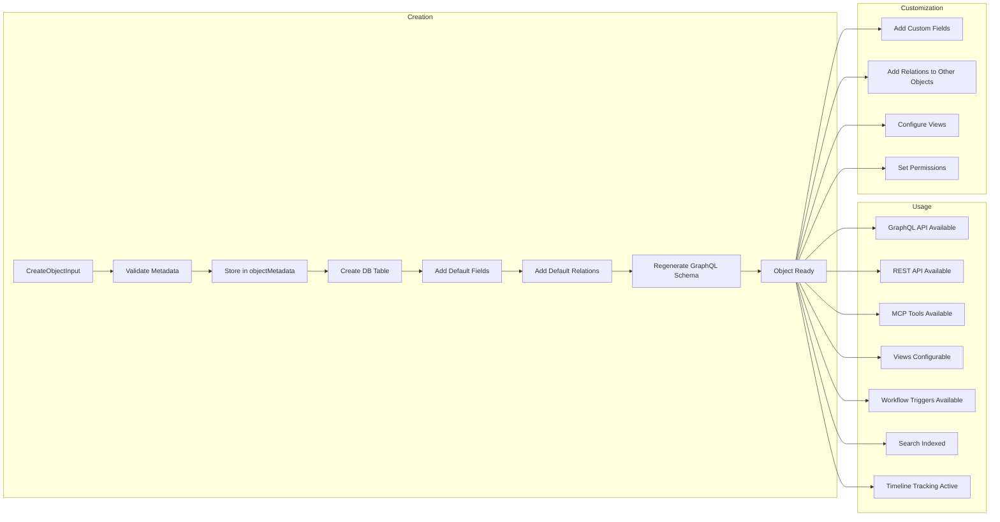
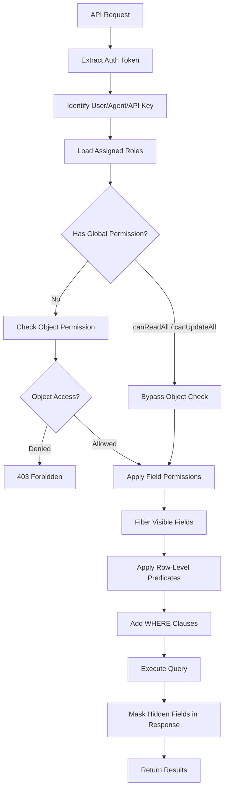
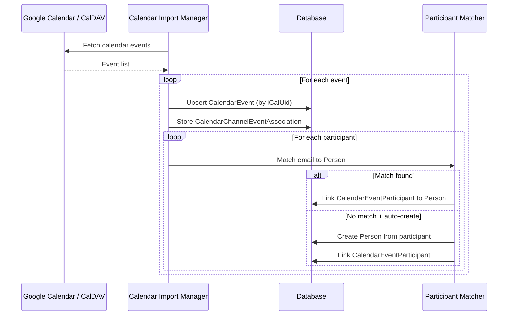

# Business Logic Flows

## Overview

This spec documents the key business logic flows in Twenty CRM, visualized as Mermaid diagrams.

## 1. Deal Pipeline Flow

## 2. Email Sync & Contact Creation Flow

## 3. Workflow Execution Flow

## 4. Custom Object Lifecycle

## 5. Permission Evaluation Flow

## 6. Calendar Sync Flow

