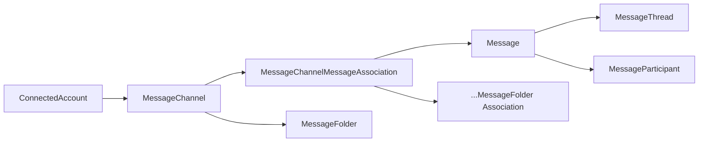
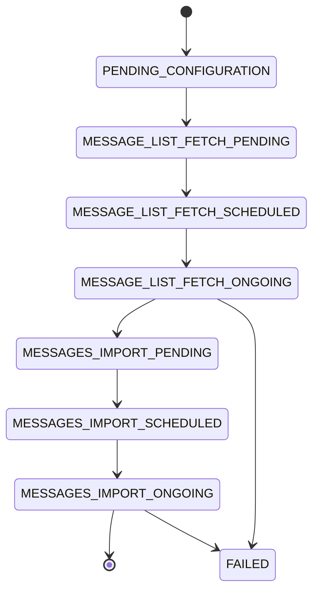
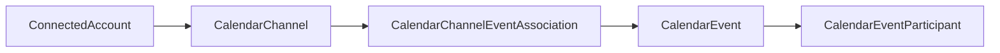

# Email & Calendar Integration

## Overview

Twenty provides native email and calendar synchronization through connected accounts. Users link their Google or Microsoft accounts (or IMAP/SMTP/CalDAV servers), and Twenty automatically imports emails and calendar events, linking them to CRM contacts. The system includes visibility controls, contact auto-creation, and folder management.

## Connected Accounts

The `ConnectedAccount` entity serves as the bridge between external services and Twenty:

- `provider` — Google, Microsoft, or custom (IMAP/SMTP/CalDAV)
- `handle` — Email address / account identifier
- `handleAliases` — Alternative email addresses for the account
- `accessToken` / `refreshToken` — OAuth credentials
- `scopes` — Granted OAuth scopes
- `connectionParameters` — IMAP/SMTP/CalDAV connection settings
- `authFailedAt` — Tracks authentication failures
- Relations: messageChannels[], calendarChannels[]

## Email (Messaging) System

### Entity Model

### MessageChannel
Controls how messages are synced:
- `type` — EMAIL or SMS
- `visibility` — METADATA (only sender/recipient), SUBJECT (+ subject line), SHARE_EVERYTHING (full content)
- `contactAutoCreationPolicy` — SENT_AND_RECEIVED, SENT, or NONE
- `excludeNonProfessionalEmails` — Filter personal emails
- `excludeGroupEmails` — Filter group/mailing list emails
- `messageFolderImportPolicy` — ALL_FOLDERS or SELECTED_FOLDERS

### Sync Pipeline
Multi-stage sync process with detailed status tracking:

Sync statuses: NOT_SYNCED, ONGOING, ACTIVE, FAILED_INSUFFICIENT_PERMISSIONS, FAILED_UNKNOWN

### Message Entity
- `headerMessageId` — Email Message-ID header
- `subject`, `text` — Message content
- `receivedAt` — Timestamp
- Relations: messageThread (conversation threading), messageParticipants[]

### Message Participant
Links messages to CRM contacts:
- Associates email addresses to Person entities
- Enables automatic contact creation from email participants

### Email Operations
The messaging module includes sub-modules for:
- **Message Import Manager** — Handles sync from providers
- **Message Outbound Manager** — Sending emails (SEND_EMAIL workflow action)
- **Message Participant Manager** — Matching participants to contacts
- **Message Cleaner** — Cleanup of old/deleted messages
- **Message Folder Manager** — Gmail label / IMAP folder management
- **Blocklist Manager** — Email blocklist management
- **Monitoring** — Sync health tracking

## Calendar System

### Entity Model

### CalendarChannel
- `visibility` — METADATA or SHARE_EVERYTHING
- `contactAutoCreationPolicy` — AS_PARTICIPANT_AND_ORGANIZER, AS_PARTICIPANT, AS_ORGANIZER, NONE
- Sync pipeline similar to messaging (CALENDAR_EVENT_LIST_FETCH -> CALENDAR_EVENTS_IMPORT)

### CalendarEvent
- `title`, `description`, `location`
- `startsAt`, `endsAt`, `isFullDay`
- `isCanceled` — Event cancellation flag
- `iCalUid` — Standard iCalendar identifier
- `conferenceSolution`, `conferenceLink` — Video call info (Zoom, Meet, etc.)
- Relations: calendarEventParticipants[]

### Calendar Event Participant
Links calendar events to CRM contacts, similar to message participants.

## Contact Auto-Creation

Both email and calendar have contact auto-creation:
- `ContactCreationManager` module handles matching participants to existing contacts
- Creates new Person records when unknown participants are encountered
- Respects policy settings (e.g., only create contacts for sent emails)
- `MatchParticipant` module handles fuzzy matching of email addresses to contacts

## Blocklist

Users can maintain a blocklist:
- Block specific email addresses or domains
- Prevents import of messages from blocked senders
- Managed per-workspace via `BlocklistManager`

## Pipelinq Comparison

| Aspect | Twenty | Pipelinq |
|--------|--------|----------|
| Email sync | Native Gmail/Microsoft/IMAP | Via n8n or Nextcloud Mail |
| Calendar sync | Native Google/Microsoft/CalDAV | Via Nextcloud Calendar |
| Contact matching | Built-in participant-to-contact | Not yet implemented |
| Contact auto-creation | Policy-based automatic | Not yet implemented |
| Email sending | From CRM (workflow action) | Via n8n or Mail app |
| Visibility controls | Metadata/Subject/Full | Nextcloud sharing model |
| Folder management | Gmail labels / IMAP folders | N/A (Nextcloud Mail) |
| Threading | Full conversation threading | N/A |

## Key Takeaway

Twenty's email/calendar integration is deeply embedded in the CRM. The automatic contact matching, threaded conversations, and visibility controls make it a true communication hub. Pipelinq can leverage Nextcloud's existing Mail and Calendar apps rather than building this from scratch, but would need a matching/linking layer to associate communications with CRM contacts.
