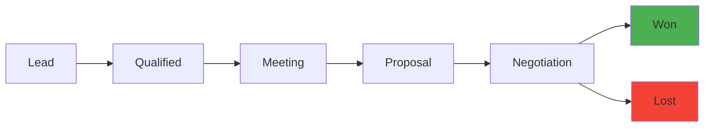

# Pipeline & View System

## Overview

Twenty's view system is a metadata-driven layer that provides configurable data visualization on top of any object type. Views support table, kanban, and calendar layouts with filtering, sorting, grouping, and field visibility configuration. The Opportunity object with kanban views forms the core pipeline feature.

## View Types

```typescript
enum ViewType {
  TABLE = 'TABLE',       // Spreadsheet-style rows
  KANBAN = 'KANBAN',     // Board with columns (e.g., deal stages)
  CALENDAR = 'CALENDAR', // Calendar layout for date-based objects
  FIELDS_WIDGET = 'FIELDS_WIDGET', // Dashboard widget showing fields
}
```

## View Entity Model

A View belongs to an ObjectMetadata and contains:

### Core Properties
- `name` — Display name
- `type` — ViewType enum (TABLE, KANBAN, CALENDAR, FIELDS_WIDGET)
- `icon` — Display icon
- `position` — Sort order
- `isCompact` — Condensed display mode
- `openRecordIn` — Where to open records: SIDE_PANEL or other options
- `visibility` — WORKSPACE (shared) or personal
- `key` — ViewKey enum for special system views

### Kanban-Specific
- `mainGroupByFieldMetadataId` — Which field to group by (e.g., stage)
- `kanbanAggregateOperation` — Aggregation on kanban columns (SUM, COUNT, AVG, etc.)
- `kanbanAggregateOperationFieldMetadataId` — Which field to aggregate (e.g., deal amount)
- `shouldHideEmptyGroups` — Hide columns with no records

### Calendar-Specific
- `calendarLayout` — Calendar display mode
- `calendarFieldMetadataId` — Which date field to plot on calendar

### View Components
- **ViewFields** — Which fields/columns to show and in what order
- **ViewFieldGroups** — Grouping of fields
- **ViewFilters** — Active filter conditions
- **ViewFilterGroups** — Logical grouping of filters (AND/OR)
- **ViewSorts** — Active sort rules
- **ViewGroups** — Row grouping configuration

## Opportunity Pipeline

The Opportunity entity serves as the pipeline/deal entity:

### Fields
- `name` — Deal name
- `stage` — Pipeline stage (configurable string, displayed as kanban columns)
- `amount` — Deal value (CurrencyMetadata with amount + currency code)
- `closeDate` — Expected close date
- `position` — Order within a stage column

### Relations
- `company` — The company this deal is with
- `pointOfContact` — Primary contact person
- `owner` — WorkspaceMember responsible for the deal

### Pipeline Flow


Stages are configurable per workspace (stored as SELECT field options, not hard-coded enum).

## Aggregation Operations

Views support aggregations on kanban columns:

```typescript
enum AggregateOperations {
  COUNT = 'COUNT',
  COUNT_EMPTY = 'COUNT_EMPTY',
  COUNT_NOT_EMPTY = 'COUNT_NOT_EMPTY',
  COUNT_UNIQUE = 'COUNT_UNIQUE',
  PERCENTAGE_EMPTY = 'PERCENTAGE_EMPTY',
  PERCENTAGE_NOT_EMPTY = 'PERCENTAGE_NOT_EMPTY',
  MIN = 'MIN',
  MAX = 'MAX',
  AVG = 'AVG',
  SUM = 'SUM',
}
```

This enables showing deal totals per stage, average deal size, etc.

## Filter System

Views use a filter group model:
- `ViewFilter` — Individual filter condition (field, operator, value)
- `ViewFilterGroup` — Logical grouping with AND/OR operators
- Nested filter groups for complex queries
- `anyFieldFilterValue` — Quick search across all fields

## View Visibility & Permissions

- `ViewVisibility.WORKSPACE` — Shared with all workspace members
- Personal views (tied to `createdByUserWorkspaceId`)
- Views inherit object-level permissions from the role system

## Pipelinq Comparison

| Aspect | Twenty | Pipelinq |
|--------|--------|----------|
| View types | Table, Kanban, Calendar, Widget | Table, Kanban (planned) |
| Pipeline entity | Opportunity (standard object) | Pipeline objects (register-based) |
| Stage config | SELECT field options | Schema-defined stages |
| Aggregations | 10 operations on kanban columns | Not yet implemented |
| Filter model | Nested filter groups with AND/OR | Basic field filtering |
| Grouping | Field-based grouping on any view | Not yet implemented |
| Calendar view | Native with date field mapping | Not yet implemented |
| View sharing | Workspace vs personal | Per-register permissions |

## Key Takeaway

Twenty's view system is its strongest differentiator. The ability to create any combination of view type + grouping + filtering + aggregation on any object type (including custom objects) makes it extremely flexible. The kanban view with aggregations is particularly powerful for pipeline management.
