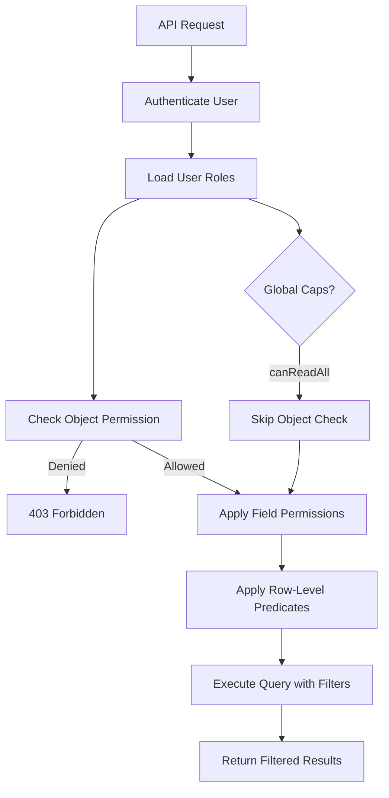

# Role-Based Access Control & Permissions

## Overview

Twenty implements a comprehensive RBAC system with roles, object-level permissions, field-level permissions, and row-level permission predicates. This enables fine-grained control over who can see and modify what data in the CRM.

## Role Entity

Roles define a set of capabilities:

### Global Capabilities
- `canUpdateAllSettings` — Admin-level settings access
- `canAccessAllTools` — Access to all workflow tools
- `canReadAllObjectRecords` — Read access to all data
- `canUpdateAllObjectRecords` — Write access to all data
- `canSoftDeleteAllObjectRecords` — Delete access
- `canDestroyAllObjectRecords` — Permanent deletion

### Role Properties
- `label` — Role name (unique per workspace)
- `description`, `icon`
- `isEditable` — Whether the role can be modified
- `canBeAssignedToUsers` — Assignable to human users
- `canBeAssignedToAgents` — Assignable to AI agents
- `canBeAssignedToApiKeys` — Assignable to API keys

### Role Targets
`RoleTarget` entities link roles to users, agents, and API keys:
- A user/agent/API key can have multiple roles
- Roles are evaluated collectively (union of permissions)

## Object-Level Permissions

`ObjectPermissionEntity` controls CRUD access per object type per role:
- Links a `role` to an `objectMetadata`
- Defines which operations are allowed (read, create, update, delete)
- Applied at the workspace query runner level

## Field-Level Permissions

`FieldPermissionEntity` controls visibility and editability of individual fields:
- Links a `role` to an `objectMetadata` and specific field
- Controls whether a field is visible and/or editable for a role
- More granular than object-level permissions

## Row-Level Permissions

The most granular permission layer:

### Predicate Groups
`RowLevelPermissionPredicateGroupEntity` groups predicates with logical operators (AND/OR).

### Predicates
`RowLevelPermissionPredicateEntity` defines conditions for row access:
- Role-scoped predicates that filter which records a role can access
- E.g., "Sales Manager can only see opportunities owned by their team"
- Predicate-based, not hard-coded — supports dynamic conditions

## Permission Evaluation Flow

## Permission Flags

`PermissionFlagEntity` provides named boolean flags for roles:
- Feature flags tied to roles
- Controls access to specific application features beyond CRUD
- E.g., "canExportData", "canManageIntegrations"

## Workspace Features

`WorkspaceFeatureFlagsMapCache` caches feature flags per workspace:
- Workspace-level feature toggling
- Performance optimization for permission checks

## Role Validation

The `role-validation/` module validates role configurations:
- Ensures role consistency
- Validates permission combinations
- Prevents invalid role assignments

## Default Roles

Roles have metadata about who they can be assigned to:
- `canBeAssignedToUsers` — Human user accounts
- `canBeAssignedToAgents` — AI agents (workflows, MCP)
- `canBeAssignedToApiKeys` — Programmatic access

This three-way distinction is notable — Twenty explicitly models AI agents as first-class permission targets.

## Pipelinq Comparison

| Aspect | Twenty | Pipelinq (Nextcloud/OpenRegister) |
|--------|--------|----------------------------------|
| Role model | Custom roles per workspace | Nextcloud groups + app roles |
| Object permissions | Per-object CRUD rules | Register-level access |
| Field permissions | Per-field visibility/editability | Not yet implemented |
| Row-level permissions | Predicate-based filtering | Not yet implemented |
| Permission flags | Custom feature flags per role | Nextcloud admin settings |
| AI agent roles | First-class (canBeAssignedToAgents) | Not yet implemented |
| API key roles | Dedicated API key assignment | Nextcloud app passwords |
| Permission inheritance | Union of all assigned roles | Nextcloud group hierarchy |

## Key Takeaway

Twenty's RBAC system is enterprise-grade with three levels of granularity (object, field, row). The AI agent role support is forward-thinking. Pipelinq benefits from Nextcloud's existing user/group management but would need to add object-level and field-level permissions within OpenRegister to match Twenty's granularity.
