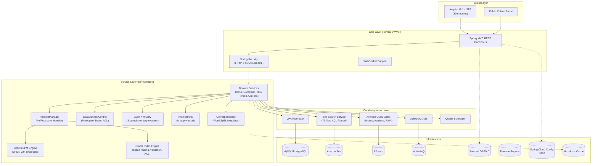

# ArkCase Competitive Analysis -- Merged Report

**Date:** 2026-03-13
**Sources:** Codebase analysis (GitHub ArkCase/ArkCase), website/marketing walkthrough (arkcase.com), documentation/release notes research, 15 feature specs

---

## 1. Executive Summary

ArkCase is an open-source case management platform built by Armedia (now ArkCase LLC), targeting US government agencies for FOIA processing, privacy/SAR requests, legal case management, complaint handling, correspondence, docket management, and matter management. It is licensed under LGPL v3 with a dual commercial license.

**Who uses it:** US federal agencies (DOJ, EEOC, OPM, DHS-affiliated), state governments (Washington State Legislature), law enforcement (Victoria Police Department), and some international government bodies (UAE). It holds FedRAMP and StateRAMP authorization -- the highest US government cloud security certifications.

**Key differentiators vs. the market:**
- 10+ years of government case management refinement with proven deployments
- Deep FOIA specialization (32 DOJ-mandated reports, exemption codes, redaction, reading rooms)
- FedRAMP/StateRAMP authorization (years to obtain, major barrier to entry)
- Comprehensive platform: 55+ backend services, 30 frontend modules, 29 tool integrations
- Open-source Community Edition alongside commercial Enterprise Edition

**Key differentiators vs. Procest specifically:**
- Mature but aging (Java 8, AngularJS 1.x EOL) -- Procest has a modern stack advantage
- US-centric -- no EU/Dutch compliance (WOO, ZGW, GEMMA, Archiefwet)
- Extremely complex deployment (7+ services) vs. Procest's Nextcloud app model
- Low community engagement (62 GitHub stars) despite being open-source

---

## 2. Tech Stack

| Layer | ArkCase | Notes |
|-------|---------|-------|
| **Language** | Java 8 (not tested on 9+) | 66.4% of codebase |
| **Backend Framework** | Spring Framework (MVC, Security, Data) | Spring Cloud Config for configuration |
| **Frontend** | AngularJS 1.x (EOL Dec 2021) | Separate repo, Grunt build, SCSS |
| **Build** | Maven 3.5+ multi-module | `mvn -DskipITs clean install` |
| **ORM** | JPA / Hibernate (javax.persistence) | Single-table inheritance for entity extension |
| **Workflow Engine** | Activiti BPM (embedded in WAR) | BPMN 2.0 XML process definitions |
| **Rules Engine** | Drools | .drl files for queue routing, validation, ACL |
| **Search** | Apache Solr | Full-text + faceted search, ACL-filtered |
| **Document Storage** | Alfresco (CMIS protocol) | Versioning, folder structures, records management |
| **Message Broker** | Apache ActiveMQ | Async events, cross-service messaging |
| **Database** | MySQL / PostgreSQL / MariaDB | Via Vagrant VM or Kubernetes |
| **App Server** | Apache Tomcat 9 (TLS on 8843) | Monolithic WAR deployment |
| **Caching** | Hazelcast | Distributed cache |
| **Reporting** | Pentaho CE / Enterprise | Canned + ad-hoc reports, dashboards |
| **Auth** | LDAP / Active Directory / Spring Security | Group-to-role mapping |
| **Document Viewer** | Snowbound VirtualViewer / PDFTron | Annotation + redaction (Enterprise) |
| **Online Editing** | OnlyOffice + WOPI (Office Online) | Plugins |
| **AI** | ArkCase Illume (Enterprise only) | PII redaction, OCR, NLP, transcription |
| **Dev Environment** | Vagrant VM (VirtualBox) | 16GB RAM, 50GB disk minimum |

**Infrastructure footprint:** ArkCase requires a minimum of 7 running services (ArkCase/Tomcat, Solr, Alfresco, ActiveMQ, Samba/LDAP, PostgreSQL/MariaDB, Pentaho) plus Spring Cloud Config Server. No unified docker-compose exists. Helm charts are Kubernetes-only. The Vagrant VM is 11GB and first startup takes 5-10 minutes.

---

## 3. Feature Map

| Feature | Category | Maturity | Relevance to Procest |
|---------|----------|----------|---------------------|
| Case file CRUD with auto-numbering | Core | High -- 10+ years | **Critical** -- must match |
| Queue-based case routing (Drools) | Workflow | High | **High** -- adapt for WOO status flows |
| Case merge and split | Core | High | **Medium** -- useful for complex zaakafhandeling |
| BPMN 2.0 workflow execution (Activiti) | Workflow | High | **Low** -- n8n replaces this |
| Pipeline pre/post-save handlers | Architecture | High | **High** -- study pattern for PHP event hooks |
| Participant-based row-level ACL | Security | High | **Critical** -- zaakafhandeling needs this |
| Functional access control (role-to-group) | Security | High | **Medium** -- Nextcloud has equivalent |
| Complaint intake and management | Core | High | **High** -- direct feature parity needed |
| FOIA processing (exemptions, redaction) | Domain | Very High | **Low** -- US-specific, but WOO equivalent exists |
| Public citizen portal (self-service) | Portal | High | **High** -- burgerportaal is essential |
| Portal user self-registration | Portal | Medium | **Medium** -- via Nextcloud registration |
| Request status tracking (portal) | Portal | High | **High** -- citizens must track zaken |
| Reading room (public documents) | Portal | Medium | **Low** -- Dutch equivalent unclear |
| Alfresco CMIS document management | ECM | High | **Low** -- Nextcloud Files is superior |
| Automatic folder structure per case | ECM | High | **High** -- useful pattern to adopt |
| Document versioning | ECM | High | **Low** -- Nextcloud has this |
| Online editing (OnlyOffice/WOPI) | ECM | Medium | **Low** -- Nextcloud has this |
| Full-text search with ACL filtering | Search | High | **High** -- OpenRegister + Solr/ES |
| OCR processing | AI/Doc | Medium | **Medium** -- Docudesk provides this |
| Audio/video transcription | AI/Doc | Medium (Enterprise) | **Low** -- niche feature |
| PII auto-redaction | AI/Security | Medium (Enterprise) | **Medium** -- AVG compliance value |
| Document redaction/annotation | ECM | High (Enterprise) | **Medium** -- useful for WOO |
| Comprehensive audit trail (DB + logs) | Compliance | High | **Critical** -- Archiefwet requires this |
| Field-level change tracking | Compliance | High | **High** -- government audit needs |
| PII masking in logs | Compliance | Medium | **Medium** -- AVG compliance |
| Request correlation (requestId) | Compliance | Medium | **Medium** -- debugging value |
| Correspondence templates (Word/SpEL) | Communication | High | **High** -- government letter generation |
| Email integration (send/receive) | Communication | Medium (buggy) | **Medium** -- Nextcloud Mail exists |
| Notification system (in-app + email) | Communication | High | **Medium** -- Nextcloud Notifications |
| Time tracking / timesheets | Billing | High | **Low** -- not core for Dutch zaakafhandeling |
| Cost tracking / billing | Billing | High | **Low** -- not core |
| Invoice generation (TouchNet) | Billing | Medium | **Low** -- not relevant |
| Calendar + Exchange integration | Productivity | Medium | **Low** -- Nextcloud Calendar |
| Milestones per case | Tracking | High | **Medium** -- useful for deadline tracking |
| Object tagging | Organization | Medium | **Low** -- Nextcloud tags exist |
| User subscriptions to objects | Notification | Medium | **Low** -- Nextcloud follow feature |
| Person/organization management | CRM | High | **High** -- needed for zaakafhandeling |
| Consultation management (inter-dept) | Collaboration | Medium | **Medium** -- advisering pattern |
| Object associations (cross-references) | Data | High | **High** -- OpenRegister relations |
| Dashboards (configurable widgets) | Reporting | High | **High** -- MyDash provides this |
| Canned + ad-hoc reports (Pentaho) | Reporting | High | **Medium** -- n8n or custom |
| Records management (DoD 5015.2) | Compliance | High | **Medium** -- Archiefwet equivalent |
| eDiscovery (ZyLAB/Relativity) | Legal | Medium | **Low** -- not relevant for Dutch gov |
| Electronic signatures | Legal | Medium | **Low** -- niche |
| Pessimistic object locking | Concurrency | Medium | **Low** -- Nextcloud handles this |
| Sequence/auto-numbering manager | Core | High | **High** -- zaaknummer generation |
| WebDAV file access | ECM | Medium | **Low** -- Nextcloud native |
| Outlook integration | Productivity | Medium | **Low** -- not priority |
| AWS Comprehend Medical NLP | AI | Low | **Low** -- not relevant |
| Hazelcast distributed caching | Infra | Medium | **Low** -- Nextcloud APCu/Redis |

---

## 4. Architecture Overview

### Key Architectural Patterns

1. **Plugin Architecture**: Core entities (CaseFile, Complaint, Task) live in `acm-plugins`. Extra integrations (Outlook, OnlyOffice, Records Management) are separate plugins.
2. **Pipeline Manager**: Every entity save goes through ordered pre-save and post-save handlers, allowing modular behavior injection without modifying core logic.
3. **Drools Rules**: Business rules in `.drl` files govern queue transitions, validation, access control, and process selection -- separating business logic from code.
4. **Event-Driven**: Spring `ApplicationEvent` for cross-cutting concerns (audit, notifications, search indexing, history recording).
5. **Entity Inheritance**: `FOIARequest` extends `CaseFile` via JPA single-table inheritance, adding domain-specific fields while reusing all case management infrastructure.

---

## 5. Strengths

### 5.1 Mature Domain Model
Ten years of iterating on government case management has produced a comprehensive data model. The `CaseFile` entity alone has 25+ fields covering everything from priority and due dates to court assignments and security classifications. Person/organization associations, milestones, and object associations provide rich relationship modeling.

### 5.2 Pipeline Pattern
The `PipelineManager<T, Context>` with ordered pre/post-save handlers is an excellent architectural pattern. It allows behaviors like folder creation, PDF generation, workflow initiation, and Outlook sync to be added/removed/reordered without touching the core save logic. Handlers support rollback in reverse order on failure.

### 5.3 Two-Tier Access Control
The combination of participant-based row-level security (who can see/edit this specific case) and role-based functional access (who can use the "Create Case" feature) is well-designed. ACL filters are injected into Solr queries so search results automatically respect permissions. This is the gold standard for case management security.

### 5.4 Queue-Based Workflow
Named queues (Intake, Fulfill, Approve, Hold, Billing, Release) with Drools-governed transitions provide a clear, auditable case routing model. The separation of "what transitions are allowed" (rules) from "what happens during transition" (side effects) is clean.

### 5.5 Comprehensive Audit
Three complementary audit systems (database events, log files, object history) with PII masking and request correlation provide the kind of thorough audit trail that government compliance demands.

### 5.6 Portal Gateway with SPI
The pluggable portal architecture (service provider interfaces for FOIA, Privacy) allows different case types to customize their citizen-facing experience while sharing infrastructure. Self-registration, status tracking, and document download are built in.

### 5.7 Automatic Folder Structures
When a case is created, a standardized folder hierarchy (Documents, Evidence, Correspondence, Working Files) is automatically created in the document store. This enforces organizational consistency across all cases.

### 5.8 Government Compliance Certifications
FedRAMP, StateRAMP, ISO 27001, HIPAA, SOC2, DoD 5015.2 -- these certifications represent years of security investment that are very difficult to replicate.

---

## 6. Weaknesses

### 6.1 Severely Aging Technology
- **AngularJS 1.x** frontend has been end-of-life since December 2021 -- no security patches, no ecosystem
- **Java 8** only (not tested on Java 9+) -- four major LTS versions behind (Java 21 is current)
- **Node 6** referenced for macOS builds -- absurdly outdated
- **Grunt** build system for frontend -- superseded by Webpack/Vite years ago
- No evidence of migration plans to modern frameworks

### 6.2 Infrastructure Complexity
Minimum deployment requires 7+ separate services: Tomcat, Solr, Alfresco, ActiveMQ, Samba/LDAP, PostgreSQL/MariaDB, Pentaho, plus Spring Cloud Config Server. No docker-compose exists. The Vagrant VM needs 16GB RAM and 50GB disk. This makes evaluation, development, and operations all significantly harder than necessary.

### 6.3 No European/Dutch Compliance
- No WOO (Wet Open Overheid) support
- No ZGW/GEMMA standards
- No Archiefwet compliance
- No AVG/GDPR-specific features
- No Dutch language support visible
- All exemption codes, report formats, and workflows are US-specific (DOJ, NARA)

### 6.4 Dual License Feature Lock
Enterprise-only features include: AI capabilities (PII redaction, OCR, NLP), full document redaction, HA/clustering, Pentaho Business Analytics, and the Forms Designer. The Community Edition is deliberately limited to drive commercial sales.

### 6.5 Technical Debt Indicators
- Recurring UI refresh bugs across release notes
- PDFTron document viewer issues in every release
- Email integration has persistent problems
- Date/timezone calculation bugs
- 100+ bug fixes per release suggests quality challenges
- Only 62 GitHub stars, 40 forks -- minimal community contribution

### 6.6 Tight Coupling
- **Alfresco dependency**: CMIS document storage is deeply integrated with no alternative backends
- **Activiti dependency**: Workflow engine embedded in the WAR, impossible to swap
- **LDAP dependency**: Authentication tightly coupled to LDAP/AD
- Monolithic WAR deployment on Tomcat -- no microservices or container-native architecture

### 6.7 Poor Developer Experience
- No online demo available (must set up Vagrant VM or Kubernetes cluster)
- Complex multi-repo development (backend + frontend in separate repos)
- No hot-reload or modern DX features
- Most development appears to happen in private GitLab (GitHub releases stopped in 2021)

---

## 7. Key Takeaways for Procest

### 7.1 Features Worth Adopting

| Feature | Priority | Rationale |
|---------|----------|-----------|
| **Participant-based case ACL** | **High** | Row-level security on zaken is essential for government. Assign participants (behandelaar, groep, medewerker) with specific privileges per zaak. |
| **Automatic folder structures per case** | **High** | When a zaak is created, auto-create standardized sub-folders in Nextcloud Files (Documenten, Correspondentie, Bijlagen). Enforces consistency. |
| **Comprehensive audit trail** | **High** | Three-layer approach: database events, activity log, field-level change tracking. Archiefwet and AVG require this. Include IP address, request correlation, and PII masking. |
| **Queue-based status routing** | **High** | Named statuses with configurable allowed transitions (Intake -> Behandeling -> Beoordeling -> Afgehandeld). Validate transitions with business rules. |
| **Citizen portal (status tracking)** | **High** | Public-facing API for citizens to submit requests and track status. ArkCase's SPI pattern is good -- let different zaaktypes customize their portal behavior. |
| **Case auto-numbering** | **High** | Configurable sequence generation for zaaknummers. OpenRegister can provide this. |
| **Correspondence templates** | **Medium** | Template-based letter/document generation (beschikkingen, ontvangstbevestigingen). ArkCase uses Word + SpEL; Procest could use Docudesk. |
| **Person/organization management** | **Medium** | Linked people and organizations per case with role types (aanvrager, behandelaar, betrokkene). |
| **Case merge** | **Medium** | Ability to merge duplicate zaken, moving all documents and associations to the target. |
| **Milestones and deadline tracking** | **Medium** | Track key dates per zaak (ontvangstdatum, wettelijke termijn, verlengingsdatum) with alerts. |
| **Configurable case types** | **Medium** | Different zaaktypes with different fields, workflows, and folder structures. OpenRegister schemas enable this. |
| **PII masking in logs** | **Medium** | AVG compliance requires that BSN, names, and addresses are masked in log files. |
| **Document redaction** | **Low** | Useful for WOO (Wet Open Overheid) but can be deferred. Basic PDF redaction would suffice initially. |
| **Case split** | **Low** | Splitting a zaak into two is rare in Dutch practice. Implement later if needed. |
| **Inter-departmental consultation** | **Low** | Advisering between departments. Can be handled with Nextcloud Talk + tasks initially. |

### 7.2 Patterns Worth Studying

| Pattern | What to Study | How to Adapt for Procest |
|---------|--------------|--------------------------|
| **Pipeline Manager** | Pre/post-save handler chains with ordering and rollback. Allows modular lifecycle hooks without modifying core save logic. | Implement as PHP event subscribers with priority ordering. Nextcloud's `IEventDispatcher` supports priority, but consider a more explicit PipelineManager class for entity saves. |
| **Participant-Based ACL** | Each object has a list of participants with types (assignee, owning group, follower) and privileges (read, write, delete). ACL filters injected into search queries. | Map to OpenRegister object-level ACL. Participant types become Nextcloud users/groups with explicit roles per zaak. Search filtering via OpenRegister query filters. |
| **Queue/Status State Machine** | Drools rules define valid transitions. Separate "is this transition allowed?" from "what happens during transition?" from "what are the side effects?" | Implement as a PHP state machine (symfony/workflow or custom). Define allowed transitions in zaaktype configuration. Side effects via n8n webhook triggers. |
| **Event-Driven Cross-Cutting** | Domain events (CaseCreated, StatusChanged) trigger audit logging, notifications, search indexing, and history recording via listeners. | Already available in Nextcloud/PHP. Ensure all zaak mutations emit events. Register listeners for audit, notification, and search indexing. |
| **Portal SPI** | Service provider interfaces let different case types customize their portal behavior while sharing infrastructure. | Define a PHP interface that zaaktypes implement for their public-facing API. Each zaaktype registers its portal provider. |
| **Folder Structure Templates** | Configurable per case type. Auto-created on case creation via post-save handler. | Store folder templates in zaaktype configuration. Use a post-create event listener to create the Nextcloud folder structure. |

### 7.3 Mistakes to Avoid

| Mistake | What ArkCase Did | What Procest Should Do |
|---------|-----------------|----------------------|
| **Over-engineering infrastructure** | Required 7+ external services (Solr, Alfresco, ActiveMQ, Pentaho, LDAP, Config Server). Each adds operational complexity, failure modes, and deployment cost. | Leverage Nextcloud's built-in capabilities (Files, Search, Auth, Calendar, Notifications). Only add external services when Nextcloud genuinely cannot do it (n8n for workflows, Elasticsearch for advanced search). |
| **Monolithic WAR deployment** | Single WAR on Tomcat with everything bundled. No ability to scale individual services. | Stay as a Nextcloud app. If scaling is needed, Nextcloud supports clustering natively. |
| **Tight coupling to specific vendors** | Alfresco for documents, Activiti for workflows, Pentaho for reports. Switching any of these would require massive refactoring. | Keep integrations behind interfaces/abstractions. n8n workflows should be called via a workflow service abstraction, not directly. |
| **Separate frontend repo** | Backend (Java) and frontend (AngularJS) in different repositories with different build systems. Makes full-stack development painful. | Keep frontend (Vue.js) in the same repo as the PHP backend. Single `npm run build` + `composer install`. |
| **Neglecting frontend modernization** | Still on AngularJS 1.x (EOL 2021). No migration path visible. Technical debt compounds annually. | Stay on Nextcloud Vue (Vue 2 -> Vue 3 migration path is clear). Follow Nextcloud's upgrade cycle. |
| **Complex configuration management** | Spring Cloud Config Server + property files + Drools rule files + LDAP configuration. Operators need deep knowledge to configure. | Use Nextcloud IAppConfig for all configuration. Admin UI for zaaktype configuration. No separate config server. |
| **Embedded rules engine** | Drools rules in .drl files are powerful but require Java/Drools expertise to modify. Business users cannot change rules. | Use n8n for business rules that non-developers might need to change. Keep simple validation in PHP code. |
| **Low community investment** | 62 GitHub stars, development moved to private GitLab. Open-source community is effectively dead. | Keep all development on public GitHub. Invest in documentation, contributor guides, and community engagement. |

---

## 8. Feature Gap Analysis

### What ArkCase Has That Procest Lacks

| Feature | ArkCase Implementation | Gap Severity | Recommendation |
|---------|----------------------|--------------|----------------|
| Queue-based case routing | Drools rules + named queues | **High** | Implement status state machine with configurable transitions per zaaktype |
| Participant-based ACL | AcmParticipant with privileges per object | **High** | Build on OpenRegister ACL, add participant types and explicit privilege grants |
| Comprehensive audit trail | DB events + log files + object history | **High** | Implement three-layer audit (DB, activity, field-level diff) |
| Citizen self-service portal | Dedicated portal gateway with SPI | **High** | Build public API routes for zaak submission and status tracking |
| Automatic folder structures | Post-save handler creates sub-folders | **Medium** | Event listener creates Nextcloud folders on zaak creation |
| Correspondence templates | Word/SpEL template engine | **Medium** | Integrate with Docudesk for template-based document generation |
| Case merge/split | Dedicated services with document migration | **Medium** | Implement merge first (more common), split later |
| Person/organization CRM | PersonAssociation, OrganizationAssociation | **Medium** | Model as OpenRegister objects with relations to zaken |
| Milestone/deadline tracking | AcmMilestone entity per case | **Medium** | Add milestone schema to zaaktype, with deadline alerts via n8n |
| Document redaction | PDFTron/Snowbound viewer + AI (Enterprise) | **Low** | Defer; basic PDF annotation could come via Nextcloud apps |
| Time/cost tracking | Dedicated services + billing | **Low** | Not relevant for Dutch zaakafhandeling |
| eDiscovery integration | ZyLAB, Relativity | **Low** | Not relevant |
| Pentaho reporting | Canned + ad-hoc + scheduled reports | **Low** | MyDash + n8n scheduled reports suffice |

### What Procest Has (or Will Have) That ArkCase Lacks

| Feature | Procest Advantage | Why It Matters |
|---------|------------------|----------------|
| **Modern tech stack** | PHP/Vue.js vs Java 8/AngularJS 1.x | Easier hiring, faster development, active ecosystem |
| **Nextcloud ecosystem** | 100+ apps (Files, Talk, Calendar, Mail, Contacts) | Collaboration features come free; no need for Alfresco, Exchange, ActiveMQ |
| **Docker-native deployment** | `docker-compose up` (4GB RAM) | vs. Vagrant VM (16GB RAM, 50GB disk) or Kubernetes |
| **ZGW/GEMMA compliance** | Dutch government standards built-in | ArkCase has zero EU government support |
| **NL Design System** | Government-compliant theming via design tokens | Professional Dutch government look without custom CSS |
| **Multi-tenancy** | Nextcloud groups/circles/organizations | ArkCase is single-tenant |
| **Modern workflow automation** | n8n with visual editor + 400+ integrations | vs. embedded Activiti BPM requiring Java expertise |
| **Schema-driven data model** | OpenRegister flexible schemas | vs. rigid JPA entities requiring code changes |
| **OIDC/SAML support** | Nextcloud native authentication | ArkCase only supports LDAP/AD |
| **Mobile-ready** | Nextcloud mobile apps | ArkCase has no mobile strategy |
| **Real-time collaboration** | Nextcloud Talk, Collabora/OnlyOffice | ArkCase collaboration is limited |
| **App store distribution** | Nextcloud app store for easy installation | ArkCase requires manual deployment |
| **Active open-source community** | Nextcloud has thousands of contributors | ArkCase has 62 GitHub stars |

---

## Summary

ArkCase is a technically mature but aging competitor. Its strengths lie in domain knowledge (10+ years of government case management), comprehensive feature coverage (55+ services), and US government compliance (FedRAMP). Its weaknesses are severe: outdated technology (Java 8, AngularJS 1.x), extreme deployment complexity (7+ services), and zero European relevance.

For Procest, the value in studying ArkCase is not in copying its architecture (which is over-engineered for Nextcloud's context), but in understanding **what features and patterns government case management actually needs**: participant-based ACL, queue-based routing, comprehensive audit trails, citizen portals, automatic folder structures, and correspondence templates. These features should be implemented with Nextcloud-native tools (OpenRegister, n8n, Nextcloud Files) rather than replicating ArkCase's infrastructure-heavy approach.

The biggest strategic takeaway: **ArkCase proves the market exists but cannot serve the European government segment.** Procest can win by offering equivalent case management capabilities on a modern, simple-to-deploy platform with native Dutch government compliance.
