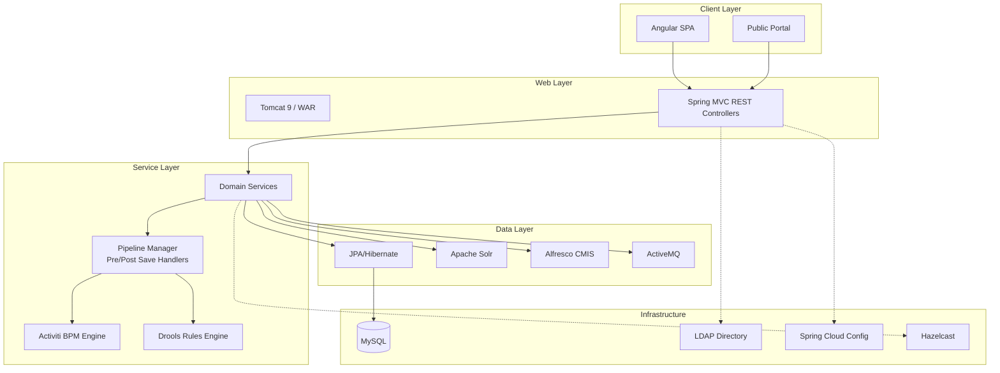

# ArkCase -- Competitive Analysis Overview

## Product Summary

ArkCase is an open-source case management and IT modernization platform built by Armedia (now ArkCase LLC). Originally developed for US government agencies, it targets FOIA (Freedom of Information Act) processing, privacy/SAR requests, legal case management, and general complaint handling. Licensed under LGPL v3 with a dual commercial license option.

## Tech Stack

| Layer | Technology |
|-------|-----------|
| Language | Java 8 (not tested on 9+) |
| Framework | Spring Framework (MVC, Security, Data), Spring Cloud Config |
| Build | Maven 3.5+ multi-module |
| ORM | JPA / Hibernate (javax.persistence) |
| Workflow Engine | Activiti BPM (embedded) |
| Rules Engine | Drools (business rules) |
| Search | Apache Solr |
| Document Management | Alfresco (via CMIS protocol) |
| Message Broker | Apache ActiveMQ |
| Database | MySQL (via Vagrant VM) |
| Frontend | Angular (separate `ark-angular-starter` project, npm/yarn build) |
| App Server | Apache Tomcat 9 |
| Caching | Hazelcast |
| Reporting | Pentaho |
| Config Server | Spring Cloud Config Server (port 9999) |
| Auth | LDAP integration, Spring Security |
| Document Viewer | Snowbound VirtualViewer |

## Architecture



## Module / Package Structure

```
ArkCase/
├── acm-core-api/              # Core interfaces: AcmObject, AcmEntity, AcmStatefulEntity
├── acm-services/              # 55+ shared services
│   ├── acm-service-audit/             # Audit trail (DB + Log4j2)
│   ├── acm-service-billing/           # Invoices, billing items, TouchNet payments
│   ├── acm-service-calendar/          # Calendar + Exchange integration
│   ├── acm-service-correspondence/    # Template-based letter generation (Word/SpEL)
│   ├── acm-service-costsheet/         # Cost tracking per case
│   ├── acm-service-data-access-control/  # Row-level security via participants
│   ├── acm-service-ecm/              # Document/folder management (Alfresco CMIS)
│   ├── acm-service-electronic-signature/ # e-Signatures
│   ├── acm-service-email/             # Email send/receive
│   ├── acm-service-exemption/         # FOIA exemption codes + redaction
│   ├── acm-service-form-configuration/ # Frevvo forms config
│   ├── acm-service-functional-access-control/ # Role-based function access
│   ├── acm-service-history/           # Object history tracking
│   ├── acm-service-labels/            # i18n labels
│   ├── acm-service-milestone/         # Case milestones
│   ├── acm-service-note/              # Notes on objects
│   ├── acm-service-notification/      # In-app + email notifications
│   ├── acm-service-object-lock/       # Pessimistic object locking
│   ├── acm-service-participants/      # Participant/role assignment model
│   ├── acm-service-pipeline/          # Pre-save / post-save handler pipeline
│   ├── acm-service-portal-gateway/    # Public portal API gateway
│   ├── acm-service-search/            # Solr search abstraction (71 files)
│   ├── acm-service-sequence-manager/  # Auto-numbering (case numbers, etc.)
│   ├── acm-service-subscription/      # User subscriptions to objects
│   ├── acm-service-tag/               # Object tagging
│   ├── acm-service-timesheet/         # Time tracking
│   ├── acm-service-transcribe/        # Audio/video transcription
│   ├── acm-service-users/             # User management
│   └── acm-service-webdav/            # WebDAV file access
├── acm-plugins/
│   ├── acm-default-plugins/           # Core domain plugins
│   │   ├── acm-case-file-plugin/      # CORE: Case management
│   │   ├── acm-complaint-plugin/      # CORE: Complaint intake
│   │   ├── acm-task-plugin/           # CORE: Task management (Activiti-backed)
│   │   ├── acm-person-plugin/         # People & organizations
│   │   ├── acm-business-process-plugin/ # Queue-based workflow
│   │   ├── acm-consultation-plugin/   # Inter-departmental consultations
│   │   ├── acm-object-association-plugin/ # Cross-object references
│   │   ├── acm-dashboard-plugin/      # User dashboards
│   │   ├── acm-billing-plugin/        # Billing UI plugin
│   │   ├── acm-admin-plugin/          # Admin panel
│   │   ├── acm-audit-plugin/          # Audit UI plugin
│   │   ├── acm-report-plugin/         # Reporting plugin
│   │   ├── acm-category-plugin/       # Object categorization
│   │   └── acm-document-repository-plugin/ # Document repository
│   └── acm-extra-plugins/
│       ├── acm-alfresco-rma-integration/ # Records management
│       ├── acm-ms-outlook-plugin/     # Outlook integration
│       ├── acm-onlyoffice-plugin/     # OnlyOffice editing
│       ├── acm-wopi-plugin/           # WOPI protocol (Office Online)
│       └── acm-personnel-security-plugin/ # Security clearances
├── acm-standard-applications/
│   ├── arkcase/                       # Base application WAR
│   ├── acm-foia/                      # FOIA module (extends CaseFile)
│   └── acm-privacy/                   # Privacy/SAR module
├── acm-tool-integrations/             # 29 integrations
│   ├── acm-activiti-configuration/    # Activiti BPM config
│   ├── acm-activemq-configuration/    # ActiveMQ config
│   ├── acm-comprehend-medical/        # AWS Comprehend Medical
│   ├── acm-email/                     # Email transport
│   ├── acm-encryption/                # Data encryption
│   ├── acm-ephesoft/                  # OCR/capture
│   ├── acm-hazelcast-integration/     # Distributed caching
│   ├── acm-media-engine/              # Media processing
│   ├── acm-ocr-tool/                  # OCR processing
│   ├── acm-pdf-utilities/             # PDF generation
│   ├── acm-quartz-scheduler/          # Job scheduling
│   ├── acm-report-configuration/      # Pentaho reports
│   ├── acm-transcribe-tool/           # Transcription
│   ├── acm-websockets/                # WebSocket support
│   └── acm-zylab-integration/         # ZyLAB eDiscovery
├── acm-forms/                         # Form definitions
│   ├── acm-form-case-file/
│   ├── acm-form-close-complaint/
│   ├── acm-form-change-case-status/
│   ├── acm-form-cost/
│   ├── acm-form-project/
│   ├── acm-form-time/
│   └── acm-form-report-of-investigation/
├── acm-user-interface/
│   └── ark-angular-starter/           # Angular frontend
├── acm-web/                           # Web configuration
├── acm-jmeter/                        # Performance tests
└── arkcase-lib/                       # Shared libraries
```

## Key Design Patterns

### 1. Pipeline Pattern (Pre-save / Post-save Handlers)
Every entity save goes through a `PipelineManager<T, Context>` with ordered pre-save and post-save handlers. Example for CaseFile:
- **Pre-save**: SetCreator, QueueHandler
- **Post-save**: ContainerHandler, EcmFolderHandler, FolderStructureHandler, RulesHandler, EventHandler, OutlookHandler, StartBusinessProcess, UploadAttachments

This allows modular, pluggable behavior without modifying the core save logic.

### 2. Drools Business Rules
Rules are used for:
- Determining next possible queues for case routing
- Access control decisions
- Save validation
- Business process selection

### 3. Event-Driven Architecture
Spring `ApplicationEvent` for domain events (CaseCreated, ComplaintClosed, TaskCompleted, etc.). Listeners handle cross-cutting concerns like:
- Audit logging
- Notification sending
- History recording
- Solr index updates

### 4. Participant-Based Access Control
Two-tier access control:
- **Data Access Control**: Row-level security via `AcmParticipant` entries per object. Each participant has a type (assignee, owning group, follower, approver) and privileges (read, write, grant, delete).
- **Functional Access Control**: Role-to-group mappings for feature-level permissions.

### 5. Solr Search Integration
Every entity has a `*ToSolrTransformer` that converts JPA entities to Solr documents. Search queries include access control filters based on user groups/roles.

### 6. Entity Inheritance with Discriminator
`CaseFile` is the base entity. `FOIARequest` extends it with FOIA-specific fields. `Complaint` is a separate entity. Both follow the same patterns (participants, containers, person associations, milestones).

### 7. Queue-Based Case Routing
Cases move through named queues (Intake, Fulfill, Approve, Hold, Billing, Release). Queue transitions are governed by Drools rules and trigger business processes.

## Integration Points

| Integration | Protocol | Purpose |
|------------|----------|---------|
| Alfresco | CMIS | Document storage, versioning, records management |
| Solr | HTTP/REST | Full-text + faceted search |
| ActiveMQ | JMS | Async messaging, event distribution |
| LDAP | LDAP/AD | User/group authentication and sync |
| Activiti | Embedded | Workflow execution, task management |
| Pentaho | HTTP | Reporting, analytics |
| Exchange | EWS | Calendar integration |
| Outlook | REST/COM | Email + calendar from Outlook |
| Ephesoft | REST | Document capture, OCR |
| ZyLAB | REST | eDiscovery |
| Snowbound | REST | Document viewing/annotation |
| OnlyOffice/WOPI | WOPI | Online document editing |
| AWS Comprehend | AWS SDK | Medical NLP processing |
| TouchNet | REST | Payment processing |
| Spring Cloud Config | HTTP | Externalized configuration |

## Strengths

1. **Mature domain model** -- 10+ years of government case management refinement
2. **Pipeline pattern** -- Clean extensibility for entity lifecycle hooks
3. **Comprehensive access control** -- Participant-based row-level + role-based functional access
4. **FOIA compliance built-in** -- Exemption codes, redaction, reading rooms, NIEM export, disposition tracking
5. **Rich service ecosystem** -- 55+ services covering billing, timesheets, signatures, correspondence, OCR, transcription
6. **Queue-based workflow** -- Flexible case routing with Drools-governed transitions
7. **Document management integration** -- Deep Alfresco/CMIS integration with folder structures, versioning
8. **Portal gateway** -- Public-facing portal for citizen request submission and status tracking
9. **Audit everything** -- Comprehensive audit trail with event-based logging

## Weaknesses

1. **Java 8 lock-in** -- Not tested on modern Java versions (9+), limiting ecosystem access
2. **Heavy infrastructure requirements** -- Needs Solr, ActiveMQ, Alfresco, MySQL, LDAP, Pentaho, Spring Config Server minimum
3. **Vagrant-based dev setup** -- 16GB RAM, 50GB disk, VirtualBox requirement is heavy
4. **Monolithic WAR deployment** -- Single WAR file on Tomcat, no microservices or container-native deployment
5. **Tight Activiti coupling** -- Workflow engine deeply embedded, hard to swap
6. **Alfresco dependency** -- CMIS document storage is tightly integrated, no alternative backends
7. **Angular frontend separate** -- UI is in a separate project, making full-stack development harder
8. **Complex configuration** -- Spring Cloud Config Server + property files + Drools rules + LDAP = operational complexity
9. **Limited modern API** -- REST controllers are Spring MVC (not WebFlux), no GraphQL, no OpenAPI generation
10. **No multi-tenancy** -- Single-tenant architecture, each deployment is isolated
11. **LGPL license concerns** -- LGPL can be restrictive for SaaS deployments compared to MIT/Apache

## Comparison with Procest (Nextcloud-based)

| Aspect | ArkCase | Procest |
|--------|---------|---------|
| Platform | Standalone Java WAR | Nextcloud app (PHP) |
| Deployment | Tomcat + 6 external services | Docker + Nextcloud container |
| Document Storage | Alfresco (CMIS) | Nextcloud Files (native) |
| Workflow | Activiti BPM (embedded) | n8n (external, via ExApp) |
| Search | Solr (external) | Nextcloud Search / OpenRegister |
| Auth | LDAP + Spring Security | Nextcloud auth (LDAP/SAML/OIDC) |
| Frontend | Separate Angular app | Nextcloud Vue (integrated) |
| Multi-tenancy | No | Via Nextcloud groups/circles |
| Rules Engine | Drools | Business logic in n8n workflows |
| Config | Spring Cloud Config Server | Nextcloud IAppConfig |
| Dev Setup | Vagrant VM (16GB RAM) | Docker Compose (4GB RAM) |
| Government Features | FOIA, Privacy/SAR, exemptions | ZGW/RGBZ compliance (Dutch) |
| License | LGPL v3 (dual) | AGPL v3 |
| Ecosystem | Standalone | Nextcloud app ecosystem (100+ apps) |
