# Access Control -- ArkCase

## Purpose
Competitive analysis spec documenting ArkCase's two-tier access control system: data access (row-level) and functional access (feature-level).

- **Product**: ArkCase
- **Category**: Security / RBAC / ACL
- **Relevance to Procest**: Zaakafhandeling requires fine-grained access to cases. Procest must implement participant-based access similar to ArkCase.

## Architecture Overview
ArkCase uses a dual access control model:
1. **Data Access Control** (row-level): `AcmParticipant` entries on each object define who can read/write/grant/delete
2. **Functional Access Control** (feature-level): Application roles mapped to LDAP groups control which features a user can access

Both are integrated into Solr search (queries are filtered by user's access rights) and Spring Security method-level annotations.

## Data Model

### AcmParticipant (Row-Level Security)
| Field | Type | Description |
|-------|------|-------------|
| id | Long | Participant PK |
| participantType | String | Type (assignee, owning group, follower, approver, reader, etc.) |
| participantLdapId | String | LDAP user or group DN |
| objectId | Long | Parent object ID |
| objectType | String | Parent object type |
| replaceChildrenParticipant | Boolean | Replace child participants |
| privileges | List<AcmParticipantPrivilege> | Granted privileges |

### AcmParticipantPrivilege
| Field | Type | Description |
|-------|------|-------------|
| objectAction | String | Action (read, write, grant, delete, unassign, subscribe) |
| accessType | String | Allow or deny |
| accessReason | String | Reason for access |

### AccessControlRule
| Field | Type | Description |
|-------|------|-------------|
| objectType | String | Entity type this rule applies to |
| participantType | String | Participant type |
| objectSubType | String | Entity subtype |
| accessLevel | List | Allowed access levels |

### Participant Types
- `assignee` -- primary assigned user
- `owning group` -- group responsible for the object
- `follower` -- user following for updates
- `approver` -- designated approver
- `reader` -- read-only access
- `collaborator` -- can edit
- `no access` -- explicitly denied
- `supervisor` -- supervisory access

## Business Logic

```mermaid
flowchart TD
    subgraph "Data Access Control"
        A[Object Created] --> B[Default participants added]
        B --> C[Creator = assignee]
        B --> D[Group = owning group]

        E[Access Check] --> F{ArkPermissionEvaluator}
        F --> G[Check user's participants on object]
        G --> H{Has matching privilege?}
        H -->|Yes| I[Allow access]
        H -->|No| J{Is restricted?}
        J -->|Yes| K[Deny]
        J -->|No| L{Check group membership}
        L --> M[Check LDAP groups against participants]
    end

    subgraph "Functional Access Control"
        N[User logs in] --> O[Resolve LDAP groups]
        O --> P[Map groups to application roles]
        P --> Q[Roles determine available features]
        Q --> R[e.g., CASE_FILES_CREATE, COMPLAINT_VIEW]
    end

    subgraph "Solr Access Filter"
        S[Search request] --> T[SearchAccessControlFields]
        T --> U[Add filter: allow_acl contains user/groups]
        U --> V[Solr returns only accessible docs]
    end

    subgraph "Drools Rules"
        W[Save entity] --> X[AcmAssignedObjectBusinessRule]
        X --> Y[Drools evaluates access rules]
        Y --> Z[Set participant privileges based on rules]
    end
```

### Access Control Services
| Service | Purpose |
|---------|---------|
| `DataAccessControlService` | Core DAC logic |
| `AccessControlRuleChecker` | Evaluates access rules |
| `ArkPermissionEvaluator` | Spring Security integration |
| `AcmPrivilegeService` | Privilege resolution |
| `ParticipantAccessChecker` | Per-participant access check |
| `SearchAccessControlFields` | Solr query filter injection |
| `AcmDataAccessBatchUpdater` | Batch permission recalculation |
| `FunctionalAccessService` | Role-to-group management |

### API Endpoints
| Endpoint | Controller | Operation |
|----------|-----------|-----------|
| GET /access-control-rules | AccessControlRulesAPIController | List rules |
| GET /roles | GetApplicationRolesAPIController | List roles |
| GET /roles-to-groups | GetApplicationRolesToGroupsAPIController | Role mappings |
| PUT /roles-to-groups | SaveApplicationRolesToGroupsAPIController | Update mappings |
| GET /groups-by-privilege | GetGroupsByPrivilegeAPIController | Groups for privilege |
| GET /users-by-privilege-and-group | GetUsersByPrivilegeAndGroupAPIController | Users for role |

## Requirements (as observed)

### REQ-AC-001: Participant-Based Row-Level Security
**Implementation**: Every `AcmAssignedObject` has a list of `AcmParticipant` with privileges.

#### Scenario AC-001a: Only assigned users can edit
- GIVEN a case file with participant "john" as "assignee" with "write" privilege
- WHEN user "jane" (not a participant) tries to edit
- THEN access is denied

### REQ-AC-002: Search Result Filtering
**Implementation**: `SearchAccessControlFields` injects ACL filters into Solr queries.

#### Scenario AC-002a: Search respects permissions
- GIVEN 100 case files exist, user has access to 30
- WHEN the user searches for all case files
- THEN only 30 results are returned

### REQ-AC-003: Restricted Object Flag
**Implementation**: `restricted` boolean on entities triggers heightened access rules.

### REQ-AC-004: Functional Access Control
**Implementation**: LDAP groups mapped to application roles determine feature access.

#### Scenario AC-004a: Role-based feature access
- GIVEN LDAP group "CASE_OFFICERS" is mapped to role "CASE_FILES_CREATE"
- WHEN a user in that group accesses the UI
- THEN they see the "Create Case" button

## Comparison Notes
| Aspect | ArkCase | Procest |
|--------|---------|---------|
| Row-level security | AcmParticipant per object | OpenRegister object-level ACL |
| Feature-level access | Application roles via LDAP groups | Nextcloud groups + capabilities |
| Search filtering | Solr ACL filter injection | OpenRegister query-level access |
| Auth backend | LDAP/AD integration | Nextcloud auth (LDAP/SAML/OIDC) |
| Permission model | Participant type + privileges | Read/Write/Admin per object |
| Restricted mode | Boolean flag with Drools rules | Not yet implemented |
