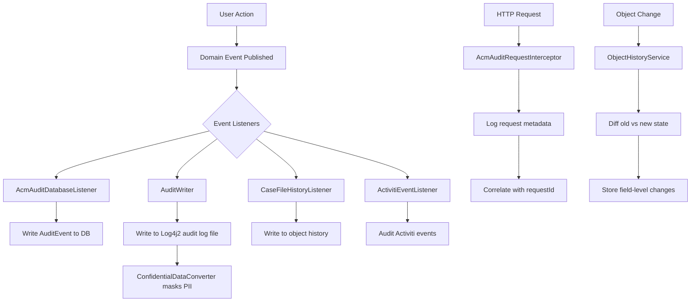

# Audit Trail -- ArkCase

## Purpose
Competitive analysis spec documenting ArkCase's comprehensive audit trail and history tracking.

- **Product**: ArkCase
- **Category**: Audit / compliance
- **Relevance to Procest**: Dutch government compliance (Archiefwet, AVG) requires complete audit trails. Procest must log all actions on cases.

## Architecture Overview
ArkCase has three complementary audit mechanisms:
1. **Audit Service** (`acm-service-audit`): Database-persisted audit events with Log4j2 integration
2. **History Service** (`acm-service-history`): User-facing action history per object
3. **Object History Service** (`acm-service-object-history`): Detailed object change tracking

All three are driven by Spring `ApplicationEvent` listeners that capture domain events.

## Data Model

### AuditEvent
| Field | Type | Description |
|-------|------|-------------|
| id | Long | Audit event PK |
| userId | String | User who performed action |
| fullEventType | String | Full event type string |
| eventDate | Date | When event occurred |
| objectType | String | Object type affected |
| objectId | Long | Object ID affected |
| ipAddress | String | User's IP address |
| status | String | Event status (SUCCESS/FAILURE) |
| eventDescription | String | Human-readable description |
| requestId | String | HTTP request correlation ID |

### Configuration
- `AuditConfig`: Enables/disables audit types
- `AuditEventConfig`: Maps event types to descriptions
- `AuditEventDescriptionConfig`: Configurable event descriptions
- `ConfidentialDataConverter`: Log4j2 converter to mask sensitive data in logs

## Business Logic

### Event Types Audited
- Case file CRUD (created, modified, viewed, deleted)
- Complaint lifecycle events
- Task create/complete/claim/delete
- Document upload/download/delete/version
- User login/logout/failed login
- Queue transitions
- Status changes
- Participant modifications
- Search queries
- Administrative actions

## Requirements (as observed)

### REQ-AT-001: All CRUD Operations Audited
**Implementation**: Spring event listeners on all entity persistence events.

### REQ-AT-002: IP Address Tracking
**Implementation**: `AcmAuditRequestInterceptor` captures source IP.

### REQ-AT-003: PII Masking in Logs
**Implementation**: `ConfidentialDataConverter` in Log4j2 masks sensitive data patterns.

### REQ-AT-004: Request Correlation
**Implementation**: `requestId` links all audit events from a single HTTP request.

### REQ-AT-005: Activiti Process Auditing
**Implementation**: `AcmActivitiEventListener` and `AcmActivitiEntityEventListener` capture BPM events.

## Comparison Notes
| Aspect | ArkCase | Procest |
|--------|---------|---------|
| Audit storage | Database + log files | OpenRegister audit objects + Nextcloud activity |
| Event capture | Spring ApplicationEvent listeners | PHP event listeners |
| PII masking | Log4j2 converter | Not yet implemented |
| Object change tracking | Field-level diff | Not yet implemented |
| Request correlation | requestId header | Nextcloud request ID |
| Compliance | US government (NARA) | Dutch (Archiefwet, AVG) |
