# Billing & Timesheets -- ArkCase

## Purpose
Competitive analysis spec documenting ArkCase's billing, cost tracking, and timesheet management.

- **Product**: ArkCase
- **Category**: Financial tracking
- **Relevance to Procest**: FOIA-style fee tracking is less relevant for Dutch government, but time tracking and cost allocation to cases may be needed for Procest.

## Architecture Overview
Three related services handle financial tracking:
- `acm-service-billing`: Invoice generation, billing items, TouchNet payment integration
- `acm-service-costsheet`: Cost tracking with line items per case
- `acm-service-timesheet`: Time tracking with charge roles

## Data Model

### BillingInvoice
| Field | Type | Description |
|-------|------|-------------|
| invoiceId | Long | Invoice PK |
| parentObjectId | Long | Case/complaint ID |
| parentObjectType | String | CASE_FILE or COMPLAINT |
| invoiceNumber | String | Auto-generated number |
| invoiceDate | Date | Invoice date |
| invoiceItems | List<BillingItem> | Line items |

### BillingItem
| Field | Type | Description |
|-------|------|-------------|
| itemId | Long | Item PK |
| itemDescription | String | Description |
| itemAmount | Double | Amount |
| itemType | String | Type (processing fee, search fee, etc.) |

### AcmTimesheet
| Field | Type | Description |
|-------|------|-------------|
| id | Long | Timesheet PK |
| user | AcmUser | User who logged time |
| status | String | DRAFT, SUBMITTED, APPROVED |
| startDate | Date | Period start |
| endDate | Date | Period end |
| times | List<AcmTime> | Time entries |

### AcmTime
| Field | Type | Description |
|-------|------|-------------|
| objectId | Long | Case/task ID |
| objectType | String | Object type |
| value | Double | Hours |
| type | String | Time type |
| code | String | Charge code |
| chargeRole | String | Charge role |

### AcmCostsheet
| Field | Type | Description |
|-------|------|-------------|
| id | Long | Costsheet PK |
| parentObjectId | Long | Case/task ID |
| parentObjectType | String | Object type |
| user | AcmUser | User |
| status | String | Status |
| costs | List<AcmCost> | Cost entries |

### AcmCost
| Field | Type | Description |
|-------|------|-------------|
| date | Date | Cost date |
| title | String | Cost title |
| amount | Double | Amount |
| description | String | Description |

## Business Logic

```mermaid
flowchart TD
    subgraph "Billing"
        A[Case Processing] --> B[Create BillingItem]
        B --> C[BillingService.createBillingItem]
        C --> D[Item stored + event published]
        D --> E[Create BillingInvoice]
        E --> F[BillingInvoiceBusinessRule validates]
        F --> G[Generate invoice PDF]
        G --> H{Payment}
        H --> I[TouchNet payment gateway]
        I --> J[Mark as paid]
    end

    subgraph "Timesheets"
        K[User logs time] --> L[Create AcmTimesheet]
        L --> M[Add AcmTime entries per case]
        M --> N[Submit for approval]
        N --> O[Activiti approval workflow]
        O --> P{Approve/Deny}
        P -->|Approve| Q[TimesheetBillingListener]
        Q --> R[Create BillingItem from timesheet]
    end

    subgraph "Costsheets"
        S[User logs cost] --> T[Create AcmCostsheet]
        T --> U[Add AcmCost entries]
        U --> V[Submit for approval]
        V --> W[CostsheetBillingListener]
        W --> X[Create BillingItem from costsheet]
    end
```

### Payment Integration
`TouchNetService` integrates with TouchNet payment gateway for FOIA fee processing.

### Charge Roles
Timesheets support configurable charge roles (`TimesheetChargeRolesConfig`) to categorize work types (e.g., Legal Review, Document Processing, Administrative).

## Requirements (as observed)

### REQ-BT-001: Time Tracking Per Case
**Implementation**: AcmTime entries linked to parent objects (cases, tasks).

### REQ-BT-002: Timesheet Approval Workflow
**Implementation**: Activiti workflow for timesheet submission and approval.

### REQ-BT-003: Invoice Generation
**Implementation**: BillingService creates invoices from billing items with PDF generation.

### REQ-BT-004: Payment Processing
**Implementation**: TouchNet integration for online payment.

### REQ-BT-005: Timesheet-to-Billing Bridge
**Implementation**: `TimesheetBillingListener` automatically creates billing items from approved timesheets.

## Comparison Notes
| Aspect | ArkCase | Procest |
|--------|---------|---------|
| Time tracking | Built-in timesheets | Not planned initially |
| Cost tracking | Built-in costsheets | Not planned initially |
| Billing/invoicing | Built-in + payment gateway | Not planned |
| Approval workflow | Activiti-based | n8n-based if needed |
| Charge roles | Configurable | N/A |
| Payment | TouchNet integration | N/A |
