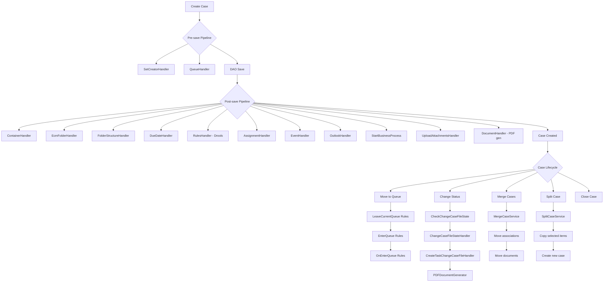

# Case Management -- ArkCase

## Purpose
Competitive analysis spec documenting how ArkCase implements its core case management functionality (CaseFile entity and lifecycle).

- **Product**: ArkCase
- **Category**: Core case management
- **Relevance to Procest**: This is the primary competitor feature -- Procest must match or exceed CaseFile functionality.

## Architecture Overview
The case management module is built around the `CaseFile` JPA entity (`acm_case_file` table) with a plugin-based architecture. The `acm-case-file-plugin` contains the model, DAO, services, pipeline handlers, controllers, and Solr transformers. CaseFile is extensible via JPA single-table inheritance (the FOIA module extends it as `FOIARequest`).

Save operations go through a `PipelineManager<CaseFile, CaseFilePipelineContext>` with ordered pre-save and post-save handlers.

## Data Model
| Entity/Field | Type | Description |
|-------------|------|-------------|
| CaseFile.id | Long | Auto-generated PK (table generator) |
| CaseFile.caseNumber | String | Auto-sequenced case number |
| CaseFile.caseType | String | Configurable case type |
| CaseFile.title | String | Case title (min 1 char) |
| CaseFile.status | String | Status (defaults to "DRAFT") |
| CaseFile.details | Lob/String | Full case description |
| CaseFile.caseDetailsSummary | Lob/String | Summary text |
| CaseFile.priority | String | Priority level |
| CaseFile.incidentDate | Date | Date of the incident |
| CaseFile.dueDate | Date | Due date |
| CaseFile.closed | Date | Closure date |
| CaseFile.disposition | String | Disposition code |
| CaseFile.external | boolean | External flag |
| CaseFile.restricted | Boolean | Restricted access flag |
| CaseFile.deniedFlag | Boolean | Denied flag |
| CaseFile.courtroomName | String | Courtroom name |
| CaseFile.responsibleOrganization | String | Responsible org |
| CaseFile.nextCourtDate | Date | Next court date |
| CaseFile.securityField | String | Security classification |
| CaseFile.legacySystemId | String | Legacy system reference |
| CaseFile.queueEnterDate | LocalDateTime | When case entered current queue |
| CaseFile.responseDueDate | LocalDate | Response due date |
| CaseFile.participants | List<AcmParticipant> | Access control list |
| CaseFile.personAssociations | List<PersonAssociation> | People linked to case |
| CaseFile.organizationAssociations | List<OrganizationAssociation> | Orgs linked to case |
| CaseFile.milestones | List<AcmMilestone> | Read-only milestones |
| CaseFile.childObjects | Collection<ObjectAssociation> | Related objects |
| CaseFile.container | AcmContainer | Document folder reference |
| CaseFile.queue | AcmQueue | Current queue |
| CaseFile.previousQueue | AcmQueue | Previous queue |
| CaseFile.lock | AcmObjectLock | Pessimistic lock |
| CaseFile.changeCaseStatus | ChangeCaseStatus | Transient: status change request |
| CaseFile.approvers | List<String> | Transient: workflow approvers |

### Key Relationships
- CaseFile -> AcmParticipant (OneToMany, cascade ALL, orphanRemoval)
- CaseFile -> PersonAssociation (OneToMany, cascade ALL, orphanRemoval, ordered by created ASC)
- CaseFile -> OrganizationAssociation (OneToMany, cascade ALL, orphanRemoval)
- CaseFile -> AcmMilestone (OneToMany, read-only)
- CaseFile -> ObjectAssociation (OneToMany, cascade PERSIST+REFRESH)
- CaseFile -> AcmContainer (OneToOne)
- CaseFile -> AcmQueue (ManyToOne, cascade ALL)
- CaseFile -> AcmObjectLock (OneToOne, cascade REMOVE)

## Business Logic

### Queue-Based Workflow
Cases flow through named queues. Queue transitions are governed by Drools rules:
1. `CaseFileNextPossibleQueuesBusinessRule` -- determines allowed next queues
2. `LeaveCurrentQueueBusinessRule` -- validates leaving current queue
3. `EnterQueueBusinessRule` -- validates entering new queue
4. `OnEnterQueueBusinessRule` / `OnLeaveQueueBusinessRule` -- side effects

### Case Operations
| Operation | Controller | Service |
|-----------|-----------|---------|
| Create/Update | SaveCaseFileAPIController | SaveCaseServiceImpl (pipeline) |
| Get by ID | FindCaseByIdAPIController | GetCaseServiceImpl |
| Get by Number | GetCaseByNumberAPIController | GetCaseByNumberServiceImpl |
| List by User | ListCaseFilesByUserAPIController | (Solr-based) |
| Change Status | ChangeCaseStatusApiController | ChangeCaseFileStateService |
| Merge | MergeCaseFilesAPIController | MergeCaseServiceImpl |
| Split | SplitCaseFilesAPIController | SplitCaseServiceImpl |
| Enqueue | CaseFileEnqueueAPIController | EnqueueCaseFileServiceImpl |
| Next Queues | CaseFileNextPossibleQueuesAPIController | (Drools rules) |
| Children Tasks | QueryCaseFileChildrenTasksAPIController | CaseFileTasksServiceImpl |
| By Status | GetCasesByStatusAPIController | (Solr-based) |
| Status Summary | GetCaseFileStatusSummaryAPIController | (aggregation) |

## Requirements (as observed)

### REQ-CA-001: Case Auto-Numbering
**Implementation**: Uses `@AcmSequence(sequenceName = "caseNumberSequence")` for automatic case number generation via the `acm-service-sequence-manager`.

#### Scenario CA-001a: New case receives unique number
- GIVEN a user creates a new case file
- WHEN the case is saved for the first time
- THEN a unique case number is auto-generated in the format defined by the sequence configuration

### REQ-CA-002: Default Status
**Implementation**: `@PrePersist` sets status to "DRAFT" if not provided.

#### Scenario CA-002a: Case defaults to DRAFT
- GIVEN a case file is being created with no status set
- WHEN the entity is persisted
- THEN the status is automatically set to "DRAFT"

### REQ-CA-003: Queue-Based Routing
**Implementation**: Cases move through named queues using Drools business rules.

#### Scenario CA-003a: Case moves to next queue
- GIVEN a case file is in queue "Intake"
- WHEN an authorized user requests to move it to "Fulfill"
- THEN Drools rules validate the transition is allowed
- AND the `queueEnterDate` is updated
- AND the `previousQueue` is set

### REQ-CA-004: Case Merge
**Implementation**: `MergeCaseServiceImpl` combines two cases, moving documents and associations.

#### Scenario CA-004a: Merge source into target
- GIVEN two active case files exist
- WHEN the merge operation is initiated
- THEN all person/org associations are moved to the target
- AND all documents are moved to the target folder
- AND the source case is marked as merged

### REQ-CA-005: Case Split
**Implementation**: `SplitCaseServiceImpl` creates a new case from selected items of an existing case.

#### Scenario CA-005a: Split selected items into new case
- GIVEN an active case file with multiple documents and associations
- WHEN a split operation selects specific items
- THEN a new case is created with the selected items
- AND the originals remain in the source case (copy, not move)

### REQ-CA-006: Pessimistic Locking
**Implementation**: `AcmObjectLock` entity linked to CaseFile via `@OneToOne`.

#### Scenario CA-006a: Concurrent edit prevention
- GIVEN a user opens a case for editing
- WHEN the case is locked
- THEN other users cannot modify the case until it is unlocked

### REQ-CA-007: Document Folder Structure
**Implementation**: Post-save `CaseFileFolderStructureHandler` creates standardized folder hierarchy in Alfresco via CMIS.

### REQ-CA-008: Restricted Access
**Implementation**: `restricted` boolean flag enables heightened access controls via Drools rules.

## Comparison Notes
| Aspect | ArkCase | Procest |
|--------|---------|---------|
| Entity model | JPA entity with 25+ fields | OpenRegister schema-based objects |
| Auto-numbering | Custom sequence manager | OpenRegister sequence generation |
| Status workflow | Queue-based with Drools rules | n8n workflow-driven status transitions |
| Document storage | Alfresco/CMIS folders | Nextcloud Files |
| Case merge/split | Built-in service | Not yet implemented |
| Locking | Pessimistic (AcmObjectLock) | Nextcloud file locking |
| Extensibility | JPA inheritance (FOIARequest extends CaseFile) | Schema-based (flexible properties) |
| Pipeline pattern | Pre/post-save handlers | Event listeners in PHP |
