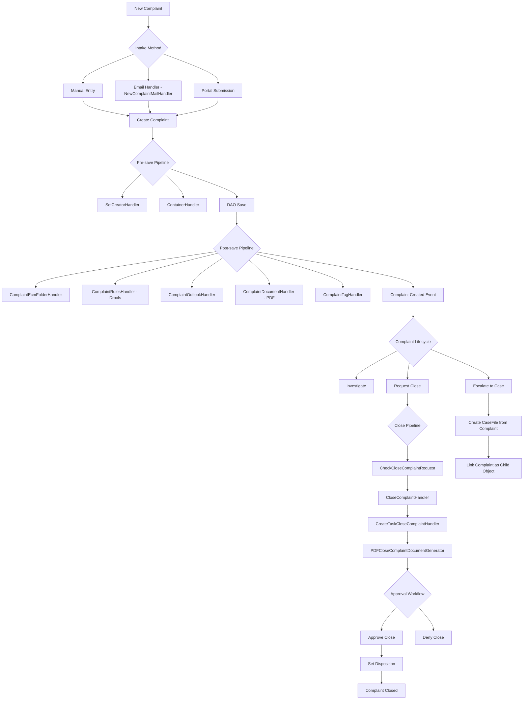

# Complaint Management -- ArkCase

## Purpose
Competitive analysis spec documenting how ArkCase implements complaint intake and management, which is the entry point for most case management workflows.

- **Product**: ArkCase
- **Category**: Complaint / intake management
- **Relevance to Procest**: In Dutch government zaakafhandeling, complaints ("klachten") and requests ("verzoeken") are primary intake channels. Procest needs an equivalent intake mechanism.

## Architecture Overview
The complaint module (`acm-complaint-plugin`) is a separate plugin from case files. Complaints have their own entity, lifecycle, and pipeline. Complaints can be converted to cases (complaint -> case file escalation). The module supports close/approval workflows via Activiti business processes.

## Data Model
| Entity/Field | Type | Description |
|-------------|------|-------------|
| Complaint.complaintId | Long | Auto-generated PK |
| Complaint.complaintNumber | String | Auto-sequenced |
| Complaint.complaintType | String | Type classification |
| Complaint.priority | String | Priority level |
| Complaint.complaintTitle | String | Title (min 1 char) |
| Complaint.details | Lob/String | Full description |
| Complaint.incidentDate | Date | Incident date |
| Complaint.status | String | Status (DRAFT default) |
| Complaint.dueDate | Date | Due date |
| Complaint.tag | String | Tag |
| Complaint.frequency | String | Frequency of complaint |
| Complaint.restricted | Boolean | Restricted access |
| Complaint.legacySystemId | String | Legacy system ref |
| Complaint.disposition | Disposition | Set on approval |
| Complaint.addresses | List<PostalAddress> | Postal addresses |
| Complaint.defaultAddress | PostalAddress | Primary address |
| Complaint.personAssociations | List<PersonAssociation> | People (initiator, subjects) |
| Complaint.organizationAssociations | List<OrganizationAssociation> | Organizations |
| Complaint.participants | List<AcmParticipant> | Access control |
| Complaint.container | AcmContainer | Document folder |
| Complaint.childObjects | Collection<ObjectAssociation> | Related objects |
| Complaint.approvers | List<String> | Transient: workflow approvers |

### Disposition Entity
| Field | Type | Description |
|-------|------|-------------|
| dispositionType | String | Type of disposition |
| existingCaseType | String | Existing case type (for referral) |
| referExternalContactMethod | String | External contact method |
| referExternalOrganization | String | External organization |
| closeDate | Date | When complaint was closed |

### Close Complaint Request
| Field | Type | Description |
|-------|------|-------------|
| complaintId | Long | Parent complaint |
| disposition | Disposition | Requested disposition |
| status | String | Request status |

## Business Logic

### Close Complaint Workflow
The close complaint process involves:
1. User submits `CloseComplaintRequest` with proposed `Disposition`
2. Pre-save validation (`CheckCloseComplaintRequest`)
3. Activiti business process starts with assigned approvers
4. Approval/denial triggers `CloseComplaintRequestProcessEndHandler`
5. On approval: disposition is set on the complaint, status changes to CLOSED

## Requirements (as observed)

### REQ-CM-001: Email-Based Complaint Creation
**Implementation**: `NewComplaintMailHandler` processes incoming emails and creates complaints automatically.

#### Scenario CM-001a: Email creates complaint
- GIVEN an email is received at the complaint intake address
- WHEN the email handler processes it
- THEN a new complaint is created with email body as details
- AND the sender is set as the initiator

### REQ-CM-002: Complaint-to-Case Escalation
**Implementation**: Complaints can create child CaseFile objects via `ObjectAssociation`.

#### Scenario CM-002a: Escalate complaint to case
- GIVEN an active complaint requires further investigation
- WHEN the user escalates it to a case
- THEN a new CaseFile is created
- AND the complaint is linked as a parent object

### REQ-CM-003: Close Complaint with Approval Workflow
**Implementation**: `CloseComplaintService` + Activiti workflow.

#### Scenario CM-003a: Close request requires approval
- GIVEN a complaint is ready to close
- WHEN the user submits a close request with disposition
- THEN an Activiti approval task is created
- AND the designated approvers can approve or deny

### REQ-CM-004: Billing Integration
**Implementation**: `ComplaintBillingInvoiceEmailSenderAPIController` and `ComplaintBillingInvoiceCreatedHandler`.

#### Scenario CM-004a: Invoice for complaint processing
- GIVEN a complaint has associated billing items
- WHEN an invoice is generated
- THEN the invoice PDF is emailed to the complainant

## Comparison Notes
| Aspect | ArkCase | Procest |
|--------|---------|---------|
| Intake channels | Manual, email, portal | Manual, n8n webhook, form |
| Close workflow | Activiti approval process | n8n workflow |
| Complaint-to-case | Object association link | Register object relations |
| Disposition tracking | Dedicated entity | Status + metadata fields |
| Billing | Built-in invoice generation | Not planned |
| Email intake | Built-in mail handler | n8n email trigger |
