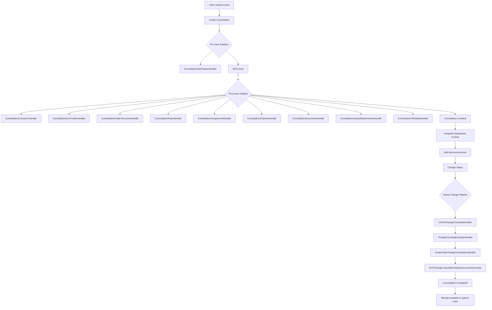

# Consultation Management -- ArkCase

## Purpose
Competitive analysis spec documenting ArkCase's consultation feature for inter-departmental coordination on cases.

- **Product**: ArkCase
- **Category**: Inter-departmental consultation
- **Relevance to Procest**: Dutch government cases often require consultation between departments (adviesaanvraag). Procest needs similar functionality.

## Architecture Overview
The `acm-consultation-plugin` is structurally very similar to the case file plugin. A `Consultation` entity represents a request for input from another department or team regarding an existing case. Consultations have their own lifecycle, pipeline, status changes, and task management -- essentially a "mini-case" that is linked to a parent case.

## Data Model
| Entity/Field | Type | Description |
|-------------|------|-------------|
| Consultation.id | Long | Consultation PK |
| Consultation.consultationNumber | String | Auto-sequenced |
| Consultation.title | String | Title |
| Consultation.consultationType | String | Type |
| Consultation.status | String | Status (DRAFT, IN PROGRESS, COMPLETED) |
| Consultation.details | Lob/String | Description |
| Consultation.dueDate | Date | Due date |
| Consultation.priority | String | Priority |
| Consultation.restricted | Boolean | Restricted flag |
| Consultation.participants | List<AcmParticipant> | Access control |
| Consultation.personAssociations | List<PersonAssociation> | People |
| Consultation.organizationAssociations | List<OrganizationAssociation> | Organizations |
| Consultation.container | AcmContainer | Document folder |
| Consultation.childObjects | Collection<ObjectAssociation> | Related objects |
| ChangeConsultationStatus | POJO | Status change request |

## Business Logic

### API Controllers
| Endpoint | Controller | Operation |
|----------|-----------|-----------|
| POST /consultations | SaveConsultationAPIController | Create/update |
| GET /consultations/{id} | GetConsultationAPIController | Get by ID |
| PUT /consultations/status | ChangeConsultationStatusApiController | Change status |
| GET /consultations/types | GetConsultationTypesAPIController | Type lookups |
| GET /consultations/by-status | GetConsultationByStatusAPIController | Filter by status |
| GET /consultations/{id}/tasks | QueryConsultationChildrenTasksAPIController | Child tasks |

## Requirements (as observed)

### REQ-CN-001: Linked Consultation Creation
**Implementation**: Consultations linked to parent cases via ObjectAssociation.

### REQ-CN-002: Independent Lifecycle
**Implementation**: Full pipeline with own status, tasks, and document management.

### REQ-CN-003: Status Change with Approval
**Implementation**: Status changes go through approval pipeline with PDF generation.

### REQ-CN-004: Department Assignment
**Implementation**: Participants model assigns consultation to target department group.

## Comparison Notes
| Aspect | ArkCase | Procest |
|--------|---------|---------|
| Consultation model | Dedicated entity | OpenRegister linked object |
| Lifecycle | Full pipeline (mirrors case) | n8n sub-workflow |
| Document management | Own Alfresco folder | Shared Nextcloud folder |
| Assignment | Participant-based | Group-based via OpenRegister |
| Status tracking | Independent status + events | Status field on object |
