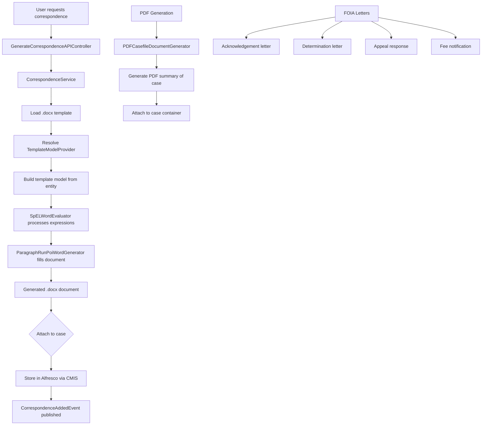

# Correspondence & Template Generation -- ArkCase

## Purpose
Competitive analysis spec documenting ArkCase's correspondence generation system for official letters and documents.

- **Product**: ArkCase
- **Category**: Document generation / correspondence
- **Relevance to Procest**: Dutch government zaakafhandeling requires generating official letters (beschikkingen, brieven). Procest needs template-based document generation.

## Architecture Overview
The `acm-service-correspondence` module generates Word documents from `.docx` templates using SpEL (Spring Expression Language) expressions as merge fields. The `ParagraphRunPoiWordGenerator` processes templates with Apache POI. Each entity type has a `TemplateModelProvider` that exposes entity data as template variables.

Additionally, dedicated PDF generators exist for specific documents:
- `PDFCasefileDocumentGenerator` -- case summary PDF
- `PDFCloseComplaintDocumentGenerator` -- complaint closure PDF
- `PDFChangeCaseFileStateDocumentGenerator` -- status change PDF
- `FOIADocumentGeneratorService` -- FOIA-specific letters
- `AcknowledgementDocumentService` -- acknowledgement letters

## Data Model

### CorrespondenceTemplate
| Field | Type | Description |
|-------|------|-------------|
| templateFilename | String | Template file name |
| objectType | String | Applicable object type |
| templateType | String | Template category |
| label | String | Display label |
| templateVersion | String | Version |
| templateVersionActive | Boolean | Active version flag |
| activatedBy | String | Who activated it |
| activatedDate | Date | When activated |

### FormattedMergeTerm
| Field | Type | Description |
|-------|------|-------------|
| spELExpression | String | SpEL expression |
| formattedRuns | List<FormattedRun> | Formatting |

### TemplateModelProviders
- `CaseFileTemplateModelProvider` -- exposes case data
- `ComplaintTemplateModelProvider` -- exposes complaint data
- `TaskTemplateModelProvider` -- exposes task data
- `ConsultationTemplateModelProvider` -- exposes consultation data

## Business Logic

### SpEL Expression Examples
Templates contain SpEL expressions like:
- `#{caseFile.caseNumber}` -- case number
- `#{caseFile.title}` -- case title
- `#{originator.person.givenName}` -- initiator's first name
- `#{assignee.fullName}` -- assigned user's name
- `#{caseFile.dueDate}` -- due date formatted

## Requirements (as observed)

### REQ-CT-001: Template-Based Document Generation
**Implementation**: `.docx` templates with SpEL merge fields processed by Apache POI.

### REQ-CT-002: Template Versioning
**Implementation**: Templates have versions; only the active version is used.

### REQ-CT-003: Auto-Attach to Case
**Implementation**: Generated documents automatically stored in case's Alfresco folder.

### REQ-CT-004: PDF Summary Generation
**Implementation**: Automatic PDF generation on case creation and status changes.

### REQ-CT-005: Multiple Template Types
**Implementation**: Templates categorized by object type and template type.

## Comparison Notes
| Aspect | ArkCase | Procest |
|--------|---------|---------|
| Template format | .docx (Word) with SpEL | TBD -- Docudesk integration |
| Template engine | Apache POI + SpEL | n8n + Docudesk ExApp |
| PDF generation | Built-in per entity type | Docudesk PDF generation |
| Template versioning | Built-in | Not yet planned |
| Auto-attach | Stores in Alfresco | Store in Nextcloud Files |
| FOIA-specific letters | Acknowledgement, determination, etc. | Dutch: beschikking, ontvangstbevestiging |
