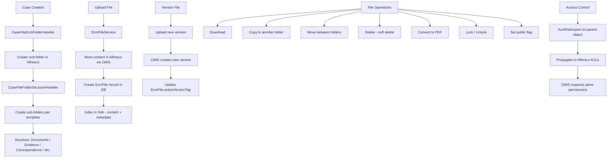

# Document Management -- ArkCase

## Purpose
Competitive analysis spec documenting ArkCase's Enterprise Content Management (ECM) integration via Alfresco CMIS.

- **Product**: ArkCase
- **Category**: Document / file management
- **Relevance to Procest**: Procest has native Nextcloud file storage; understanding ArkCase's ECM patterns reveals feature gaps and architectural differences.

## Architecture Overview
The `acm-service-ecm` module provides document and folder management via CMIS protocol to Alfresco. Every parent object (CaseFile, Complaint, Task) has an `AcmContainer` that references a root folder in Alfresco. Files (`EcmFile`) are tracked in the ArkCase database with metadata while the actual content lives in Alfresco. Versioning, participant-based permissions, and folder structure templates are built-in.

## Data Model
| Entity/Field | Type | Description |
|-------------|------|-------------|
| AcmContainer.id | Long | Container PK |
| AcmContainer.containerObjectId | Long | Parent object ID |
| AcmContainer.containerObjectType | String | Parent object type |
| AcmContainer.containerObjectTitle | String | Parent title |
| AcmContainer.folder | AcmFolder | Root folder reference |
| EcmFile.fileId | Long | File PK |
| EcmFile.fileName | String | Display name |
| EcmFile.fileType | String | Logical type (attachment, evidence, etc.) |
| EcmFile.fileMimeType | String | MIME type |
| EcmFile.fileActiveVersionMimeType | String | Active version MIME |
| EcmFile.fileActiveVersionNameExtension | String | File extension |
| EcmFile.fileStatus | String | Status (ACTIVE, DELETED) |
| EcmFile.cmisRepositoryId | String | CMIS repo identifier |
| EcmFile.versionSeriesId | String | CMIS version series |
| EcmFile.activeVersionTag | String | Current version tag |
| EcmFile.category | String | Document category |
| EcmFile.pageCount | Integer | Number of pages |
| EcmFile.securityField | String | Security classification |
| AcmFolder.id | Long | Folder PK |
| AcmFolder.name | String | Folder name |
| AcmFolder.cmisFolderId | String | CMIS folder ID |
| AcmFolder.parentFolder | AcmFolder | Parent folder ref |
| AcmFolder.participantType | String | Default participant type |

## Business Logic

### Folder Structure Templates
When a case is created, predefined sub-folders are automatically created:
- Root folder (named by case number)
  - Documents
  - Evidence
  - Correspondence
  - Working Files
  - (Configurable per case type)

### File Services
| Service | Purpose |
|---------|---------|
| `acm-service-ecm` | Core file/folder CRUD |
| `acm-service-convert-file` | File format conversion |
| `acm-service-convert-folder` | Bulk folder conversion |
| `acm-service-compress-folder` | ZIP compression |
| `acm-service-ocr` | OCR processing |
| `acm-service-transcribe` | Audio/video transcription |
| `acm-service-media-engine` | Media processing |
| `acm-service-webdav` | WebDAV access |
| `acm-onlyoffice-plugin` | Online editing |
| `acm-wopi-plugin` | WOPI editing (Office Online) |

## Requirements (as observed)

### REQ-DM-001: Automatic Folder Structure
**Implementation**: `CaseFileFolderStructureHandler` and `ComplaintEcmFolderHandler` create folder hierarchies in Alfresco.

### REQ-DM-002: Document Versioning
**Implementation**: CMIS version series tracking with `activeVersionTag` in EcmFile.

### REQ-DM-003: Full-Text Search
**Implementation**: Document content is indexed in Solr via `EcmFileContentIndexedEvent`.

### REQ-DM-004: File Format Conversion
**Implementation**: Dedicated `acm-service-convert-file` for PDF conversion and other formats.

### REQ-DM-005: Online Document Editing
**Implementation**: OnlyOffice and WOPI plugins for in-browser editing.

### REQ-DM-006: Records Management
**Implementation**: `acm-alfresco-rma-integration` for Alfresco Records Management.

## Comparison Notes
| Aspect | ArkCase | Procest |
|--------|---------|---------|
| Storage backend | Alfresco (CMIS) | Nextcloud Files (native) |
| Versioning | CMIS version series | Nextcloud file versions |
| Online editing | OnlyOffice/WOPI plugins | Nextcloud OnlyOffice/Collabora |
| Folder templates | Auto-created per case type | Manual / n8n automation |
| OCR | Dedicated service (Ephesoft) | Docudesk ExApp |
| Full-text search | Solr indexing | Nextcloud search |
| WebDAV | Dedicated service | Nextcloud native WebDAV |
| Records management | Alfresco RMA | Not implemented |
| Access control | Propagated to Alfresco ACLs | Nextcloud sharing |
