# FOIA Compliance -- ArkCase

## Purpose
Competitive analysis spec documenting ArkCase's Freedom of Information Act (FOIA) processing module, the platform's flagship government compliance feature.

- **Product**: ArkCase
- **Category**: Government compliance / FOIA
- **Relevance to Procest**: While Procest targets Dutch government (WOB/WOO rather than FOIA), the patterns for government information request processing are very similar. FOIA implementation reveals best practices for request lifecycle, exemptions, redaction, and public reading rooms.

## Architecture Overview
The FOIA module (`acm-standard-applications/acm-foia`) extends the base CaseFile entity as `FOIARequest` using JPA single-table inheritance. It adds 30+ FOIA-specific fields and a complete set of services for FOIA-specific operations including request intake via public portal, queue-based processing, exemption tracking, document redaction, correspondence generation, billing/fees, and NIEM export.

A parallel `acm-privacy` module handles Privacy Act / Subject Access Requests (SAR) with a similar architecture.

## Data Model
| Entity/Field | Type | Description |
|-------------|------|-------------|
| FOIARequest (extends CaseFile) | Entity | FOIA request entity |
| receivedDate | LocalDateTime | Date received |
| finalReplyDate | LocalDate | Final reply deadline |
| scannedDate | LocalDate | Date request was scanned |
| releasedDate | LocalDateTime | Date response released |
| billingEnterDate | LocalDateTime | When entered billing queue |
| holdEnterDate | LocalDateTime | When put on hold |
| expediteFlag | Boolean | Expedited processing request |
| amendmentFlag | Boolean | Amendment request |
| feeWaiverFlag | Boolean | Fee waiver request |
| litigationFlag | Boolean | Related to litigation |
| requestType | String | FOIA, PA, or both |
| requestSubType | String | New, Appeal, Referral, Consultation |
| requestCategory | String | Category (Individual, Organization, Media, etc.) |
| componentAgency | String | Component/agency |
| returnReason | String | Reason for return |
| requestSource | String | Source (online, mail, etc.) |
| dispositionSubtype | String | Disposition subtype |
| paidFlag | Boolean | Fees paid |
| publicFlag | Boolean | Public reading room flag |
| deliveryMethodOfResponse | String | Mail, email, portal, etc. |
| recordSearchDateFrom | LocalDateTime | Record search start date |
| recordSearchDateTo | LocalDateTime | Record search end date |
| dispositionClosedDate | LocalDateTime | Disposition close date |
| processingFeeWaive | double | Fee waiver amount |
| requestFeeWaiveReason | String | Waiver justification |
| payFee | String | Fee amount |
| requestExpediteReason | String | Expedite justification |
| requestAmendmentDetails | String | Amendment details |
| requestTrack | String | Processing track (Simple, Complex, Expedited) |
| otherReason | String | Other reason text |
| extensionFlag | Boolean | Extension granted |
| notificationGroup | String | Notification group |
| externalIdentifier | String | External tracking number |
| tollingFlag | Boolean | Clock tolling flag |
| limitedDeliveryFlag | boolean | Limited delivery |
| generatedZipFlag | Boolean | ZIP file generated |
| declaredAsRecord | Boolean | Declared as record |
| dispositionReasons | List<DispositionReason> | Disposition justifications |

### ExemptionCode
| Field | Type | Description |
|-------|------|-------------|
| exemptionCode | String | Code (e.g., b(1), b(6), b(7)(A)) |
| fileId | Long | Document reference |
| fileVersion | String | Document version |
| parentObjectId | Long | Case/request ID |
| parentObjectType | String | Object type |

### ExemptionStatute
| Field | Type | Description |
|-------|------|-------------|
| statuteCode | String | Statute code |
| statuteDescription | String | Description |
| parentObjectId | Long | Case reference |

### Queue-Time-To-Complete Configuration
| Field | Type | Description |
|-------|------|-------------|
| queueName | String | Queue name |
| daysToComplete | Integer | SLA days |
| includeWeekends | Boolean | Count weekends |

## Business Logic

```mermaid
flowchart TD
    subgraph "FOIA Request Intake"
        A[Public Portal] --> A1[PortalFOIARequest submission]
        A1 --> A2[PortalCreateRequestService]
        A2 --> A3[Create FOIARequest]
        A3 --> A4[Send acknowledgement]

        B[Email] --> B1[Email handler]
        C[Mail] --> C1[Manual entry]
        D[Broker] --> D1[FoiaRequestBrokerConfig - inter-agency]
    end

    subgraph "FOIA Processing Pipeline"
        E[Intake Queue] --> F{Triage}
        F --> F1[Assign track: Simple/Complex/Expedited]
        F --> F2[Set component agency]
        F --> F3[Check for duplicates]

        F1 --> G[Fulfill Queue]
        G --> G1[Search responsive records]
        G1 --> G2[Review documents]
        G2 --> G3[Apply exemptions]
        G3 --> G4[Redact documents]

        G4 --> H{Exemption Codes}
        H --> H1["b(1) - National Security"]
        H --> H2["b(6) - Personal Privacy"]
        H --> H3["b(7)(A) - Law Enforcement"]

        G4 --> I[Approve Queue]
        I --> I1[Supervisory review]
        I1 --> I2[Generate determination letter]
        I2 --> I3[Set disposition]

        I3 --> J{Disposition}
        J --> J1[Full Grant]
        J --> J2[Partial Grant/Partial Denial]
        J --> J3[Full Denial]
        J --> J4[No Records]
        J --> J5[Referred]
        J --> J6[Fee-Related]

        J1 & J2 & J3 --> K[Release Queue]
        K --> K1[Prepare response package]
        K1 --> K2[Generate ZIP if needed]
        K2 --> K3[Send to requester]
        K3 --> K4[Update public reading room if public]

        J4 & J5 & J6 --> L[Complete]
    end

    subgraph "Hold/Billing"
        M[Hold Queue] --> M1[Awaiting fees or clarification]
        M1 --> M2[Tolling clock pauses SLA timer]
        M2 --> M3{Response received?}
        M3 -->|Yes| M4[Resume processing]
        M3 -->|After purge period| M5[Auto-close]

        N[Billing Queue] --> N1[Invoice generated]
        N1 --> N2[TouchNet payment]
        N2 --> N3{Paid?}
        N3 -->|Yes| N4[Resume processing]
        N3 -->|After purge period| N5[Auto-close]
    end

    subgraph "Appeals"
        O[Appeal Filed] --> O1[Create appeal FOIARequest]
        O1 --> O2[Link to original request]
        O2 --> O3[Separate review process]
    end
```

### FOIA-Specific Services
| Service | Purpose |
|---------|---------|
| `FOIARequestService` | Core FOIA request operations |
| `FOIAExemptionService` | Exemption code management |
| `FOIAExemptionStatuteService` | Statute reference management |
| `FOIADocumentGeneratorService` | FOIA-specific letter generation |
| `AcknowledgementDocumentService` | Acknowledgement letters |
| `PortalCreateRequestService` | Public portal intake |
| `PortalRequestService` | Portal request status |
| `RequestAssignmentService` | Auto-assignment logic |
| `RequestFolderStructureService` | FOIA folder templates |
| `RequestResponseFolderService` | Response package management |
| `PublicFlagService` | Reading room management |
| `QueuesTimeToCompleteService` | SLA tracking per queue |
| `NiemExportService` | NIEM XML export for reporting |
| `DeclareRequestAsRecordService` | Records management |
| `ConvertAndCompressResponseFolderFileUpdateService` | Response ZIP |
| `FOIAQueueCorrespondenceService` | Queue-triggered letters |
| `FOIALdapAuthenticationService` | Portal auth |
| `FoiaConfigurationService` | FOIA config management |
| `FoiaDocumentPrintService` | Print support |

### Portal Features
| Feature | Description |
|---------|-------------|
| Request submission | Public form for filing FOIA requests |
| Status tracking | Requester can check request status |
| File upload | Attach supporting documents |
| Response download | Download released documents |
| Inquiry | Submit inquiries about requests |
| Reading room | Access publicly released documents |
| User registration | Portal user self-registration |

## Requirements (as observed)

### REQ-FOIA-001: Public Portal Intake
**Implementation**: `PortalCreateRequestService` creates FOIARequests from public portal submissions.

### REQ-FOIA-002: Exemption Code Tracking
**Implementation**: `ExemptionCode` entities linked to documents track which exemptions were applied to which pages.

### REQ-FOIA-003: SLA Tracking with Tolling
**Implementation**: `tollingFlag` pauses the SLA clock when waiting for requester response.

### REQ-FOIA-004: Document Redaction
**Implementation**: `DocumentExemptionService` + `DocumentRedactionEvent` handle document redaction with exemption code annotation.

### REQ-FOIA-005: NIEM Export
**Implementation**: `NiemExportService` generates NIEM-compliant XML for government reporting.

### REQ-FOIA-006: Reading Room
**Implementation**: `publicFlag` marks released documents for the public reading room portal.

### REQ-FOIA-007: Multi-Track Processing
**Implementation**: `requestTrack` field categorizes requests into Simple, Complex, or Expedited tracks with different SLAs.

### REQ-FOIA-008: Fee Management
**Implementation**: Fee waiver requests, billing queue, TouchNet payment integration.

### REQ-FOIA-009: Appeal Processing
**Implementation**: Appeals are separate FOIARequest entities linked to the original via ObjectAssociation.

### REQ-FOIA-010: Inter-Agency Referral
**Implementation**: `FoiaRequestBrokerConfig` enables request forwarding between agencies.

## Comparison Notes
| Aspect | ArkCase | Procest |
|--------|---------|---------|
| Law compliance | US FOIA (5 USC 552) | Dutch WOO (Wet Open Overheid) |
| Request intake | Public portal + email + mail | Citizen portal + e-forms |
| Exemption tracking | Per-document exemption codes | N/A for WOO (different model) |
| Redaction | Built-in with Snowbound viewer | Docudesk integration |
| SLA tracking | Per-queue with tolling | Planned |
| Public reading room | Built-in portal feature | Not yet planned |
| Reporting format | NIEM XML export | ZGW/StUF reporting |
| Fee management | Billing queue + payment gateway | Not applicable (Dutch gov = free) |
| Appeal processing | Separate linked request | Bezwaar process in Procest |
| Inter-agency | Broker config for referrals | Not yet planned |
