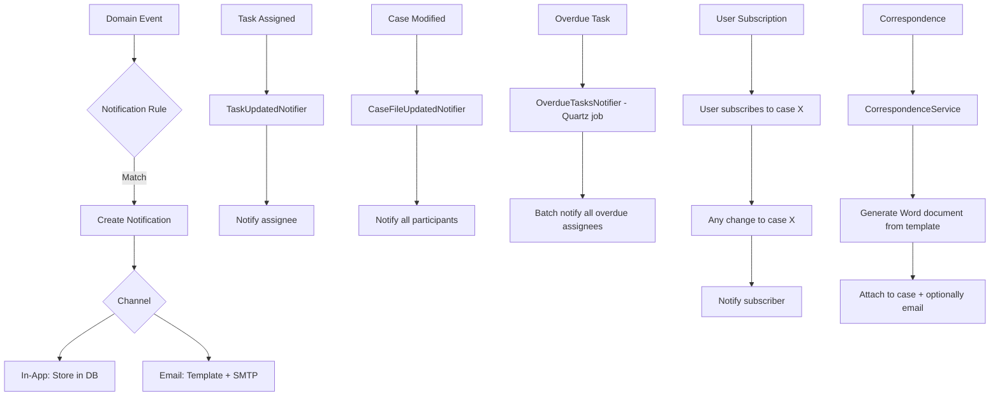

# Notification System -- ArkCase

## Purpose
Competitive analysis spec documenting ArkCase's notification and email system.

- **Product**: ArkCase
- **Category**: Notifications / email
- **Relevance to Procest**: Procest needs to notify users of case updates, task assignments, and deadlines.

## Architecture Overview
ArkCase has a multi-channel notification system:
- **In-app notifications**: `Notification` entity stored in database, shown in UI
- **Email notifications**: SMTP-based email sending with template support
- **Subscription-based**: Users can subscribe to objects for update notifications

The `acm-service-notification` handles in-app notifications. The `acm-service-email` and `acm-service-email-smtp` handle email delivery. `acm-service-subscription` manages user subscriptions.

## Data Model

### Notification
| Field | Type | Description |
|-------|------|-------------|
| id | Long | Notification PK |
| title | String | Notification title |
| note | String | Notification body |
| type | String | Notification type |
| parentType | String | Parent object type |
| parentId | Long | Parent object ID |
| parentName | String | Parent object name |
| parentNumber | String | Parent object number |
| user | String | Target user |
| status | String | Status (NEW, READ) |
| state | String | State |
| action | String | Action that triggered it |
| data | String | Additional data (JSON) |
| emailAddresses | String | Email recipients |

### NotificationConfig
| Field | Type | Description |
|-------|------|-------------|
| userBatchSize | Integer | Batch processing size |
| userBatchRun | Boolean | Enable batch processing |
| purgeDays | Integer | Days to keep notifications |
| notificationsEnabled | Boolean | Global enable/disable |

## Business Logic

### Notification Triggers
- Task created / assigned / completed / overdue / upcoming
- Case created / modified / status changed / closed
- Complaint created / modified / closed
- Document uploaded / deleted
- Participant added / removed
- Queue transition
- Workflow approval needed
- Billing invoice created

### Template System
Email notifications use FreeMarker or SpEL templates with merge fields from entity data. The `CorrespondenceService` generates Word documents from `.docx` templates using SpEL expressions (`ParagraphRunPoiWordGenerator`).

## Requirements (as observed)

### REQ-NS-001: Event-Driven Notifications
**Implementation**: Spring event listeners trigger notification creation based on domain events.

### REQ-NS-002: Template-Based Emails
**Implementation**: Configurable email templates with merge fields.

### REQ-NS-003: User Subscriptions
**Implementation**: `acm-service-subscription` allows users to follow objects.

### REQ-NS-004: Batch Processing
**Implementation**: Notifications processed in batches (`userBatchSize`) for performance.

### REQ-NS-005: Auto-Purge
**Implementation**: Notifications older than `purgeDays` are automatically cleaned up.

## Comparison Notes
| Aspect | ArkCase | Procest |
|--------|---------|---------|
| In-app notifications | Custom Notification entity | Nextcloud Notifications API |
| Email | Built-in SMTP service | n8n email nodes |
| Templates | FreeMarker/SpEL + Word | n8n template rendering |
| Subscriptions | Built-in subscription service | Nextcloud activity app |
| Batch processing | Configurable batch size | Not applicable |
| Scheduled notifications | Quartz jobs | n8n cron triggers |
