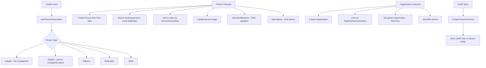

# Person & Organization Management -- ArkCase

## Purpose
Competitive analysis spec documenting ArkCase's person and organization management (contacts, parties, stakeholders).

- **Product**: ArkCase
- **Category**: Contact / party management
- **Relevance to Procest**: Cases involve people (aanvragers, betrokkenen) and organizations. Procest needs similar contact management.

## Architecture Overview
The `acm-person-plugin` manages Person and Organization entities as first-class objects. They are linked to cases/complaints via association entities (`PersonAssociation`, `OrganizationAssociation`) that define the relationship type. The `acm-addressable-plugin` provides `PostalAddress` and `ContactMethod` entities.

## Data Model

### Person
| Field | Type | Description |
|-------|------|-------------|
| id | Long | Person PK |
| title | String | Salutation/title |
| givenName | String | First name |
| middleName | String | Middle name |
| familyName | String | Last name |
| dateOfBirth | LocalDate | Birth date |
| placeOfBirth | String | Birth place |
| status | String | Status |
| hairColor | String | Physical description |
| eyeColor | String | Physical description |
| heightInInches | Integer | Height |
| weightInPounds | Integer | Weight |
| dateMarried | Date | Marriage date |
| company | String | Company name |
| position | String | Job position |
| className | String | JPA discriminator |
| contactMethods | List<ContactMethod> | Phone, email, etc. |
| addresses | List<PostalAddress> | Postal addresses |
| identifications | List<Identification> | IDs (SSN, passport, etc.) |
| personAliases | List<PersonAlias> | Aliases / AKA |
| organizationAssociations | List<PersonOrganizationAssociation> | Org links |
| container | AcmContainer | Document folder |
| participants | List<AcmParticipant> | Access control |
| defaultPhone | ContactMethod | Primary phone |
| defaultEmail | ContactMethod | Primary email |
| defaultUrl | ContactMethod | Primary URL |
| defaultAddress | PostalAddress | Primary address |
| defaultAlias | PersonAlias | Primary alias |
| defaultIdentification | Identification | Primary ID |

### PersonAssociation
| Field | Type | Description |
|-------|------|-------------|
| id | Long | Association PK |
| person | Person | The person |
| personType | String | Role: Initiator, Subject, Witness, Defendant, etc. |
| parentId | Long | Parent object ID |
| parentType | String | Parent object type (CASE_FILE, COMPLAINT) |
| personDescription | String | Description of involvement |
| notes | String | Notes |

### Organization
| Field | Type | Description |
|-------|------|-------------|
| organizationId | Long | Org PK |
| organizationValue | String | Organization name |
| organizationType | String | Type classification |
| addresses | List<PostalAddress> | Addresses |
| contactMethods | List<ContactMethod> | Contact methods |
| identifications | List<Identification> | Identifications |
| dbas | List<OrganizationDBA> | Doing-business-as names |
| parentOrganization | Organization | Parent org reference |

### OrganizationAssociation
| Field | Type | Description |
|-------|------|-------------|
| id | Long | Association PK |
| organization | Organization | The organization |
| associationType | String | Relationship type |
| parentId | Long | Parent object ID |
| parentType | String | Parent object type |
| parentTitle | String | Parent title |

### Identification
| Field | Type | Description |
|-------|------|-------------|
| identificationType | String | Type (SSN, Passport, Driver License) |
| identificationNumber | String | Number |
| identificationYearIssued | Integer | Year issued |
| identificationIssuer | String | Issuing authority |

### ContactMethod
| Field | Type | Description |
|-------|------|-------------|
| type | String | Phone, Email, Fax, URL |
| value | String | The contact value |
| subType | String | Mobile, Home, Work |

### PostalAddress
| Field | Type | Description |
|-------|------|-------------|
| streetAddress | String | Street |
| streetAddress2 | String | Street line 2 |
| city | String | City |
| state | String | State/province |
| zip | String | Postal code |
| country | String | Country |
| type | String | Home, Work, Mailing |

## Business Logic

### Originator Pattern
Both CaseFile and Complaint have a special `getOriginator()` method that finds the PersonAssociation with `personType = "Initiator"`. This is the primary contact/requestor for the case.

### API Controllers
| Endpoint | Controller | Operation |
|----------|-----------|-----------|
| GET /people/{id} | FindPersonAPIController | Get person |
| POST /people | SavePersonAPIController | Create/update person |
| GET /people | ListPersonAPIController | List people |
| DELETE /people/{id} | DeletePersonByPersonIdAPIController | Delete person |
| GET /people/types | GetPersonTypesAPIController | Person type lookups |
| POST /personAssociations | PersonAssociationAPIController | Create/update association |
| DELETE /personAssociations/{id} | DeletePersonAssocByIdAPIController | Delete association |
| POST /organizations | OrganizationAPIController | CRUD organizations |
| POST /organizationAssociations | OrganizationAssociationAPIController | CRUD org associations |

## Requirements (as observed)

### REQ-PO-001: Person-to-Case Association with Roles
**Implementation**: `PersonAssociation` with `personType` field defines the role.

### REQ-PO-002: Organization Hierarchy
**Implementation**: `Organization.parentOrganization` self-referencing ManyToOne.

### REQ-PO-003: Multiple Identification Types
**Implementation**: `Identification` entity supports SSN, passport, driver license, etc.

### REQ-PO-004: Person Image Upload
**Implementation**: `UploadImageRequest` + dedicated image upload endpoint.

### REQ-PO-005: LDAP User to Person Sync
**Implementation**: `CreatePersonFromUser` service creates Person records from LDAP.

### REQ-PO-006: Duplicate Person Prevention
**Implementation**: Search-based deduplication when creating person associations.

## Comparison Notes
| Aspect | ArkCase | Procest |
|--------|---------|---------|
| Person model | Dedicated JPA entity (25+ fields) | OpenRegister schema object |
| Association model | PersonAssociation with role type | OpenRegister object relations |
| Organization | Dedicated entity with hierarchy | OpenRegister schema object |
| Contact methods | Dedicated entity (phone, email, fax) | Schema properties |
| Postal addresses | Dedicated entity | Schema properties |
| Identifications | Dedicated entity (SSN, passport) | Schema properties (BSN in NL) |
| LDAP sync | Built-in person creation | Nextcloud user system |
| Duplicate detection | Search-based | Not yet implemented |
