# Portal Gateway -- ArkCase

## Purpose
Competitive analysis spec documenting ArkCase's public-facing portal for citizen self-service.

- **Product**: ArkCase
- **Category**: Public portal / citizen interface
- **Relevance to Procest**: Dutch government zaakafhandeling requires citizen-facing portals for request submission and status tracking.

## Architecture Overview
The `acm-service-portal-gateway` provides a pluggable API gateway for public-facing portals. It separates internal case management from public-facing services through service provider interfaces. FOIA and Privacy modules implement these interfaces for their specific portal needs.

### Key Interfaces
- `PortalRequestServiceProvider` -- plugin SPI for request handling
- `PortalUserServiceProvider` -- plugin SPI for user management
- `PortalAdminService` -- portal configuration management

## Data Model
| Entity/Field | Type | Description |
|-------------|------|-------------|
| PortalUser.userId | String | Portal user ID |
| PortalUser.firstName | String | First name |
| PortalUser.lastName | String | Last name |
| PortalUser.email | String | Email |
| PortalUser.role | String | User role |
| PortalConfig | Config | Portal configuration |
| PortalUserConfig | Config | User-related portal config |
| PortalUserCredentials | POJO | Login credentials |
| UserRegistrationRequest | POJO | Registration form data |
| UserRegistrationResponse | POJO | Registration result |
| UserResetRequest | POJO | Password reset request |
| UserResetResponse | POJO | Password reset result |

### FOIA Portal Models
| Entity | Description |
|--------|-------------|
| PortalFOIARequest | Public request submission form |
| PortalFOIARequestStatus | Request status for portal display |
| PortalFOIAPerson | Requester information |
| PortalFOIARequestFile | Uploaded file reference |
| PortalFOIAInquiry | Inquiry about a request |
| PortalFOIAReadingRoom | Reading room entry |

## Business Logic

```mermaid
flowchart TD
    subgraph "Portal Gateway"
        A[Public Portal UI] --> B[Portal API Controller]
        B --> C{Authentication}
        C -->|Registered user| D[PortalUserService]
        C -->|Anonymous| E[Limited access]

        D --> F{Operation}
        F --> F1[Submit Request]
        F --> F2[Check Status]
        F --> F3[Upload Documents]
        F --> F4[Download Response]
        F --> F5[Submit Inquiry]
        F --> F6[Browse Reading Room]
    end

    subgraph "User Management"
        G[Self-Registration] --> H[UserRegistrationRequest]
        H --> I[PortalUserService.register]
        I --> J[Create portal user account]
        J --> K[Send verification email]
        K --> L[User verified]

        M[Password Reset] --> N[UserResetRequest]
        N --> O[Send reset link]
    end

    subgraph "Request Lifecycle (Portal View)"
        P[Submit Request] --> Q[PortalRequestService.create]
        Q --> R[Internal FOIARequest created]
        R --> S[Acknowledgement sent]

        T[Check Status] --> U[PortalRequestService.getStatus]
        U --> V[Return PortalFOIARequestStatus]
        V --> W[Show: Received/Processing/Complete]
    end

    subgraph "Security"
        X[Portal Request] --> Y[CheckPortalUserAssignment]
        Y --> Z{Is user authorized for this request?}
        Z -->|Yes| AA[Allow access]
        Z -->|No| AB[Deny access]
    end
```

### API Controllers
| Endpoint | Controller | Operation |
|----------|-----------|-----------|
| POST /portal/requests | ArkCasePortalGatewayRequestAPIController | Submit request |
| GET /portal/requests/{id}/status | ArkCasePortalGatewayRequestAPIController | Check status |
| POST /portal/users/register | ArkCasePortalGatewayUserAPIController | Self-register |
| POST /portal/users/reset | ArkCasePortalGatewayUserAPIController | Reset password |
| GET /portal/admin/config | ArkCasePortalAdminAPIController | Portal config |
| PUT /portal/admin/config | ArkCasePortalAdminAPIController | Update config |

### Security
`CheckPortalUserAssignementAspect` (AOP) validates that portal users can only access their own requests.

## Requirements (as observed)

### REQ-PG-001: Self-Service Request Submission
**Implementation**: Public API endpoint for anonymous or registered users to submit requests.

### REQ-PG-002: Portal User Registration
**Implementation**: Self-registration with email verification.

### REQ-PG-003: Request Status Tracking
**Implementation**: Simplified status view for portal users (hides internal queue details).

### REQ-PG-004: User-Request Authorization
**Implementation**: AOP aspect ensures users only see their own requests.

### REQ-PG-005: Pluggable Architecture
**Implementation**: Service provider interfaces allow different modules (FOIA, Privacy) to implement portal behavior.

## Comparison Notes
| Aspect | ArkCase | Procest |
|--------|---------|---------|
| Portal approach | Dedicated portal gateway service | Nextcloud guest access / Forms |
| User registration | Self-registration with verification | Nextcloud registration |
| Status tracking | Simplified portal status API | OpenRegister public API |
| Architecture | Service provider interfaces (SPI) | Nextcloud app routes |
| Auth | Separate portal auth | Nextcloud auth + public shares |
| Reading room | Built-in public document browser | Not yet planned |
