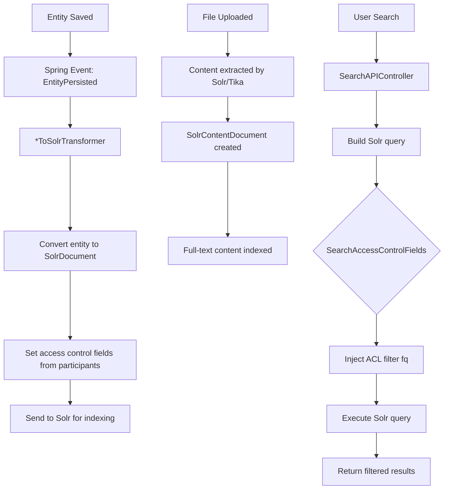

# Search Engine -- ArkCase

## Purpose
Competitive analysis spec documenting ArkCase's Solr-based search system.

- **Product**: ArkCase
- **Category**: Search / indexing
- **Relevance to Procest**: Full-text search across cases, documents, and people is essential. Procest uses OpenRegister search; understanding Solr patterns helps improve it.

## Architecture Overview
The `acm-service-search` module (71 Java files) provides a comprehensive search abstraction over Apache Solr. Every entity type has a `*ToSolrTransformer` that converts JPA entities to Solr documents. Search queries are enhanced with access control filters and support faceting, sorting, pagination, and content extraction.

## Data Model

### SolrAbstractDocument (base)
| Field | Type | Description |
|-------|------|-------------|
| id | String | Composite: objectId-objectType |
| object_id_s | String | Object ID |
| object_type_s | String | Object type |
| name | String | Display name |
| title_parseable | String | Searchable title |
| status_s | String | Status |
| create_date_tdt | Date | Created date |
| modifier_s | String | Last modifier |
| modified_date_tdt | Date | Modified date |
| creator_s | String | Creator |

### SolrAdvancedSearchDocument (full)
Extends base with: object-specific fields, access control fields, parent references, full-text content.

### SolrContentDocument
| Field | Type | Description |
|-------|------|-------------|
| content_type | String | MIME type |
| ecmFileId | String | File reference |
| content | String | Extracted text content |

### Access Control Fields in Solr
| Field | Description |
|-------|-------------|
| allow_user_ls | Users with read access |
| allow_group_ls | Groups with read access |
| deny_user_ls | Users explicitly denied |
| deny_group_ls | Groups explicitly denied |

## Business Logic

### Solr Cores
- **Advanced search core**: Structured metadata for all entity types
- **Quick search core**: Simplified search across common fields
- **Content core**: Full-text document content

### Entity-to-Solr Transformers
Every entity type has a dedicated transformer:
- `CaseFileToSolrTransformer`
- `ComplaintToSolrTransformer`
- `TaskToSolrTransformer`
- `PersonToSolrTransformer`
- `OrganizationToSolrTransformer`
- `EcmFileToSolrTransformer` (file metadata)
- `BillingInvoiceToSolrTransformer`
- `QueueToSolrTransformer`
- `DispositionToSolrTransformer`
- `BusinessProcessToSolrTransformer`
- Plus many more (contact, alias, email, association transformers)

## Requirements (as observed)

### REQ-SE-001: Access-Controlled Search
**Implementation**: Every Solr query is filtered by `allow_user_ls` and `allow_group_ls`.

### REQ-SE-002: Full-Text Content Search
**Implementation**: Document content extracted via Tika and indexed in Solr content core.

### REQ-SE-003: Faceted Search
**Implementation**: Solr faceting on status, type, assignee, date ranges, etc.

### REQ-SE-004: Cross-Entity Search
**Implementation**: Single search query can return cases, complaints, tasks, documents, people.

### REQ-SE-005: Real-Time Indexing
**Implementation**: Entity save events trigger immediate Solr index updates.

## Comparison Notes
| Aspect | ArkCase | Procest |
|--------|---------|---------|
| Search engine | Apache Solr (external) | OpenRegister search / Nextcloud |
| Full-text | Tika content extraction | Not yet implemented |
| Access filtering | Solr fq filters on ACL fields | Query-level access check |
| Faceting | Solr native faceting | OpenRegister faceting config |
| Index strategy | Event-driven per entity save | On-demand |
| Content search | Separate content core | Nextcloud full-text search provider |
