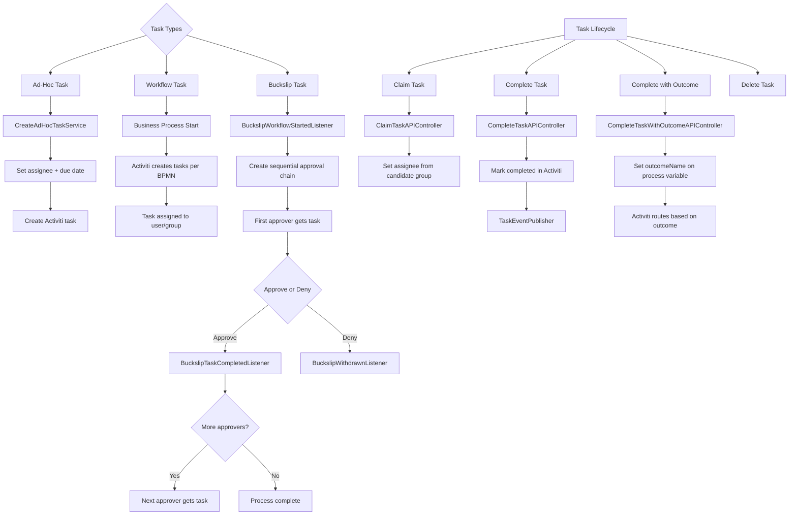

# Task Management -- ArkCase

## Purpose
Competitive analysis spec documenting how ArkCase implements task management via Activiti BPM integration.

- **Product**: ArkCase
- **Category**: Task / workflow management
- **Relevance to Procest**: Tasks are the atomic work units in zaakafhandeling. Procest needs robust task assignment, tracking, and completion.

## Architecture Overview
AcmTask is a POJO (not a JPA entity) that wraps Activiti task instances. The `ActivitiTaskDao` bridges between the Activiti engine and the ArkCase domain model. Tasks can be ad-hoc (standalone) or workflow-driven (part of a business process). A "buckslip" pattern supports sequential approval chains.

## Data Model
| Entity/Field | Type | Description |
|-------------|------|-------------|
| AcmTask.taskId | Long | Activiti task ID |
| AcmTask.title | String | Task title (min 1 char) |
| AcmTask.priority | String | Priority |
| AcmTask.dueDate | Date | Due date (required) |
| AcmTask.status | String | Status |
| AcmTask.pendingStatus | String | Pending status |
| AcmTask.percentComplete | Integer | Progress (0-100) |
| AcmTask.details | String | Description |
| AcmTask.type | String | Task type |
| AcmTask.assignee | String | Current assignee (LDAP ID) |
| AcmTask.owner | String | Creator |
| AcmTask.nextAssignee | String | Next person in workflow |
| AcmTask.adhocTask | boolean | True if standalone task |
| AcmTask.completed | boolean | Completion flag |
| AcmTask.buckslipTask | boolean | Sequential approval task |
| AcmTask.candidateGroups | List<String> | Groups that can claim task |
| AcmTask.attachedToObjectType | String | Parent object type |
| AcmTask.attachedToObjectId | Long | Parent object ID |
| AcmTask.attachedToObjectName | String | Parent object name |
| AcmTask.businessProcessName | String | Workflow name |
| AcmTask.businessProcessId | Long | Process instance ID |
| AcmTask.createDate | Date | Creation date |
| AcmTask.taskStartDate | Date | Start date |
| AcmTask.taskFinishedDate | Date | Completion date |
| AcmTask.taskDurationInMillis | Long | Duration in ms |
| AcmTask.workflowRequestType | String | Workflow request type |
| AcmTask.workflowRequestId | Long | Workflow request ID |
| AcmTask.outcomeName | String | Selected outcome name |
| AcmTask.availableOutcomes | List<TaskOutcome> | Possible outcomes |
| AcmTask.taskOutcome | TaskOutcome | Chosen outcome |
| AcmTask.reworkInstructions | String | Rework instructions |
| AcmTask.documentUnderReview | EcmFile | Document for review |
| AcmTask.documentsToReview | List<EcmFile> | Multiple docs to review |
| AcmTask.childObjects | List<ObjectAssociation> | Related objects |
| AcmTask.participants | List<AcmParticipant> | Access control |
| AcmTask.container | AcmContainer | Document folder |
| AcmTask.buckslipFutureTasks | List<BuckslipFutureTask> | Future approvers in chain |
| AcmTask.buckslipPastApprovers | String | Past approvers (serialized) |
| AcmTask.restricted | Boolean | Restricted flag |

### TaskOutcome
| Field | Type | Description |
|-------|------|-------------|
| name | String | Outcome name (e.g., "APPROVE", "DENY") |
| description | String | Display description |

## Business Logic

### Notification System
- `OverdueTasksNotifier` -- scheduled job notifying assignees of overdue tasks
- `UpcomingTasksNotifier` -- warns about approaching due dates
- `TaskUpdatedNotifier` -- real-time change notifications
- `TaskChangeNotifier` -- general change notifier

### API Controllers
| Endpoint | Controller | Operation |
|----------|-----------|-----------|
| POST /tasks | CreateAdHocTaskAPIController | Create ad-hoc task |
| GET /tasks/{id} | FindTaskByIdAPIController | Get task |
| PUT /tasks | SaveTaskAPIController | Update task |
| DELETE /tasks/{id} | DeleteTaskAPIController | Delete task |
| POST /tasks/{id}/claim | ClaimTaskAPIController | Claim from group |
| POST /tasks/{id}/complete | CompleteTaskAPIController | Complete task |
| POST /tasks/{id}/completeWithOutcome | CompleteTaskWithOutcomeAPIController | Complete with outcome |
| GET /tasks | ListAllTasksAPIController | List all tasks |
| GET /tasks/user | RetrieveTasksAPIController | Tasks for current user |
| GET /tasks/diagram/{processId} | DiagramTaskAPIController | BPMN diagram |
| GET /tasks/history/{processId} | WorkflowHistoryAPIController | Workflow history |
| POST /tasks/businessprocess | CreateBusinessProcessTasksAPIController | Start business process |
| DELETE /tasks/process/{processId} | DeleteProcessInstanceAPIController | Kill process |

## Requirements (as observed)

### REQ-TM-001: Group-Based Task Claiming
**Implementation**: Tasks can have `candidateGroups` -- any member of those groups can claim the task.

#### Scenario TM-001a: User claims task from group queue
- GIVEN a task has candidateGroups = ["OFFICERS_GROUP"]
- WHEN a member of OFFICERS_GROUP claims the task
- THEN the task.assignee is set to that user
- AND the task is no longer visible to other group members

### REQ-TM-002: Buckslip Sequential Approval
**Implementation**: `BuckslipTaskCompletedListener` chains tasks through ordered approvers.

#### Scenario TM-002a: Sequential document approval
- GIVEN a document requires approval from 3 reviewers in order
- WHEN the first reviewer approves
- THEN a new task is created for the second reviewer
- AND buckslipPastApprovers is updated

### REQ-TM-003: Task Outcomes
**Implementation**: `availableOutcomes` list defines possible task outcomes. The selected outcome drives BPMN process routing.

#### Scenario TM-003a: Complete with specific outcome
- GIVEN a review task has outcomes [APPROVE, DENY, REWORK]
- WHEN the user selects REWORK and provides instructions
- THEN the `reworkInstructions` field is set
- AND the workflow routes back to the originator

### REQ-TM-004: Overdue Task Notifications
**Implementation**: `OverdueTaskNotifierJobDescriptor` runs on a schedule via Quartz.

#### Scenario TM-004a: Overdue notification sent
- GIVEN a task has passed its due date
- WHEN the scheduled job runs
- THEN a notification is sent to the assignee and the case owner

## Comparison Notes
| Aspect | ArkCase | Procest |
|--------|---------|---------|
| Task engine | Activiti BPM (embedded) | n8n workflows (external) |
| Task storage | Activiti tables (POJO wrapper) | OpenRegister objects |
| Ad-hoc tasks | Built-in | Planned |
| Buckslip approval | Built-in chain | n8n sequential node execution |
| Task claiming | Group candidate pool | Group-based assignment |
| BPMN diagrams | Live diagram rendering | Not applicable |
| Overdue notifications | Quartz scheduled | n8n cron trigger |
