# Workflow Engine -- ArkCase

## Purpose
Competitive analysis spec documenting ArkCase's Activiti BPM and Drools business rules integration.

- **Product**: ArkCase
- **Category**: Workflow / business process management
- **Relevance to Procest**: Procest uses n8n for workflows. Understanding ArkCase's BPM approach highlights trade-offs between embedded vs external workflow engines.

## Architecture Overview
ArkCase embeds Activiti BPM (predecessor to Flowable/Camunda) for workflow execution and Drools for business rule evaluation. The `acm-business-process-plugin` provides queue management and process coordination. The `acm-activiti-configuration` integration module handles engine configuration. Workflows are defined in BPMN 2.0 XML and executed in-process within the Tomcat JVM.

### Key Components
- **Activiti Engine**: Embedded in the WAR, creates/manages process instances and user tasks
- **Drools Engine**: Evaluates business rules for queue transitions, access control, validation
- **PipelineManager**: Pre/post-save handler chains per entity type
- **Event System**: Spring ApplicationEvent for domain events

## Data Model
| Entity/Field | Type | Description |
|-------------|------|-------------|
| BusinessProcess.id | Long | Process PK |
| BusinessProcess.name | String | Process name |
| BusinessProcess.status | String | Status |
| AcmQueue.id | Long | Queue PK |
| AcmQueue.name | String | Queue name (Intake, Fulfill, etc.) |
| StartBusinessProcessModel | POJO | Process variables + case ref |
| NextPossibleQueuesModel | POJO | Input/output for Drools rule |
| EnterQueueModel | POJO | Queue entry rule input |
| LeaveCurrentQueueModel | POJO | Queue leave rule input |
| OnEnterQueueModel | POJO | Side-effect on entry |
| OnLeaveQueueModel | POJO | Side-effect on leaving |

## Business Logic

```mermaid
flowchart TD
    subgraph "Workflow Patterns"
        A[Sequential Approval] --> A1[Buckslip chain]
        B[Queue-Based Routing] --> B1[Drools determines next queue]
        C[Status Change Workflow] --> C1[Activiti process with approvers]
        D[Close Complaint Workflow] --> D1[Approval + disposition]
        E[FOIA Processing] --> E1[Multi-queue pipeline]
    end

    subgraph "Queue Lifecycle"
        F[Case in Queue A] --> G{NextPossibleQueues Rule}
        G --> H[Allowed: Queue B, Queue C]
        H --> I[User selects Queue B]
        I --> J{LeaveCurrentQueue Rule}
        J -->|Valid| K{EnterQueue Rule}
        K -->|Valid| L[OnLeaveQueue Side-Effects]
        L --> M[Move case to Queue B]
        M --> N[OnEnterQueue Side-Effects]
        N --> O[Update queueEnterDate]
    end

    subgraph "Business Process Start"
        P[Entity Saved] --> Q[PostSave: StartBusinessProcessIfNeeded]
        Q --> R{StartBusinessProcess Rule}
        R -->|businessProcessName set| S[Start Activiti Process]
        S --> T[Process creates user tasks]
        T --> U[Tasks appear in user queues]
    end

    subgraph "Pipeline Pattern"
        V[Controller receives request] --> W[PipelineManager.executeOperation]
        W --> X[Pre-save handlers execute in order]
        X --> Y[DAO.save - JPA persist]
        Y --> Z[Post-save handlers execute in order]
        Z --> AA[Return result]
    end
```

### Drools Rule Integration
Drools rules are loaded from `.drl` files and evaluated at key decision points:

1. **SaveCaseFileBusinessRule** -- validation on save
2. **CaseFileNextPossibleQueuesBusinessRule** -- determine valid next queues
3. **EnterQueueBusinessRule** -- validate queue entry
4. **LeaveCurrentQueueBusinessRule** -- validate queue exit
5. **OnEnterQueueBusinessRule** -- side effects on queue entry
6. **OnLeaveQueueBusinessRule** -- side effects on queue exit
7. **CaseFileStartBusinessProcessBusinessRule** -- decide which BPMN process to start
8. **SplitCaseFileBusinessRule** -- validate case splitting
9. **AcmAssignedObjectBusinessRule** -- access control decisions
10. **TaskBusinessRule** -- task-related rules
11. **BillingInvoiceBusinessRule** -- billing rule validation

### Pipeline Handlers (CaseFile)
**Pre-save:**
1. `CaseFileSetCreatorHandler` -- set creator if new
2. `CaseFileQueueHandler` -- handle queue transitions

**Post-save:**
1. `CaseFileContainerHandler` -- ensure container exists
2. `CaseFileEcmFolderHandler` -- create ECM folder
3. `CaseFileFolderStructureHandler` -- create sub-folders
4. `CaseFileDueDateHandler` -- due date logic
5. `CaseFileRulesHandler` -- execute Drools rules
6. `CaseFileAssignmentHandler` -- handle assignment
7. `CaseFileEventHandler` -- publish events
8. `CaseFileOutlookHandler` -- sync to Outlook
9. `CaseFileStartBusinessProcessIfNeededHandler` -- start BPMN process
10. `CaseFileUploadAttachmentsHandler` -- handle file uploads
11. `CasefileDocumentHandler` -- generate PDF document

## Requirements (as observed)

### REQ-WF-001: Drools-Based Queue Routing
**Implementation**: Drools rules determine valid queue transitions based on case type, status, and user role.

#### Scenario WF-001a: Queue transition validation
- GIVEN a case is in "Intake" queue
- WHEN the user requests move to "Fulfill"
- THEN Drools evaluates `NextPossibleQueuesBusinessRule`
- AND returns "Fulfill" as a valid option
- AND side-effects are executed via `OnLeaveQueueBusinessRule` and `OnEnterQueueBusinessRule`

### REQ-WF-002: BPMN Process Execution
**Implementation**: Activiti engine executes BPMN 2.0 process definitions.

#### Scenario WF-002a: Approval workflow starts on status change
- GIVEN a user requests to change case status
- WHEN approvers are specified
- THEN an Activiti process instance is created
- AND each approver receives a user task with APPROVE/DENY outcomes

### REQ-WF-003: Pipeline Handler Ordering
**Implementation**: `PipelineManager` executes handlers in defined order with rollback support.

#### Scenario WF-003a: Rollback on handler failure
- GIVEN 3 pre-save handlers execute successfully
- WHEN the 4th handler throws PipelineProcessException
- THEN handlers 3, 2, 1 are rolled back in reverse order

## Comparison Notes
| Aspect | ArkCase | Procest |
|--------|---------|---------|
| Workflow engine | Activiti BPM (embedded) | n8n (external ExApp) |
| Process definition | BPMN 2.0 XML | n8n visual workflow editor |
| Rules engine | Drools (DRL files) | n8n conditional logic + PHP |
| Queue management | Named queues with Drools routing | Status-based with n8n triggers |
| Pipeline handlers | Spring-managed ordered list | Nextcloud event listeners |
| Process visibility | BPMN diagram rendering | n8n execution history |
| Rollback support | Per-handler rollback | n8n error handling nodes |
| Hot deployment | Drools rule files | n8n workflow update |
