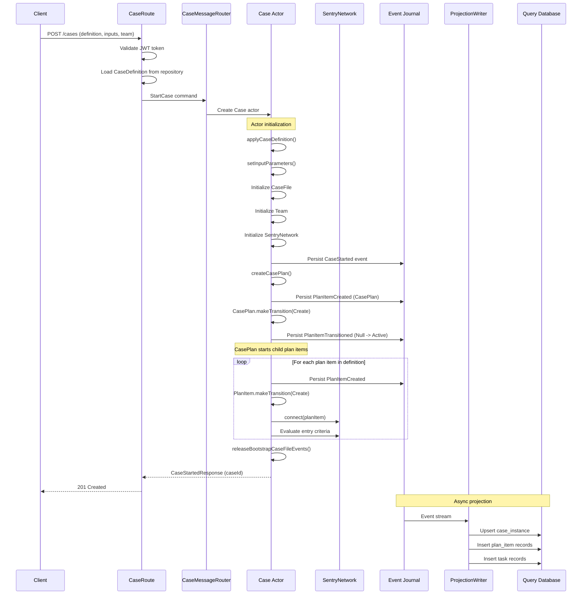
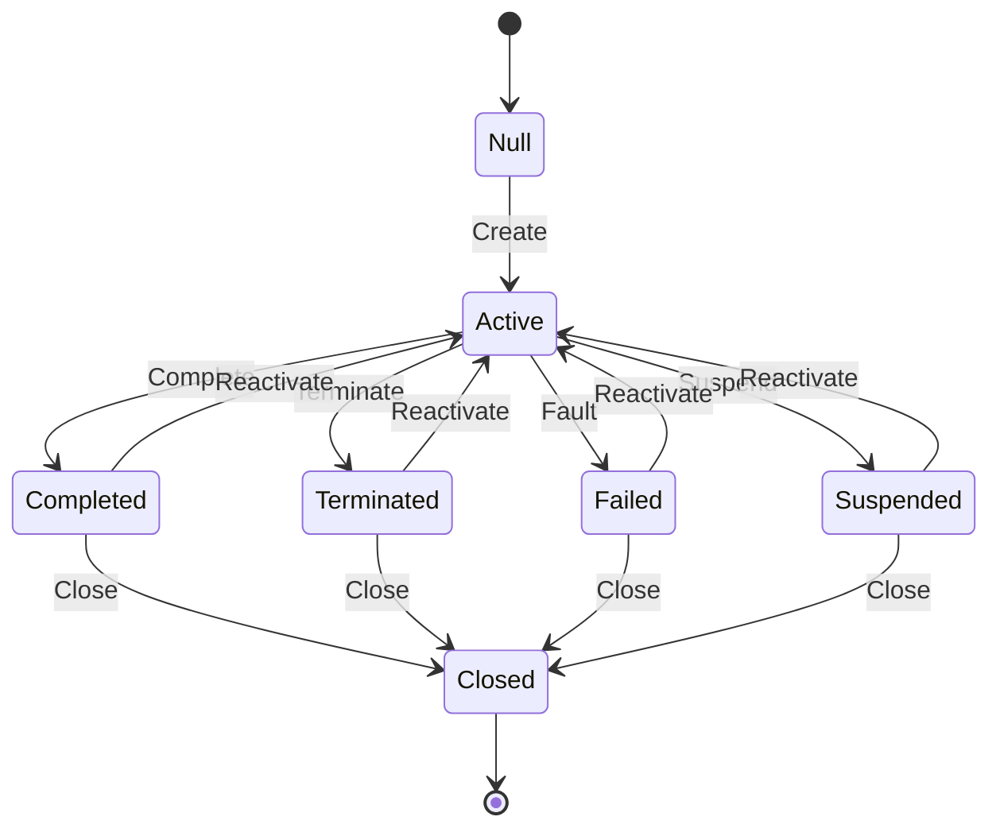
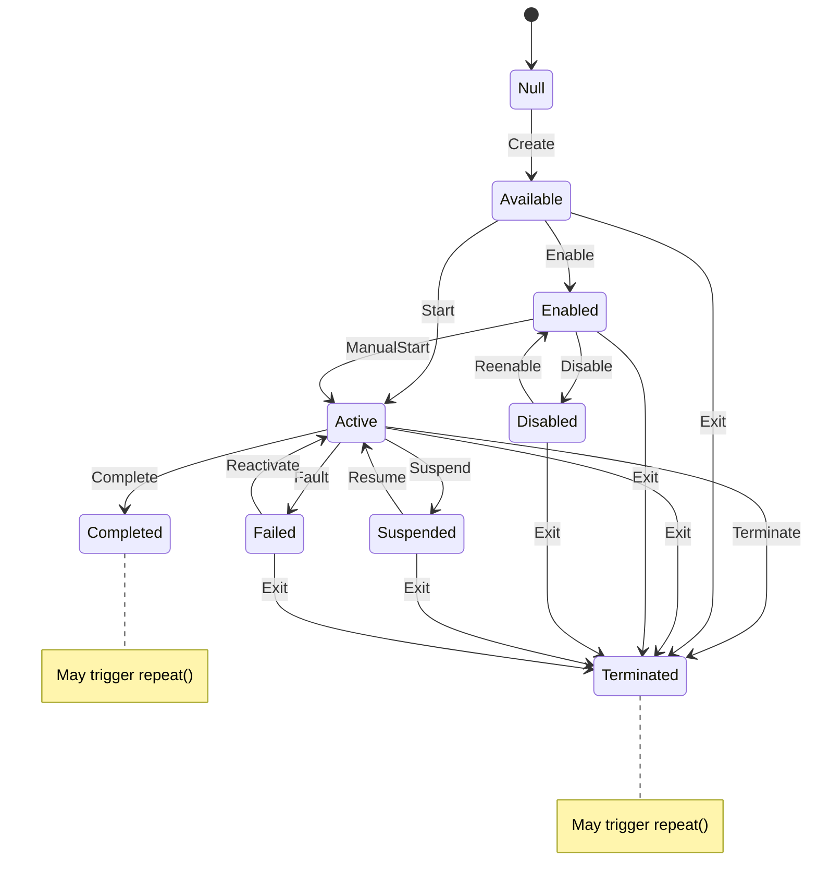
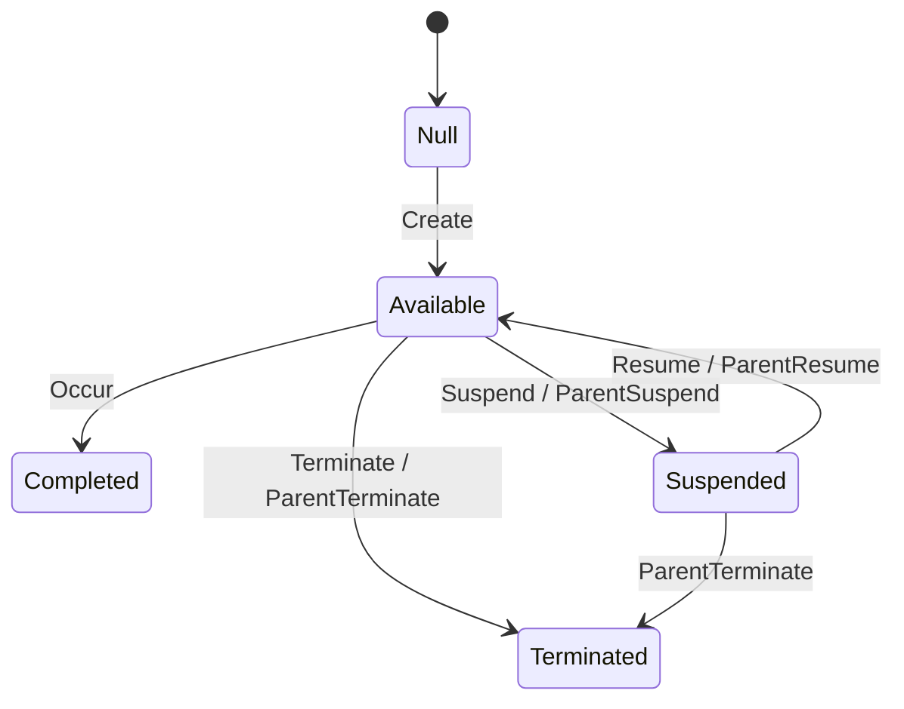

# Case Lifecycle Flow

## Case Creation and Execution

```mermaid
sequenceDiagram
    participant Client
    participant API as CaseRoute
    participant Router as CaseMessageRouter
    participant Case as Case Actor
    participant Sentry as SentryNetwork
    participant Journal as Event Journal
    participant Projection as ProjectionWriter
    participant QueryDB as Query Database

    Client->>API: POST /cases (definition, inputs, team)
    API->>API: Validate JWT token
    API->>API: Load CaseDefinition from repository
    API->>Router: StartCase command
    Router->>Case: Create Case actor

    Note over Case: Actor initialization
    Case->>Case: applyCaseDefinition()
    Case->>Case: setInputParameters()
    Case->>Case: Initialize CaseFile
    Case->>Case: Initialize Team
    Case->>Case: Initialize SentryNetwork

    Case->>Journal: Persist CaseStarted event
    Case->>Case: createCasePlan()
    Case->>Journal: Persist PlanItemCreated (CasePlan)
    Case->>Case: CasePlan.makeTransition(Create)
    Case->>Journal: Persist PlanItemTransitioned (Null -> Active)

    Note over Case: CasePlan starts child plan items
    loop For each plan item in definition
        Case->>Journal: Persist PlanItemCreated
        Case->>Case: PlanItem.makeTransition(Create)
        Case->>Sentry: connect(planItem)
        Case->>Sentry: Evaluate entry criteria
    end

    Case->>Case: releaseBootstrapCaseFileEvents()
    Case-->>API: CaseStartedResponse (caseId)
    API-->>Client: 201 Created

    Note over Journal,QueryDB: Async projection
    Journal->>Projection: Event stream
    Projection->>QueryDB: Upsert case_instance
    Projection->>QueryDB: Insert plan_item records
    Projection->>QueryDB: Insert task records
```

## Case Plan State Machine (CasePlan)

```mermaid
stateDiagram-v2
    [*] --> Null
    Null --> Active: Create
    Active --> Completed: Complete
    Active --> Terminated: Terminate
    Active --> Failed: Fault
    Active --> Suspended: Suspend
    Completed --> Active: Reactivate
    Terminated --> Active: Reactivate
    Failed --> Active: Reactivate
    Suspended --> Active: Reactivate
    Completed --> Closed: Close
    Terminated --> Closed: Close
    Failed --> Closed: Close
    Suspended --> Closed: Close
    Closed --> [*]
```

## Task/Stage State Machine (TaskStage)

```mermaid
stateDiagram-v2
    [*] --> Null
    Null --> Available: Create
    Available --> Enabled: Enable
    Available --> Active: Start
    Enabled --> Active: ManualStart
    Enabled --> Disabled: Disable
    Disabled --> Enabled: Reenable
    Active --> Completed: Complete
    Active --> Failed: Fault
    Active --> Terminated: Terminate
    Active --> Suspended: Suspend
    Suspended --> Active: Resume
    Failed --> Active: Reactivate

    Available --> Terminated: Exit
    Active --> Terminated: Exit
    Enabled --> Terminated: Exit
    Disabled --> Terminated: Exit
    Suspended --> Terminated: Exit
    Failed --> Terminated: Exit

    note right of Completed: May trigger repeat()
    note right of Terminated: May trigger repeat()
```

## Event/Milestone State Machine

```mermaid
stateDiagram-v2
    [*] --> Null
    Null --> Available: Create
    Available --> Completed: Occur
    Available --> Suspended: Suspend / ParentSuspend
    Available --> Terminated: Terminate / ParentTerminate
    Suspended --> Available: Resume / ParentResume
    Suspended --> Terminated: ParentTerminate
```
