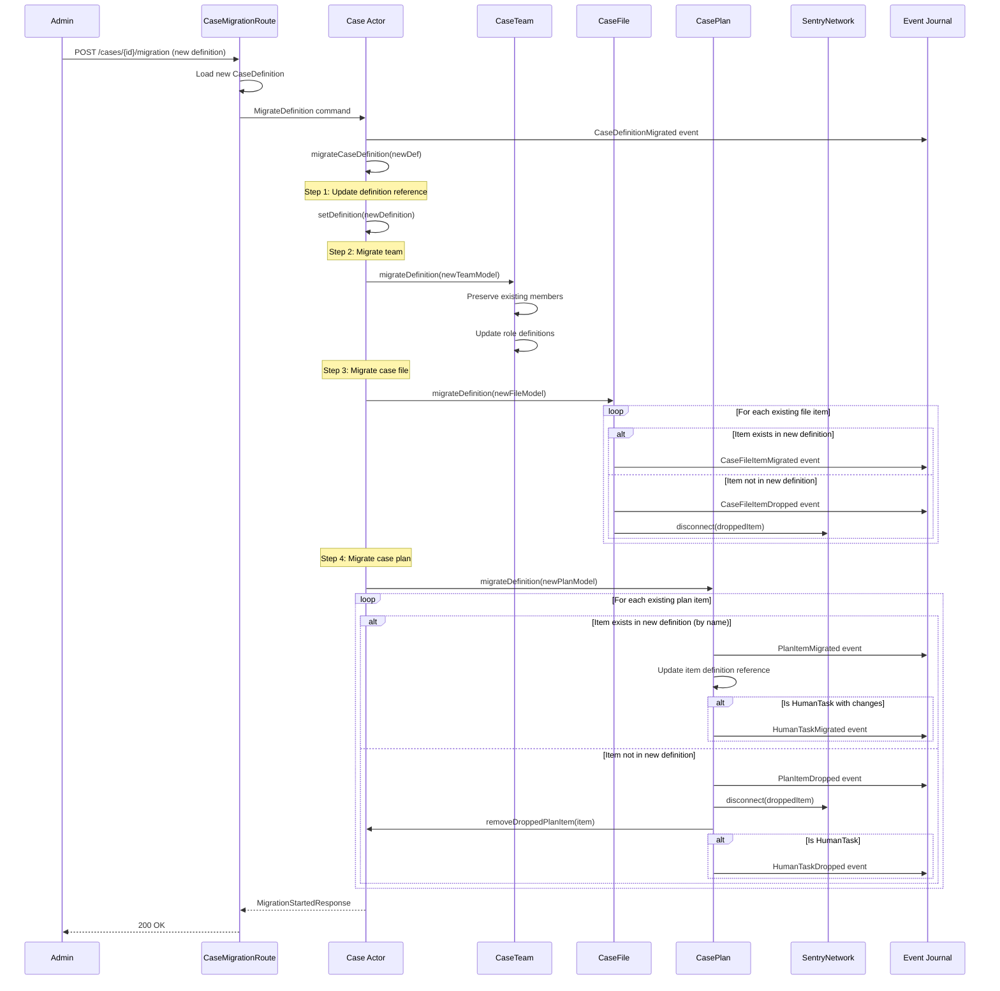
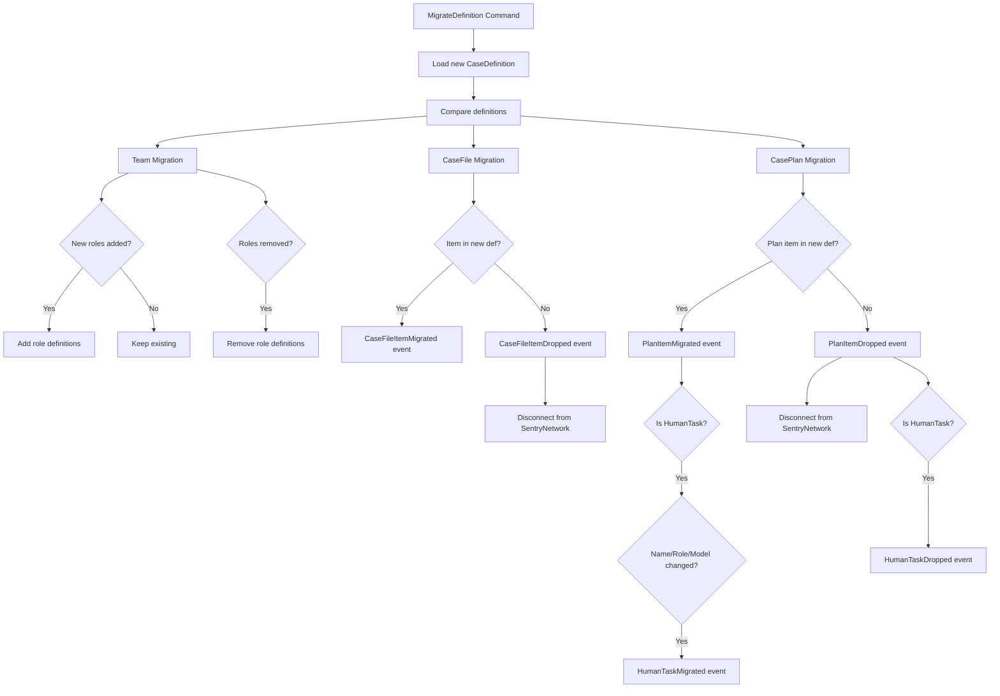

# Case Migration Flow

## Live Definition Migration

```mermaid
sequenceDiagram
    participant Admin
    participant API as CaseMigrationRoute
    participant Case as Case Actor
    participant Team as CaseTeam
    participant File as CaseFile
    participant Plan as CasePlan
    participant Sentry as SentryNetwork
    participant Journal as Event Journal

    Admin->>API: POST /cases/{id}/migration (new definition)
    API->>API: Load new CaseDefinition
    API->>Case: MigrateDefinition command

    Case->>Journal: CaseDefinitionMigrated event
    Case->>Case: migrateCaseDefinition(newDef)

    Note over Case: Step 1: Update definition reference
    Case->>Case: setDefinition(newDefinition)

    Note over Case: Step 2: Migrate team
    Case->>Team: migrateDefinition(newTeamModel)
    Team->>Team: Preserve existing members
    Team->>Team: Update role definitions

    Note over Case: Step 3: Migrate case file
    Case->>File: migrateDefinition(newFileModel)
    loop For each existing file item
        alt Item exists in new definition
            File->>Journal: CaseFileItemMigrated event
        else Item not in new definition
            File->>Journal: CaseFileItemDropped event
            File->>Sentry: disconnect(droppedItem)
        end
    end

    Note over Case: Step 4: Migrate case plan
    Case->>Plan: migrateDefinition(newPlanModel)
    loop For each existing plan item
        alt Item exists in new definition (by name)
            Plan->>Journal: PlanItemMigrated event
            Plan->>Plan: Update item definition reference
            alt Is HumanTask with changes
                Plan->>Journal: HumanTaskMigrated event
            end
        else Item not in new definition
            Plan->>Journal: PlanItemDropped event
            Plan->>Sentry: disconnect(droppedItem)
            Plan->>Case: removeDroppedPlanItem(item)
            alt Is HumanTask
                Plan->>Journal: HumanTaskDropped event
            end
        end
    end

    Case-->>API: MigrationStartedResponse
    API-->>Admin: 200 OK
```

## Migration Decision Tree

```mermaid
flowchart TD
    A[MigrateDefinition Command] --> B[Load new CaseDefinition]
    B --> C[Compare definitions]

    C --> D[Team Migration]
    D --> D1{New roles added?}
    D1 -->|Yes| D2[Add role definitions]
    D1 -->|No| D3[Keep existing]
    D --> D4{Roles removed?}
    D4 -->|Yes| D5[Remove role definitions]

    C --> E[CaseFile Migration]
    E --> E1{Item in new def?}
    E1 -->|Yes| E2[CaseFileItemMigrated event]
    E1 -->|No| E3[CaseFileItemDropped event]
    E3 --> E4[Disconnect from SentryNetwork]

    C --> F[CasePlan Migration]
    F --> F1{Plan item in new def?}
    F1 -->|Yes| F2[PlanItemMigrated event]
    F2 --> F3{Is HumanTask?}
    F3 -->|Yes| F4{Name/Role/Model changed?}
    F4 -->|Yes| F5[HumanTaskMigrated event]
    F1 -->|No| F6[PlanItemDropped event]
    F6 --> F7[Disconnect from SentryNetwork]
    F6 --> F8{Is HumanTask?}
    F8 -->|Yes| F9[HumanTaskDropped event]
```
