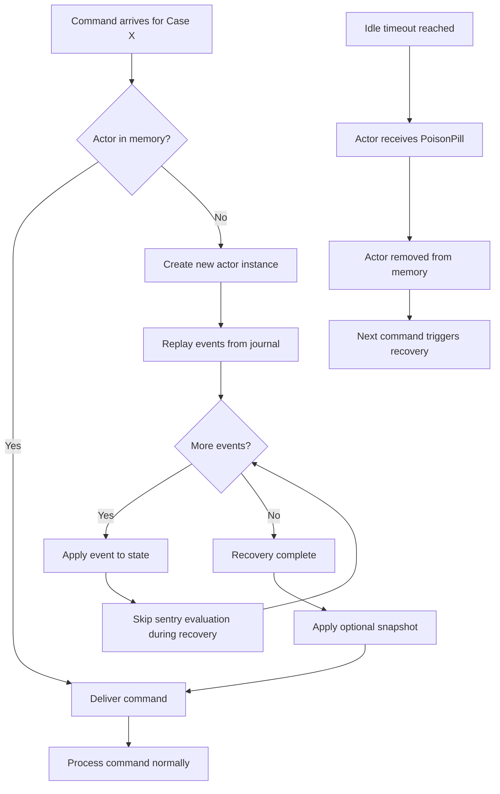
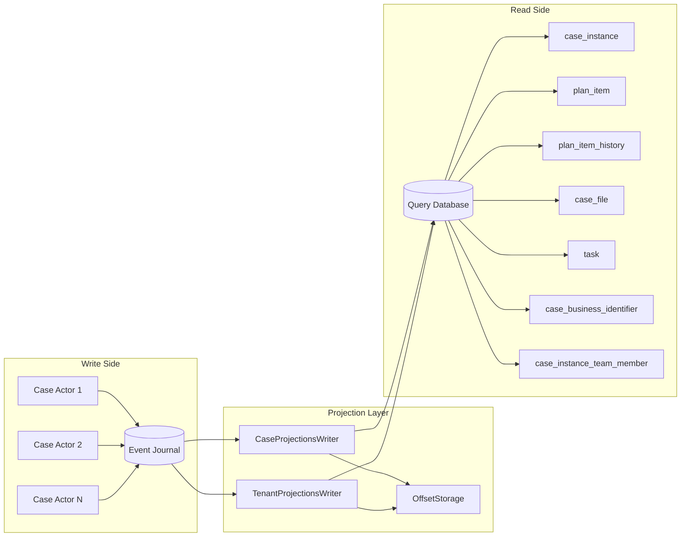
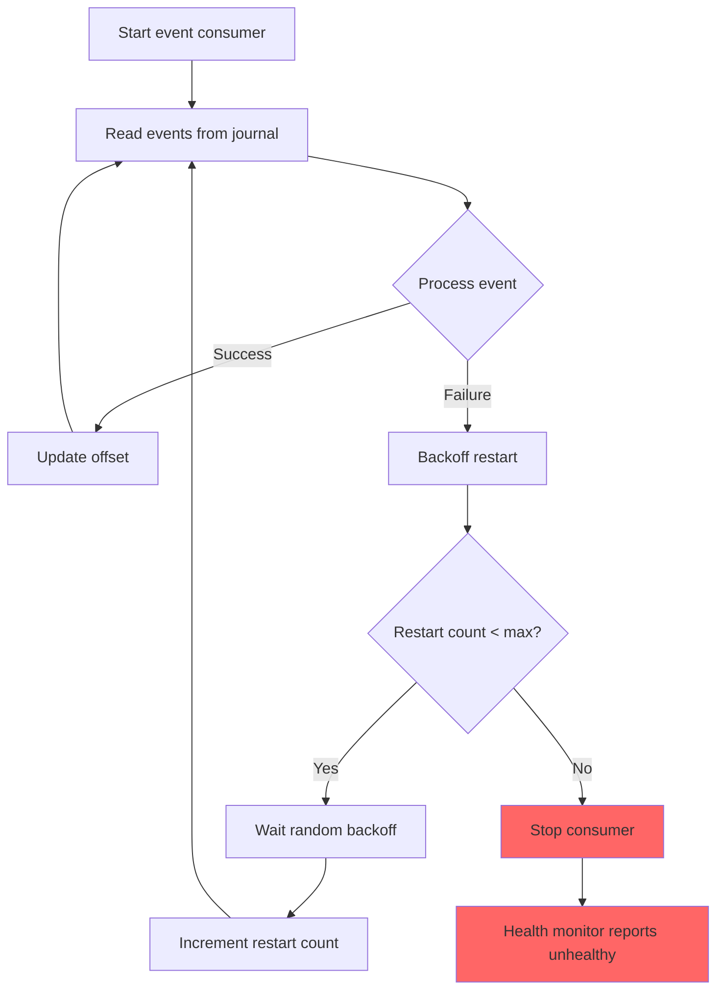

# Event Sourcing and CQRS Flow

## Command Processing and Event Persistence

```mermaid
sequenceDiagram
    participant Client
    participant HTTP as Akka HTTP
    participant Router as CaseMessageRouter
    participant Actor as Case Actor
    participant Journal as Event Journal
    participant Projector as ProjectionWriter
    participant QueryDB as Query Database

    Client->>HTTP: REST Request
    HTTP->>HTTP: JWT Validation
    HTTP->>HTTP: Create Command
    HTTP->>Router: Route command to actor

    alt Actor not in memory
        Router->>Journal: Replay events for case ID
        Journal-->>Router: Event stream
        Router->>Actor: Create actor, apply events
    end

    Router->>Actor: Deliver command
    Actor->>Actor: Validate command
    Actor->>Actor: Process business logic
    Actor->>Actor: Generate events

    loop For each generated event
        Actor->>Journal: Persist event
        Journal-->>Actor: Persistence confirmed
        Actor->>Actor: Apply event to in-memory state
    end

    Actor-->>HTTP: Command response
    HTTP-->>Client: HTTP response

    Note over Journal,QueryDB: Asynchronous projection
    Journal->>Projector: Tagged event stream (polling)
    Projector->>Projector: Transform event to record
    Projector->>QueryDB: Upsert/Insert records
    Projector->>Projector: Update offset
```

## Actor Recovery



## CQRS Projection Architecture



## Event Stream with Backoff Restart


