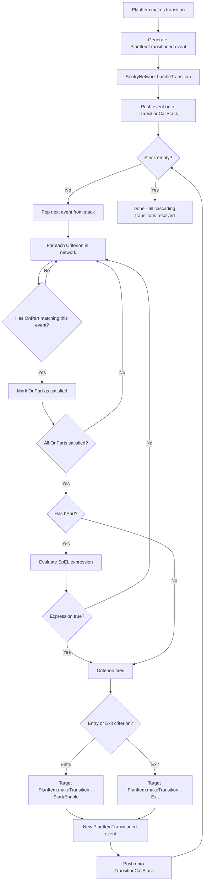
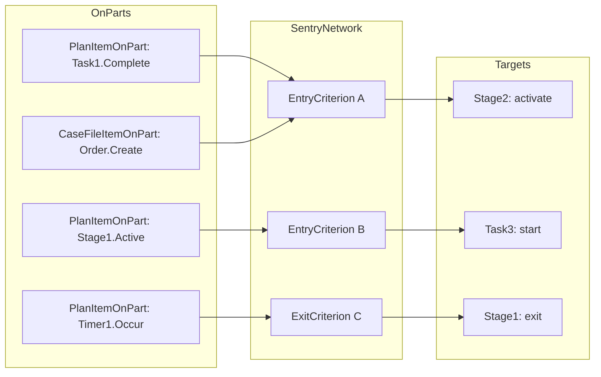
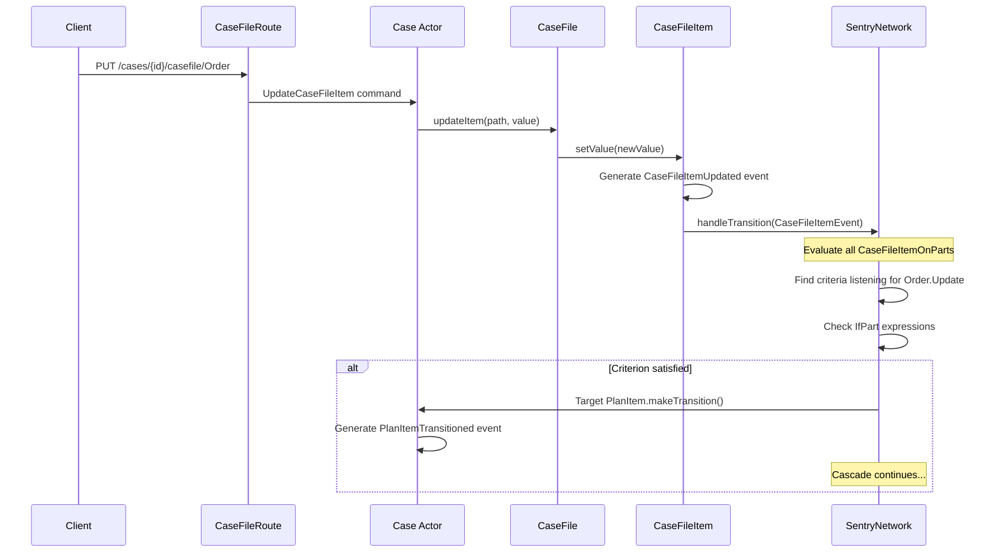

# Sentry Evaluation Flow

## Reactive Criteria Evaluation

```mermaid
flowchart TD
    A[PlanItem makes transition] --> B[Generate PlanItemTransitioned event]
    B --> C[SentryNetwork.handleTransition]
    C --> D[Push event onto TransitionCallStack]
    D --> E{Stack empty?}
    E -->|No| F[Pop next event from stack]
    F --> G[For each Criterion in network]
    G --> H{Has OnPart matching this event?}
    H -->|No| G
    H -->|Yes| I[Mark OnPart as satisfied]
    I --> J{All OnParts satisfied?}
    J -->|No| G
    J -->|Yes| K{Has IfPart?}
    K -->|Yes| L[Evaluate SpEL expression]
    L --> M{Expression true?}
    M -->|No| G
    M -->|Yes| N[Criterion fires]
    K -->|No| N
    N --> O{Entry or Exit criterion?}
    O -->|Entry| P[Target PlanItem.makeTransition - Start/Enable]
    O -->|Exit| Q[Target PlanItem.makeTransition - Exit]
    P --> R[New PlanItemTransitioned event]
    Q --> R
    R --> S[Push onto TransitionCallStack]
    S --> E
    E -->|Yes| T[Done - all cascading transitions resolved]
```

## Sentry Network Connection

```mermaid
flowchart LR
    subgraph SentryNetwork
        C1[EntryCriterion A]
        C2[EntryCriterion B]
        C3[ExitCriterion C]
    end

    subgraph OnParts
        OP1[PlanItemOnPart: Task1.Complete]
        OP2[CaseFileItemOnPart: Order.Create]
        OP3[PlanItemOnPart: Stage1.Active]
        OP4[PlanItemOnPart: Timer1.Occur]
    end

    subgraph Targets
        T1[Stage2: activate]
        T2[Task3: start]
        T3[Stage1: exit]
    end

    OP1 --> C1
    OP2 --> C1
    C1 --> T1

    OP3 --> C2
    C2 --> T2

    OP4 --> C3
    C3 --> T3
```

## Case File Item Trigger

```mermaid
sequenceDiagram
    participant Client
    participant API as CaseFileRoute
    participant Case as Case Actor
    participant File as CaseFile
    participant Item as CaseFileItem
    participant Sentry as SentryNetwork

    Client->>API: PUT /cases/{id}/casefile/Order
    API->>Case: UpdateCaseFileItem command
    Case->>File: updateItem(path, value)
    File->>Item: setValue(newValue)
    Item->>Item: Generate CaseFileItemUpdated event
    Item->>Sentry: handleTransition(CaseFileItemEvent)

    Note over Sentry: Evaluate all CaseFileItemOnParts
    Sentry->>Sentry: Find criteria listening for Order.Update
    Sentry->>Sentry: Check IfPart expressions
    alt Criterion satisfied
        Sentry->>Case: Target PlanItem.makeTransition()
        Case->>Case: Generate PlanItemTransitioned event
        Note over Sentry: Cascade continues...
    end
```
