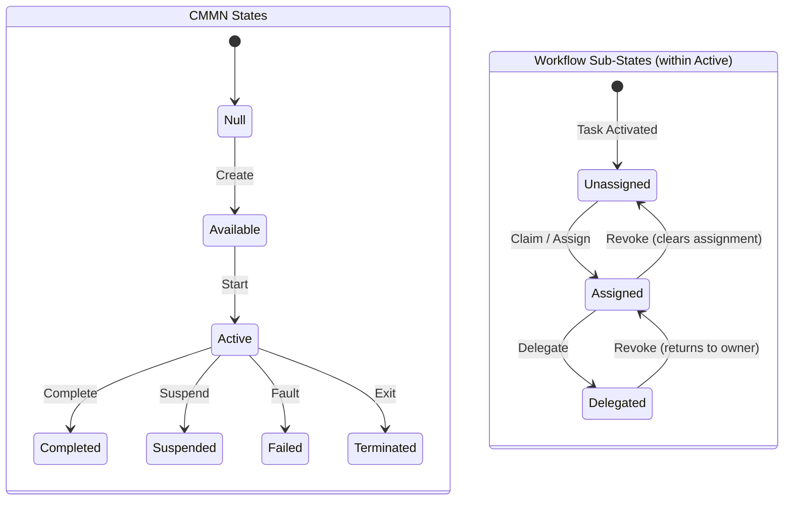
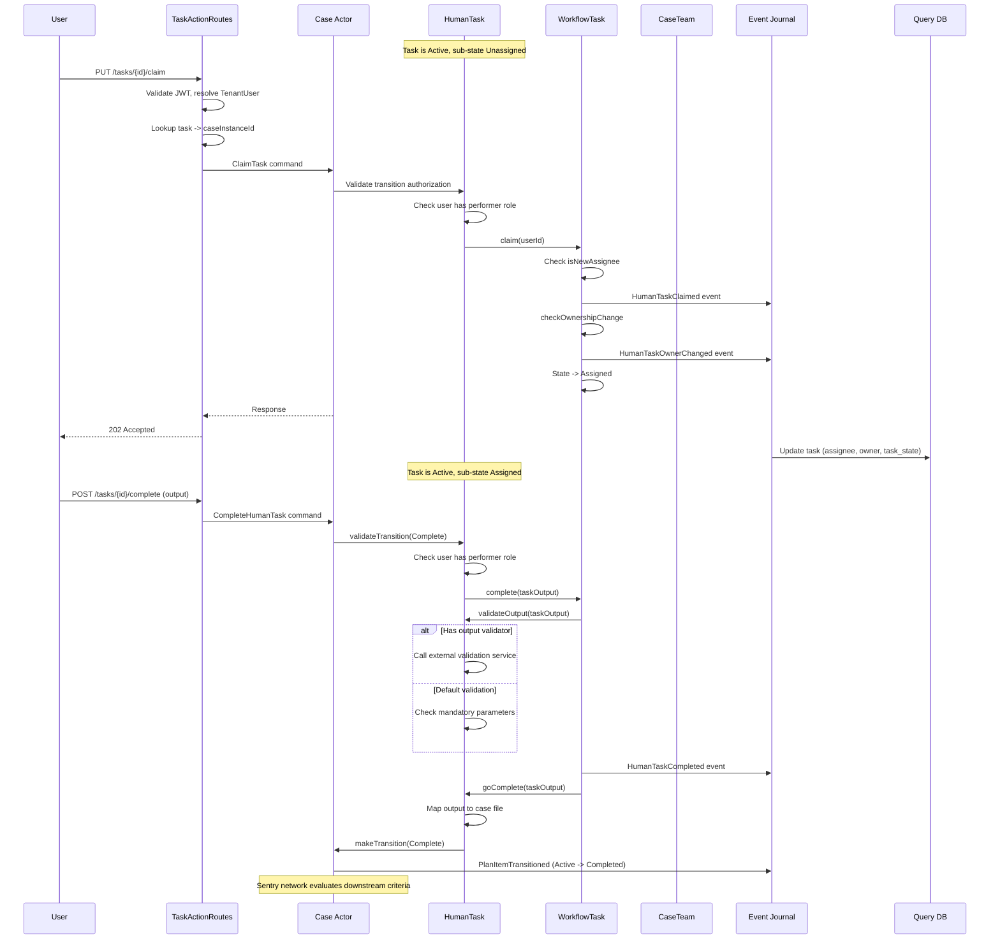
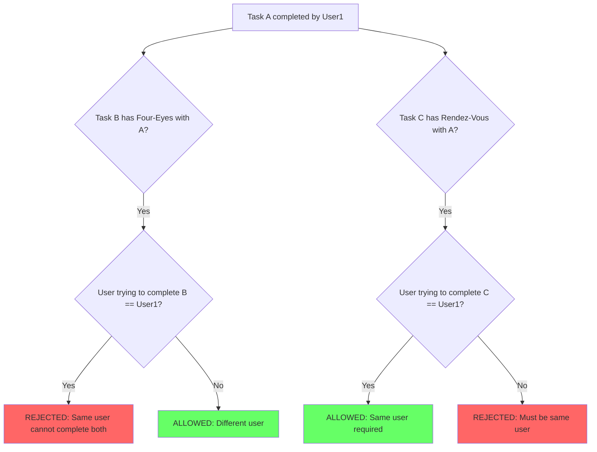
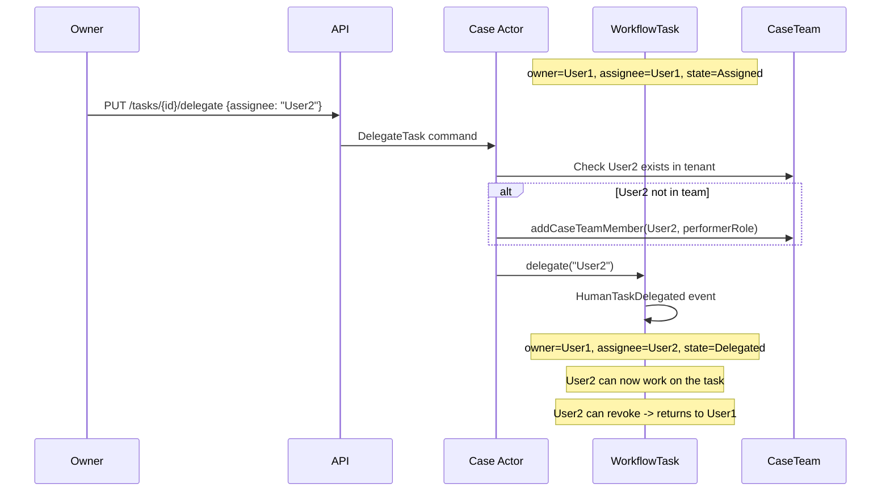

# Task Workflow Flow

## Human Task Extended Lifecycle

```mermaid
stateDiagram-v2
    state "CMMN States" as cmmn {
        [*] --> Null
        Null --> Available: Create
        Available --> Active: Start
        Active --> Completed: Complete
        Active --> Suspended: Suspend
        Active --> Failed: Fault
        Active --> Terminated: Exit
    }

    state "Workflow Sub-States (within Active)" as workflow {
        [*] --> Unassigned: Task Activated
        Unassigned --> Assigned: Claim / Assign
        Assigned --> Delegated: Delegate
        Delegated --> Assigned: Revoke (returns to owner)
        Assigned --> Unassigned: Revoke (clears assignment)
    }
```

## Task Claim and Complete Flow

```mermaid
sequenceDiagram
    participant User
    participant API as TaskActionRoutes
    participant Case as Case Actor
    participant HT as HumanTask
    participant WF as WorkflowTask
    participant Team as CaseTeam
    participant Journal as Event Journal
    participant QueryDB as Query DB

    Note over HT: Task is Active, sub-state Unassigned

    User->>API: PUT /tasks/{id}/claim
    API->>API: Validate JWT, resolve TenantUser
    API->>API: Lookup task -> caseInstanceId
    API->>Case: ClaimTask command

    Case->>HT: Validate transition authorization
    HT->>HT: Check user has performer role
    HT->>WF: claim(userId)
    WF->>WF: Check isNewAssignee
    WF->>Journal: HumanTaskClaimed event
    WF->>WF: checkOwnershipChange
    WF->>Journal: HumanTaskOwnerChanged event
    WF->>WF: State -> Assigned

    Case-->>API: Response
    API-->>User: 202 Accepted

    Journal->>QueryDB: Update task (assignee, owner, task_state)

    Note over HT: Task is Active, sub-state Assigned

    User->>API: POST /tasks/{id}/complete (output)
    API->>Case: CompleteHumanTask command

    Case->>HT: validateTransition(Complete)
    HT->>HT: Check user has performer role
    HT->>WF: complete(taskOutput)

    WF->>HT: validateOutput(taskOutput)
    alt Has output validator
        HT->>HT: Call external validation service
    else Default validation
        HT->>HT: Check mandatory parameters
    end

    WF->>Journal: HumanTaskCompleted event
    WF->>HT: goComplete(taskOutput)
    HT->>HT: Map output to case file
    HT->>Case: makeTransition(Complete)
    Case->>Journal: PlanItemTransitioned (Active -> Completed)

    Note over Case: Sentry network evaluates downstream criteria
```

## Four-Eyes and Rendez-Vous

```mermaid
flowchart TD
    A[Task A completed by User1] --> B{Task B has Four-Eyes with A?}
    B -->|Yes| C{User trying to complete B == User1?}
    C -->|Yes| D[REJECTED: Same user cannot complete both]
    C -->|No| E[ALLOWED: Different user]

    A --> F{Task C has Rendez-Vous with A?}
    F -->|Yes| G{User trying to complete C == User1?}
    G -->|Yes| H[ALLOWED: Same user required]
    G -->|No| I[REJECTED: Must be same user]

    style D fill:#f66
    style I fill:#f66
    style E fill:#6f6
    style H fill:#6f6
```

## Task Delegation Flow

```mermaid
sequenceDiagram
    participant Owner
    participant API
    participant Case as Case Actor
    participant WF as WorkflowTask
    participant Team as CaseTeam

    Note over WF: owner=User1, assignee=User1, state=Assigned

    Owner->>API: PUT /tasks/{id}/delegate {assignee: "User2"}
    API->>Case: DelegateTask command

    Case->>Team: Check User2 exists in tenant
    alt User2 not in team
        Case->>Team: addCaseTeamMember(User2, performerRole)
    end

    Case->>WF: delegate("User2")
    WF->>WF: HumanTaskDelegated event
    Note over WF: owner=User1, assignee=User2, state=Delegated

    Note over WF: User2 can now work on the task
    Note over WF: User2 can revoke -> returns to User1
```
