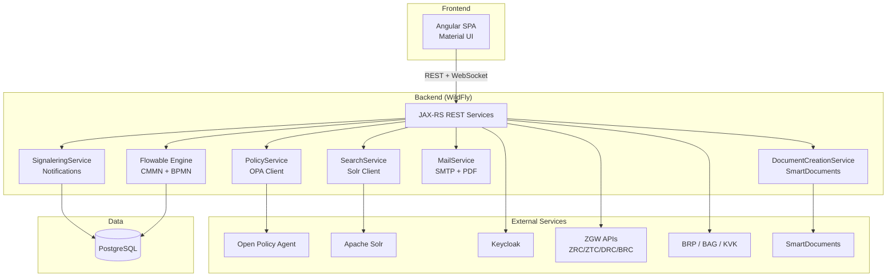

# Dimpact ZAC Competitive Analysis -- Merged Report

**Date:** 2026-03-14
**Sources:** Codebase analysis (GitHub infonl/dimpact-zaakafhandelcomponent), user manual screenshots, admin manual screenshots, architecture documentation, Angular source code analysis, Dutch-language documentation research, 18 feature specs

---

## 1. Sources Summary

| Source Type | Count | Details |
|-------------|-------|---------|
| Codebase files analyzed | 2 | `overview.md` (architecture overview), `business-logic/browser-walkthrough-notes.md` (UI walkthrough) |
| Documentation files | 13 | Solution architecture, system context, data model, IAM, access control, process automation, product request flow, SmartDocuments, Solr, deployment, user manual, configuration manual, overview |
| Feature specs created | 18 | Full specs covering all major functional domains |
| Screenshots captured | 104 | User interface, admin interface, architecture diagrams, process flows |
| Live demo | 0 | No public demo available; local Docker setup failed due to 1Password CLI dependency and 20+ container complexity |

---

## 2. Product Overview

**Dimpact Zaakafhandelcomponent (ZAC)** is an open-source, workflow-based component for managing "zaken" (cases) in the Dutch "zaakgericht werken" paradigm. It serves as the case handling layer for Dutch municipalities.

| Attribute | Value |
|-----------|-------|
| **Developer** | INFO.nl (previously Atos, taken over by Lifely/INFO.nl in July 2023) |
| **Client** | Dimpact cooperative (42 Dutch municipalities) |
| **License** | EUPL-1.2+ |
| **Repository** | https://github.com/infonl/dimpact-zaakafhandelcomponent |
| **Version analyzed** | v4.4.0 (2026-03-04), v4.4.38 latest |
| **Target users** | Municipal case workers (behandelaars, coordinators, record managers) |
| **Market position** | Core of PodiumD Zaak, part of the broader PodiumD suite (Portaal, Contact, Formulier, Zaak) |
| **Community** | 6 GitHub stars, 2 forks -- very limited community adoption |
| **Release cadence** | Multiple releases per day via automated CI/CD |

### Technology Stack

| Layer | Technology |
|-------|-----------|
| **Backend** | Kotlin (primary) + Java 21 (legacy clients), WildFly (Jakarta EE / CDI) |
| **Frontend** | Angular 19+ (TypeScript), Angular Material |
| **Build** | Gradle (backend) + npm/webpack (frontend) |
| **Database** | PostgreSQL (89 Flyway migration versions) |
| **Search** | Apache Solr 9.x |
| **Authentication** | Keycloak 26.x (OIDC/OAuth2) |
| **Authorization** | Open Policy Agent (OPA) + PABC (Platform Autorisatie Beheer Component) |
| **Workflow engine** | Flowable (CMMN + BPMN) |
| **Document creation** | SmartDocuments (commercial, Word templates via WebDAV) |
| **Caching** | Redis 8.x |
| **Messaging** | RabbitMQ 4.x |
| **Observability** | OpenTelemetry, Grafana, Prometheus, Tempo |
| **Container** | Docker, Helm charts for Kubernetes |
| **i18n** | Dutch (primary), English |

---

## 3. Architecture Summary

ZAC sits in the **interaction layer** of the Common Ground 5-layer model. It is a UI/orchestration layer -- all case data lives in external ZGW APIs (Open Zaak). ZAC does not own the data.

### Key Architectural Patterns

1. **ZGW-first**: All case data lives in external ZGW APIs. ZAC is an orchestration layer, not a data store.
2. **Policy-based authorization**: All permission checks delegate to OPA with Rego policies. Five policy domains: zaak, taak, document, werklijst, overige.
3. **Event-driven UI**: WebSocket screen events push updates to the Angular frontend in real time.
4. **Dual workflow**: Cases can be CMMN-driven (default generic model) or BPMN-driven (custom process definitions per zaaktype).
5. **Converter pattern**: REST models use dedicated converters to map between API DTOs and domain/ZGW models.
6. **BFF-only**: No public API -- the backend serves exclusively as a Backend-for-Frontend for the Angular SPA.

### Application Roles

| Role | Dutch | Capabilities |
|------|-------|-------------|
| `raadpleger` | Viewer | Read cases, tasks, documents; search |
| `behandelaar` | Handler | Full CRUD on assigned cases/tasks; start cases; create documents |
| `coordinator` | Coordinator | Distribute/release tasks and cases; manage inbox |
| `recordmanager` | Record Manager | Reopen cases; manage documents on closed cases |
| `beheerder` | Administrator | View case data; manage admin configuration; export |

### Infrastructure Requirements

Full deployment requires 15+ Docker containers: ZAC, Keycloak, PostgreSQL, Solr, OPA, Redis, RabbitMQ, Open Zaak (+ PostGIS), Open Klant, Open Notificaties, Objects API, Open Archiefbeheer, PABC, SmartDocuments (mock), Office Converter, BRP mock, plus optional observability stack (OpenTelemetry, Grafana, Tempo, Prometheus).

---

## 4. Feature Inventory

### Specs Created (18)

| # | Spec | Description |
|---|------|-------------|
| 1 | **access-control-policies** | OPA-based policy authorization with 5 policy domains and 51+ individual permissions |
| 2 | **admin-configuration** | Per-zaaktype configuration (parameters, mail templates, reference tables, inrichtingscheck validation) |
| 3 | **case-management** | Full zaak lifecycle: create, view, edit, suspend, extend, reopen, close with status tracking |
| 4 | **client-customer-management** | Person (BRP/BSN) and company (KVK) management with cross-case overviews |
| 5 | **dashboard-worklists** | Customizable drag-and-drop dashboard with signaling cards and configurable worklist tables |
| 6 | **decision-management** | Formal besluit (decision) recording with publication dates, response periods, and withdrawal |
| 7 | **deployment-architecture** | Docker/Kubernetes deployment with 15+ services, Helm charts, health probes |
| 8 | **document-management** | Document CRUD with versioning, locking, signing, PDF conversion, confidentiality, bulk operations |
| 9 | **mail-integration** | SMTP email sending with templates, variable insertion, and per-zaaktype configuration |
| 10 | **process-automation** | CMMN/BPMN process orchestration via Flowable with two-phase intake/treatment model |
| 11 | **productaanvraag-intake** | Citizen product request intake from external form systems via Objects API |
| 12 | **search-and-indexing** | Solr-powered full-text search with faceted filtering across zaken, taken, documenten, personen |
| 13 | **signalering-notifications** | Per-user configurable notification system with dashboard cards and email delivery |
| 14 | **smart-documents-integration** | SmartDocuments template-based document creation with WebDAV editing |
| 15 | **task-management** | 5 task types (aanvullende info, advies intern/extern, goedkeuren, document verzenden) with workflow |
| 16 | **websocket-events** | Real-time UI updates via WebSocket screen events for collaborative use |
| 17 | **workflow-engine-integration** | Flowable CMMN/BPMN integration with generic zaakafhandelmodel and custom process definitions |
| 18 | **zaak-management** | Core zaak entity management including initiator, betrokkenen, BAG objects, location, notes |

### Documentation Files (13)

| # | Document | Topic |
|---|----------|-------|
| 1 | `overview.md` | High-level product and architecture overview |
| 2 | `solution-architecture.md` | Detailed solution architecture documentation |
| 3 | `system-context.md` | System context diagram and integration landscape |
| 4 | `data-model.md` | Database schema and entity relationships |
| 5 | `iam-architecture.md` | Keycloak + PABC IAM architecture |
| 6 | `access-control-policies.md` | OPA Rego policy documentation |
| 7 | `process-automation.md` | CMMN/BPMN process model documentation |
| 8 | `product-request-flow.md` | Productaanvraag intake flow |
| 9 | `smartdocuments-integration.md` | SmartDocuments integration details |
| 10 | `solr-architecture.md` | Solr indexing and search architecture |
| 11 | `deployment-model.md` | Deployment topology and container overview |
| 12 | `user-manual-features.md` | User-facing feature documentation |
| 13 | `configuration-manual.md` | Admin configuration manual |

---

## 5. Key Strengths

### 5.1 Mature Case Lifecycle Management
ZAC implements a comprehensive zaak lifecycle: create, intake, treatment, suspend/resume, extend, close, reopen, and archive. The two-phase CMMN model (intake then behandeling) with configurable transitions per zaaktype is well-thought-out. Suspension automatically recalculates deadlines. Extension is a one-time operation with configurable maximums.

### 5.2 ZGW API Compliance
Full integration with Dutch government standard APIs (ZRC, ZTC, DRC, BRC). This is the correct architecture for municipalities already invested in the Common Ground ecosystem. Data stays at the source (Open Zaak).

### 5.3 Rich Task Workflow
Five distinct task types (aanvullende informatie, advies intern, advies extern, goedkeuren, document verzenden) with email integration, interim saves, zaak suspension from tasks, and approval workflows. Tasks have start forms and treatment forms with configurable fields.

### 5.4 Fine-Grained Authorization
OPA + PABC provides 51+ individual permissions across 5 policy domains. The new PABC architecture supports domain-based authorization (groups of zaaktypes) with multi-group membership and merged permissions. This is enterprise-grade access control.

### 5.5 National Registry Integration
Direct integration with BRP (citizen data via BSN), BAG (addresses/buildings with map visualization), and KVK (company data). Person/company detail pages show cross-case overviews and contact moments.

### 5.6 Customizable Dashboard
Three-column drag-and-drop dashboard with werklijst cards (my cases, my tasks) and signaling cards (newly assigned, approaching deadlines, recent documents). Red badges indicate new items. Worklists support configurable columns, saved searches, bulk operations, and faceted filtering.

### 5.7 Comprehensive Admin Tooling
Per-zaaktype configuration of process models, default groups, warning windows, task configurations, mail templates, result codes, and external integrations. The inrichtingscheck validates that all zaaktypes are properly configured before use.

### 5.8 Notification System
Per-user configurable signals with two delivery channels (dashboard cards and email). Signals cover: document added to case, case assigned, approaching deadline, task assigned, task deadline reached.

### 5.9 Document Management
Full document lifecycle: create (SmartDocuments templates), upload, version, lock, sign, convert to PDF, move between cases, unlink, delete. Confidentiality levels, status tracking (draft/final), bulk operations, and WebDAV editing via MS Office Desktop Apps.

### 5.10 Active Development
Multiple releases per day via automated CI/CD. Kotlin-first modern backend. Angular 19 frontend. Professional development team at INFO.nl with clear JIRA-based project management.

---

## 6. Key Weaknesses

### 6.1 Massive Infrastructure Complexity
20+ Docker services required for a full deployment. The start script requires 1Password CLI for secrets injection. No simplified single-node deployment exists. This makes evaluation, development, and operations significantly harder than necessary for smaller municipalities.

### 6.2 No Public API
ZAC is a BFF-only application -- the backend serves exclusively as a Backend-for-Frontend for the Angular SPA. External systems cannot consume ZAC's case management capabilities. This is a fundamental architectural limitation for ecosystem integration.

### 6.3 No Horizontal Scaling
Single-instance deployment only. Cannot scale horizontally to handle increased load. This is a significant limitation for larger municipalities or shared service centers.

### 6.4 External Dependency Heavy
Requires Keycloak, Open Zaak, OPA, Solr, Redis, RabbitMQ, PABC, and more as hard dependencies. Each adds operational complexity, failure modes, and deployment cost. A failure in any external service can cascade.

### 6.5 Proprietary Document Creation
SmartDocuments is commercial software. Document template creation and WebDAV-based editing are locked into this proprietary dependency. No open-source alternative is supported.

### 6.6 Fixed Process Model
The generic CMMN model cannot be customized without code changes. BPMN customization requires Flowable expertise and model uploads. Business users cannot modify process flows.

### 6.7 Limited Community
6 GitHub stars, 2 forks. Despite being open-source (EUPL-1.2+), there is virtually no community contribution. Development is concentrated entirely at INFO.nl for Dimpact.

### 6.8 Not Common Ground Compliant in Key Areas
Despite using ZGW APIs, ZAC is **not compliant with NLX or Haven standards**. No public API means it cannot participate in the Common Ground data exchange model as a provider.

---

## 7. Relevance to Procest (Competitive Positioning)

### Direct Competitor
ZAC is the most direct competitor to Procest in the Dutch municipal case management space. Both target the same user base (behandelaars, coordinators) and the same domain (zaakgericht werken). ZAC is backed by the 42-municipality Dimpact cooperative, giving it significant procurement leverage.

### Positioning Comparison

| Dimension | ZAC | Procest |
|-----------|-----|---------|
| **Deployment model** | 15+ containers, Kubernetes recommended | Nextcloud app (single container) |
| **Data ownership** | Data in Open Zaak (external) | Data in OpenRegister (embedded) |
| **Workflow engine** | Flowable (CMMN/BPMN, Java expertise) | n8n (visual, 400+ integrations, accessible) |
| **Document management** | SmartDocuments (commercial) + DRC | Nextcloud Files (built-in) + DocuDesk |
| **Authorization** | OPA + PABC (51+ permissions) | Nextcloud RBAC (simpler, evolving) |
| **Search** | Solr (dedicated, powerful) | OpenRegister search (integrated) |
| **API** | BFF-only (no public API) | Public REST API via OpenRegister |
| **Scaling** | Single instance only | Nextcloud cluster (horizontal) |
| **Ecosystem** | Standalone (PodiumD suite) | Multi-app (OpenCatalogi, OpenConnector, DocuDesk) |
| **Community** | 6 GitHub stars | Growing Nextcloud ecosystem |
| **Backing** | 42 municipalities via Dimpact | ConductionNL |
| **Tech stack age** | Modern (Kotlin, Angular 19) | Modern (PHP 8, Vue.js) |

### Strategic Implications

1. **ZAC's Dimpact backing is its strongest competitive advantage.** 42 municipalities creating collective procurement demand is hard to counter with technology alone. Procest needs to find municipalities outside Dimpact or offer compelling cost/simplicity advantages.

2. **ZAC's complexity is Procest's opportunity.** A municipality evaluating ZAC must deploy 15+ containers, integrate with Keycloak, set up Open Zaak, configure OPA policies, and license SmartDocuments. Procest can install as a Nextcloud app.

3. **ZAC's lack of public API is a strategic weakness.** As Common Ground evolves toward API-first architectures, ZAC's BFF-only design limits its role in the ecosystem. Procest's OpenRegister-backed public API is a genuine differentiator.

4. **ZAC's process model inflexibility creates opportunity.** Business users cannot modify workflows without developer intervention. n8n's visual workflow editor is dramatically more accessible.

---

## 8. Feature Gap Analysis

### What ZAC Has That Procest Lacks

| Feature | ZAC Implementation | Gap Severity | Recommendation |
|---------|-------------------|--------------|----------------|
| **Case lifecycle (suspend/resume/extend)** | Automatic date recalculation, configurable max extensions | **Critical** | Implement zaak opschorten/hervatten/verlengen with deadline recalculation |
| **5-type task workflow** | Aanvullende info, advies intern/extern, goedkeuren, document verzenden | **Critical** | Model task types as OpenRegister schemas, orchestrate via n8n |
| **Fine-grained OPA authorization** | 51+ permissions across 5 policy domains | **High** | Extend Nextcloud RBAC with zaak-level participant permissions |
| **National registry integration** | BRP (BSN), BAG (addresses + maps), KVK (companies) | **High** | Integrate via OpenConnector; BAG/BRP/KVK are essential for Dutch municipalities |
| **Per-zaaktype configuration** | Process model, groups, warning windows, tasks, mail, result codes | **High** | Build admin UI for zaaktype parameters in Procest |
| **Signaling/notification system** | Per-user configurable, dashboard + email, 5 signal types | **High** | Extend Nextcloud Notifications with zaak-specific signals |
| **Decision (besluit) management** | Formal decisions with publication dates, response periods, withdrawal | **High** | Model besluiten as OpenRegister objects linked to zaken |
| **Productaanvraag intake** | Citizen form submission via Objects API triggers case creation | **High** | Build intake flow from external forms (e.g., Open Formulieren) |
| **Inrichtingscheck** | Configuration validation per zaaktype before go-live | **Medium** | Build validation endpoint that checks zaaktype completeness |
| **Customizable dashboard** | Drag-and-drop cards, saved searches, column configuration | **Medium** | Leverage MyDash for dashboard; add saved search to worklists |
| **Contact moments** | Open Klant integration for customer interaction history | **Medium** | Integrate with Open Klant via OpenConnector |
| **Location/map integration** | OpenStreetMap/Leaflet, coordinate storage, nearest address | **Medium** | Add location field to zaak schema with map component |
| **Document signing** | Digital signature on documents | **Low** | Defer; can use Nextcloud signing apps |
| **SmartDocuments templates** | Commercial template engine with WebDAV editing | **Low** | DocuDesk provides equivalent open-source capability |
| **Bulk work distribution** | Coordinator assigns cases/tasks to groups/behandelaars in bulk | **Medium** | Add bulk operations to worklist views |
| **Saved search queries** | Persistent filter/sort combinations per user | **Medium** | Store saved filters in user preferences |
| **WebSocket real-time updates** | Screen events push UI changes to all connected users | **Low** | Nextcloud has polling; WebSocket is nice-to-have |

### What Procest Has (or Will Have) That ZAC Lacks

| Feature | Procest Advantage | Why It Matters |
|---------|------------------|----------------|
| **Simple deployment** | Single Nextcloud app vs. 15+ containers | Dramatically lower barrier to entry for municipalities |
| **Public REST API** | OpenRegister exposes all data via API | External systems can consume case data; ZAC cannot offer this |
| **Horizontal scaling** | Nextcloud cluster support | Handle increased load without architectural changes |
| **Built-in document management** | Nextcloud Files with versioning, sharing, WebDAV | No dependency on SmartDocuments or DRC |
| **Visual workflow editor** | n8n with 400+ integrations | Business users can modify workflows; Flowable requires developers |
| **Multi-app ecosystem** | OpenCatalogi, OpenConnector, DocuDesk, MyDash | Broader platform capabilities beyond case management |
| **Real-time collaboration** | Nextcloud Talk, Collabora/OnlyOffice | Built-in team communication and document co-editing |
| **Mobile access** | Nextcloud mobile apps | Case workers can access cases from the field |
| **Schema-driven data model** | OpenRegister flexible schemas | New zaaktypes without code changes; ZAC requires CMMN/BPMN model updates |
| **NL Design System theming** | Government-compliant design tokens | Professional Dutch government look with configurable themes |
| **App store distribution** | Nextcloud app store | One-click installation; ZAC requires infrastructure team |
| **Cost** | No commercial dependencies | ZAC requires SmartDocuments license; Keycloak/OPA/Solr operational costs |
| **Active ecosystem** | Nextcloud has thousands of contributors | ZAC has 6 GitHub stars |

---

## Summary

Dimpact ZAC is Procest's most direct competitor: same country, same domain, same users. Its strengths are significant -- mature case lifecycle management, comprehensive ZGW integration, fine-grained authorization, national registry integration, and the backing of 42 municipalities through Dimpact. It is a serious, well-engineered product with active professional development.

However, ZAC's weaknesses create clear opportunities for Procest. The 15+ container deployment complexity, lack of public API, single-instance scaling limitation, and dependency on commercial software (SmartDocuments) are structural disadvantages. The fixed CMMN/BPMN models and 6-star GitHub community suggest limited extensibility and adoption beyond Dimpact.

Procest's winning strategy should focus on three pillars: (1) **deployment simplicity** -- install as a Nextcloud app vs. orchestrate 15+ containers; (2) **API-first architecture** -- public REST API via OpenRegister enables ecosystem integration that ZAC fundamentally cannot provide; and (3) **accessible workflow customization** -- n8n visual workflows vs. Flowable CMMN/BPMN that requires developer expertise. The critical gap to close is implementing the core zaak lifecycle features (suspend/resume/extend, task types, besluit management, signaleringen) that ZAC already offers.
