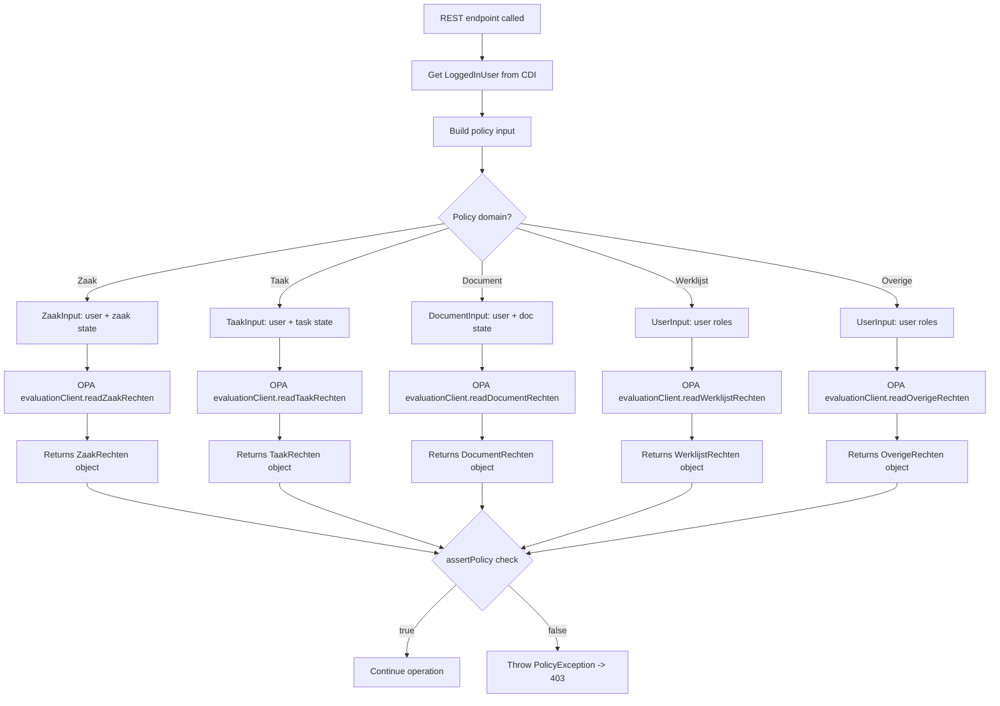
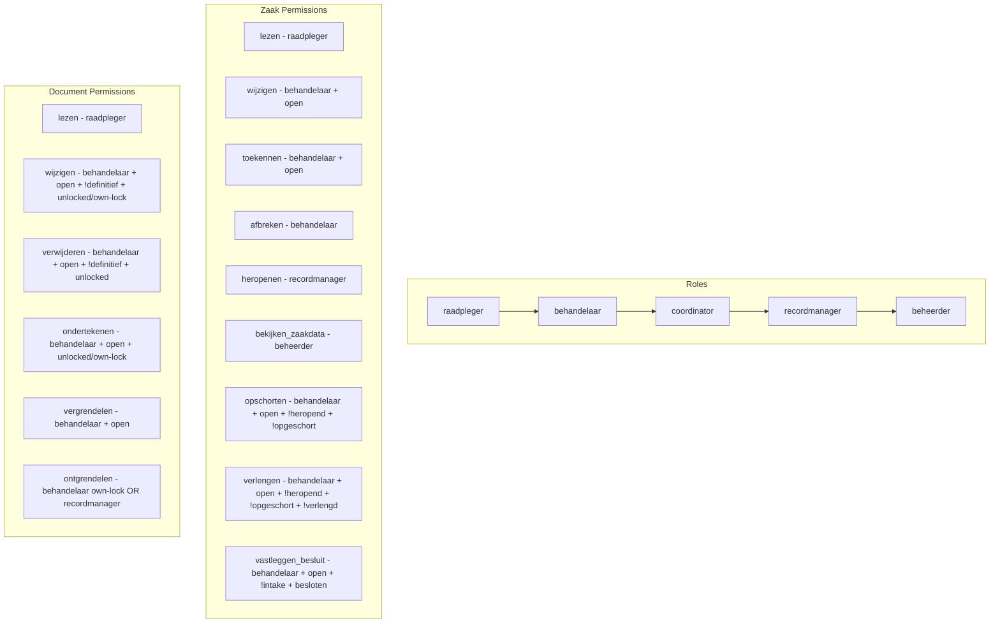
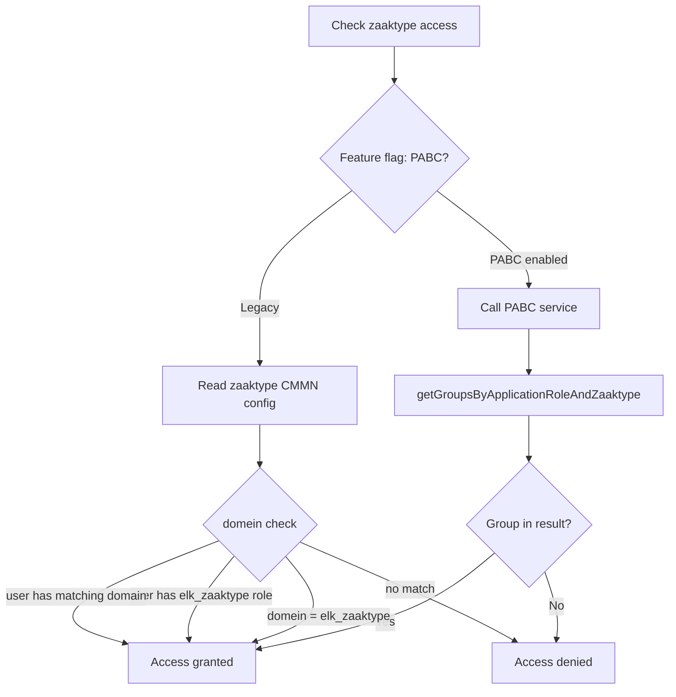

# Authorization Flow

## OPA Policy Evaluation

```mermaid
flowchart TD
    A[REST endpoint called] --> B[Get LoggedInUser from CDI]
    B --> C[Build policy input]
    C --> D{Policy domain?}

    D -->|Zaak| E[ZaakInput: user + zaak state]
    D -->|Taak| F[TaakInput: user + task state]
    D -->|Document| G[DocumentInput: user + doc state]
    D -->|Werklijst| H[UserInput: user roles]
    D -->|Overige| I[UserInput: user roles]

    E --> J[OPA evaluationClient.readZaakRechten]
    F --> J2[OPA evaluationClient.readTaakRechten]
    G --> J3[OPA evaluationClient.readDocumentRechten]
    H --> J4[OPA evaluationClient.readWerklijstRechten]
    I --> J5[OPA evaluationClient.readOverigeRechten]

    J --> K[Returns ZaakRechten object]
    J2 --> K2[Returns TaakRechten object]
    J3 --> K3[Returns DocumentRechten object]
    J4 --> K4[Returns WerklijstRechten object]
    J5 --> K5[Returns OverigeRechten object]

    K --> L{assertPolicy check}
    K2 --> L
    K3 --> L
    K4 --> L
    K5 --> L

    L -->|true| M[Continue operation]
    L -->|false| N[Throw PolicyException -> 403]
```

## Role Hierarchy and Permissions

```mermaid
graph TD
    subgraph Roles
        R[raadpleger] --> B[behandelaar]
        B --> C[coordinator]
        C --> RM[recordmanager]
        RM --> BH[beheerder]
    end

    subgraph "Zaak Permissions"
        Z1[lezen - raadpleger]
        Z2[wijzigen - behandelaar + open]
        Z3[toekennen - behandelaar + open]
        Z4[afbreken - behandelaar]
        Z5[heropenen - recordmanager]
        Z6[bekijken_zaakdata - beheerder]
        Z7[opschorten - behandelaar + open + !heropend + !opgeschort]
        Z8[verlengen - behandelaar + open + !heropend + !opgeschort + !verlengd]
        Z9[vastleggen_besluit - behandelaar + open + !intake + besloten]
    end

    subgraph "Document Permissions"
        D1[lezen - raadpleger]
        D2[wijzigen - behandelaar + open + !definitief + unlocked/own-lock]
        D3[verwijderen - behandelaar + open + !definitief + unlocked]
        D4[ondertekenen - behandelaar + open + unlocked/own-lock]
        D5[vergrendelen - behandelaar + open]
        D6[ontgrendelen - behandelaar own-lock OR recordmanager]
    end
```

## Zaaktype-based Authorization (Legacy vs PABC)

```mermaid
flowchart TD
    A[Check zaaktype access] --> B{Feature flag: PABC?}

    B -->|PABC enabled| C[Call PABC service]
    C --> D[getGroupsByApplicationRoleAndZaaktype]
    D --> E{Group in result?}
    E -->|Yes| F[Access granted]
    E -->|No| G[Access denied]

    B -->|Legacy| H[Read zaaktype CMMN config]
    H --> I{domein check}
    I -->|domein = elk_zaaktype| F
    I -->|user has elk_zaaktype role| F
    I -->|user has matching domain| F
    I -->|no match| G
```
