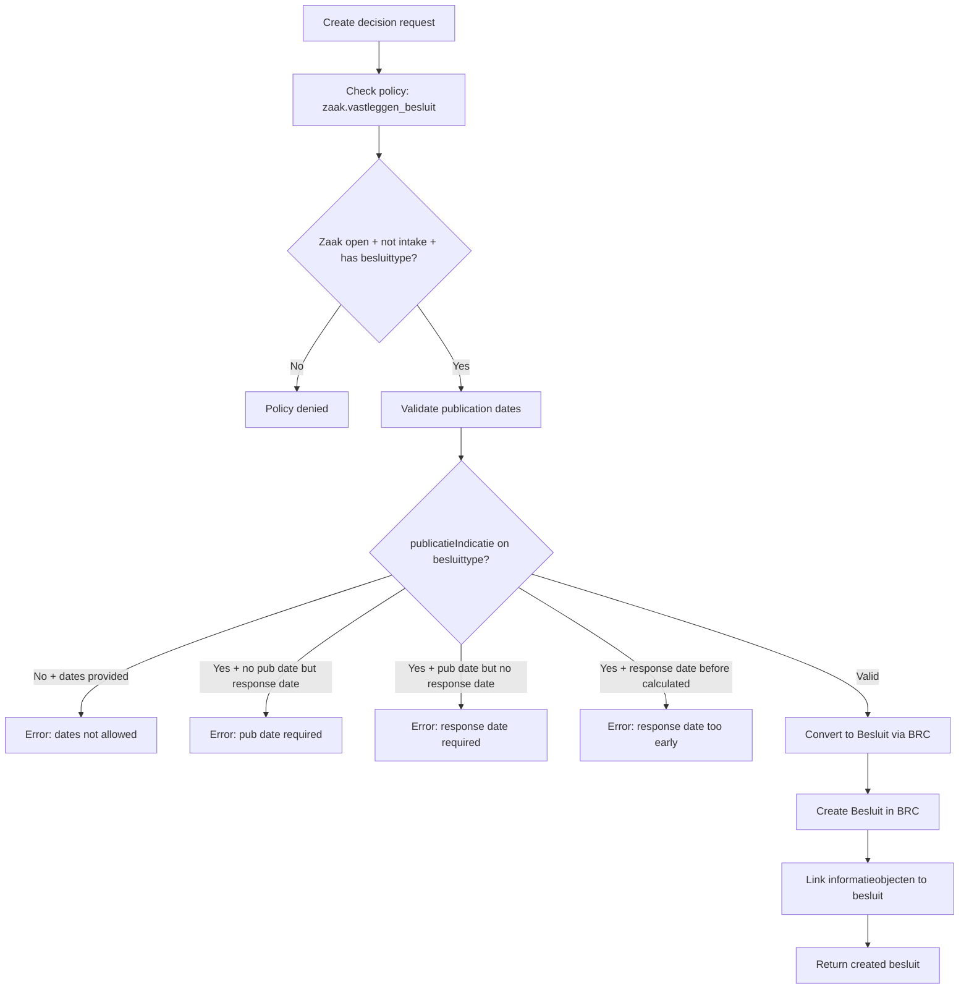
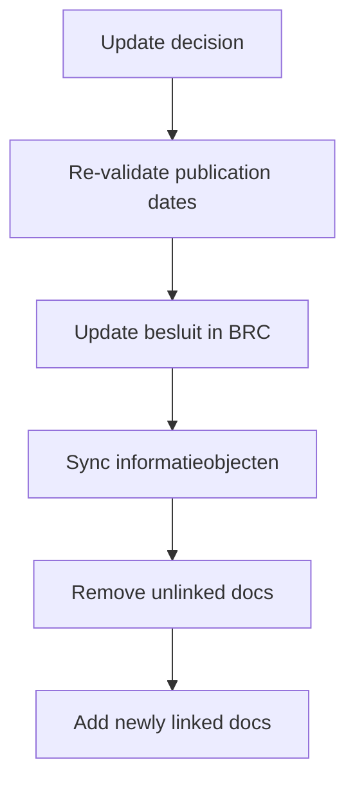

# Decision (Besluit) Management Flow

## Create Decision



## Update Decision



## Withdraw Decision

```mermaid
flowchart TD
    A[Withdraw decision] --> B[Set vervaldatum + vervalreden]
    B --> C{Withdrawal reason?}
    C -->|INGETROKKEN_OVERHEID| D[Format: "Overheid: reason"]
    C -->|INGETROKKEN_BELANGHEBBENDE| E[Format: "Belanghebbende: reason"]
    C -->|Other| F[No explanation]
    D --> G[Update besluit in BRC]
    E --> G
    F --> G
```
