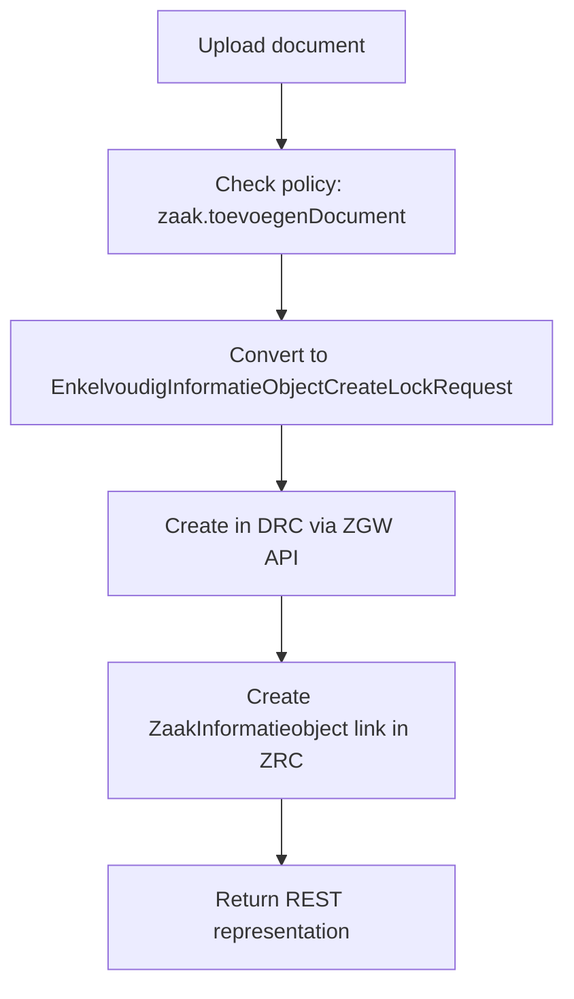
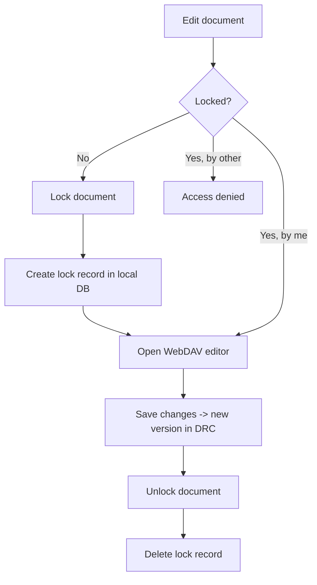
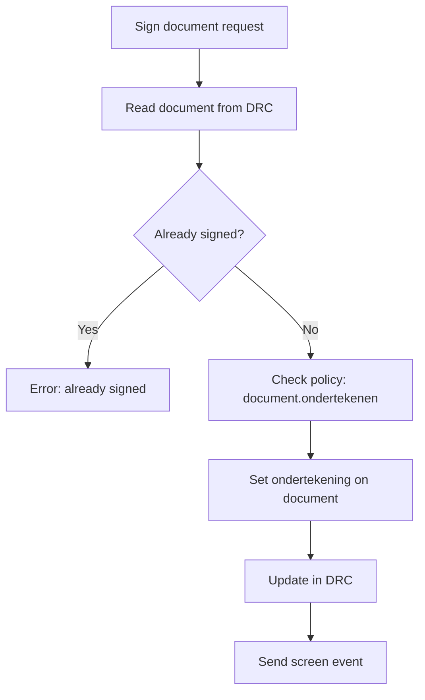
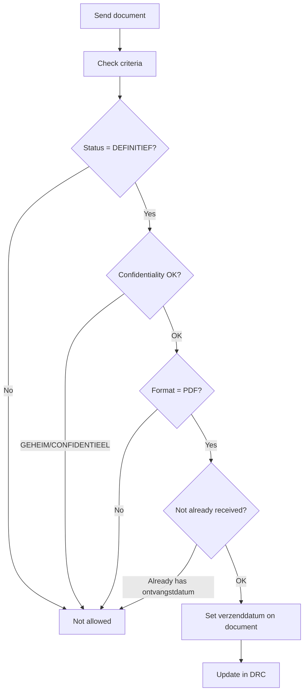
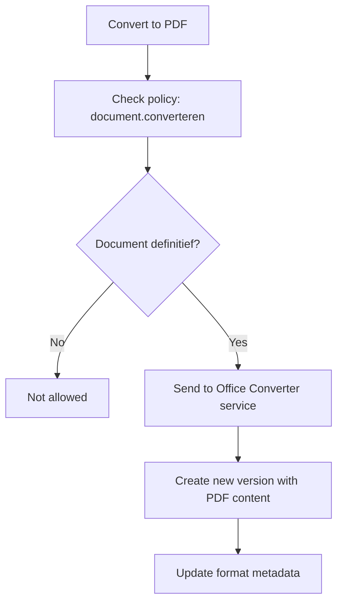

# Document Management Flow

## Document Upload and Link to Case

```mermaid
flowchart TD
    A[Upload document] --> B[Check policy: zaak.toevoegenDocument]
    B --> C[Convert to EnkelvoudigInformatieObjectCreateLockRequest]
    C --> D[Create in DRC via ZGW API]
    D --> E[Create ZaakInformatieobject link in ZRC]
    E --> F[Return REST representation]
```

## Document Versioning and Locking

```mermaid
flowchart TD
    A[Edit document] --> B{Locked?}
    B -->|No| C[Lock document]
    C --> D[Create lock record in local DB]
    D --> E[Open WebDAV editor]
    E --> F[Save changes -> new version in DRC]
    F --> G[Unlock document]
    G --> H[Delete lock record]

    B -->|Yes, by me| E
    B -->|Yes, by other| I[Access denied]
```

## Document Signing Flow

```mermaid
flowchart TD
    A[Sign document request] --> B[Read document from DRC]
    B --> C{Already signed?}
    C -->|Yes| D[Error: already signed]
    C -->|No| E[Check policy: document.ondertekenen]
    E --> F[Set ondertekening on document]
    F --> G[Update in DRC]
    G --> H[Send screen event]
```

## Document Sending (Verzenden)

```mermaid
flowchart TD
    A[Send document] --> B[Check criteria]
    B --> C{Status = DEFINITIEF?}
    C -->|No| D[Not allowed]
    C -->|Yes| E{Confidentiality OK?}
    E -->|GEHEIM/CONFIDENTIEEL| D
    E -->|OK| F{Format = PDF?}
    F -->|No| D
    F -->|Yes| G{Not already received?}
    G -->|Already has ontvangstdatum| D
    G -->|OK| H[Set verzenddatum on document]
    H --> I[Update in DRC]
```

## Document Conversion

```mermaid
flowchart TD
    A[Convert to PDF] --> B[Check policy: document.converteren]
    B --> C{Document definitief?}
    C -->|No| D[Not allowed]
    C -->|Yes| E[Send to Office Converter service]
    E --> F[Create new version with PDF content]
    F --> G[Update format metadata]
```
