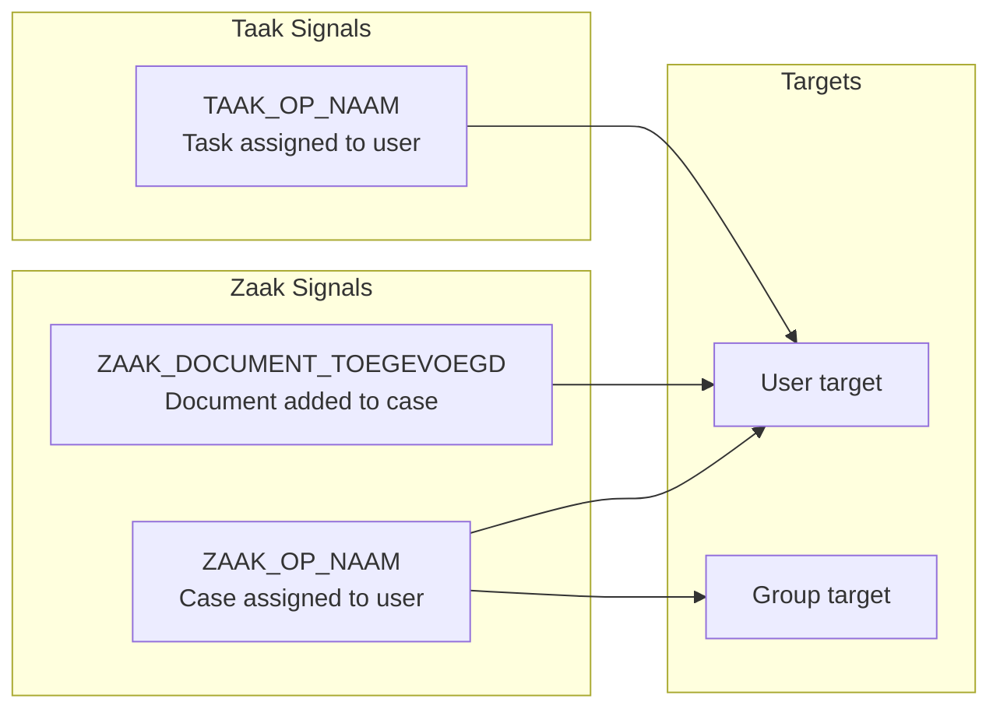
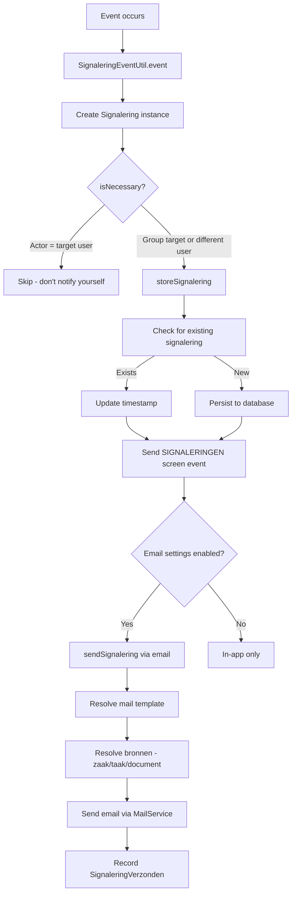
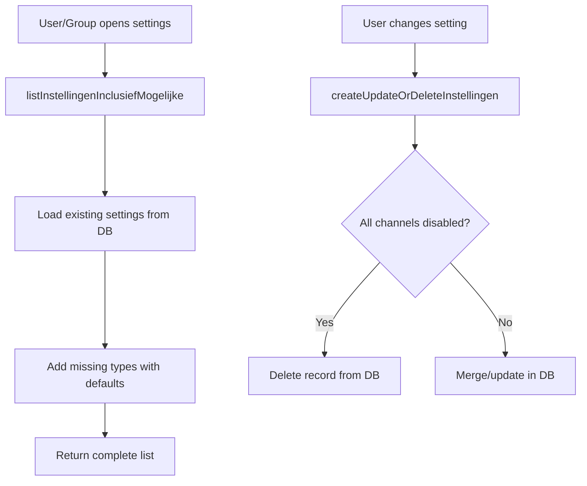
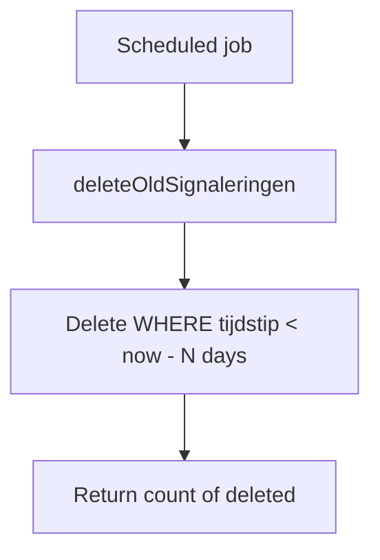

# Signalering (Notification) Flow

## Notification Types

```mermaid
graph LR
    subgraph "Zaak Signals"
        ZON[ZAAK_OP_NAAM<br/>Case assigned to user]
        ZDT[ZAAK_DOCUMENT_TOEGEVOEGD<br/>Document added to case]
    end

    subgraph "Taak Signals"
        TON[TAAK_OP_NAAM<br/>Task assigned to user]
    end

    subgraph "Targets"
        USER[User target]
        GROUP[Group target]
    end

    ZON --> USER
    ZON --> GROUP
    ZDT --> USER
    TON --> USER
```

## Signalering Creation and Delivery

```mermaid
flowchart TD
    A[Event occurs] --> B[SignaleringEventUtil.event]
    B --> C[Create Signalering instance]
    C --> D{isNecessary?}
    D -->|Actor = target user| E[Skip - don't notify yourself]
    D -->|Group target or different user| F[storeSignalering]

    F --> G[Check for existing signalering]
    G -->|Exists| H[Update timestamp]
    G -->|New| I[Persist to database]
    H --> J[Send SIGNALERINGEN screen event]
    I --> J

    J --> K{Email settings enabled?}
    K -->|Yes| L[sendSignalering via email]
    K -->|No| M[In-app only]

    L --> N[Resolve mail template]
    N --> O[Resolve bronnen - zaak/taak/document]
    O --> P[Send email via MailService]
    P --> Q[Record SignaleringVerzonden]
```

## Signalering Settings Management

```mermaid
flowchart TD
    A[User/Group opens settings] --> B[listInstellingenInclusiefMogelijke]
    B --> C[Load existing settings from DB]
    C --> D[Add missing types with defaults]
    D --> E[Return complete list]

    F[User changes setting] --> G[createUpdateOrDeleteInstellingen]
    G --> H{All channels disabled?}
    H -->|Yes| I[Delete record from DB]
    H -->|No| J[Merge/update in DB]
```

## Signalering Cleanup

```mermaid
flowchart TD
    A[Scheduled job] --> B[deleteOldSignaleringen]
    B --> C[Delete WHERE tijdstip < now - N days]
    C --> D[Return count of deleted]
```
