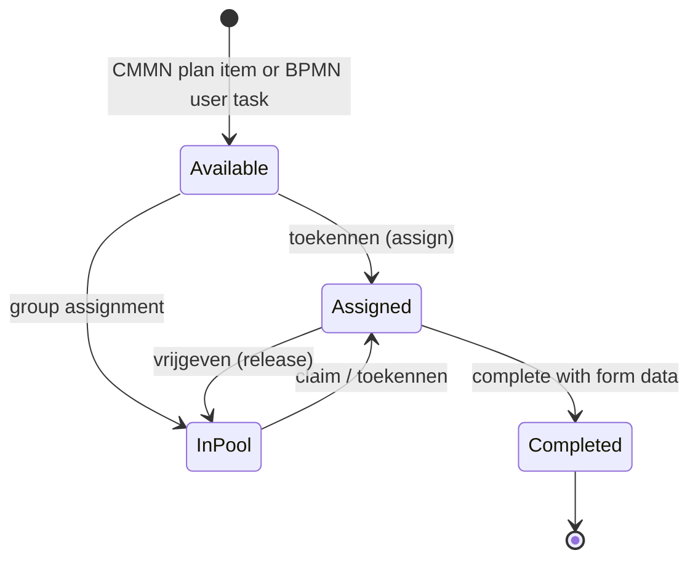
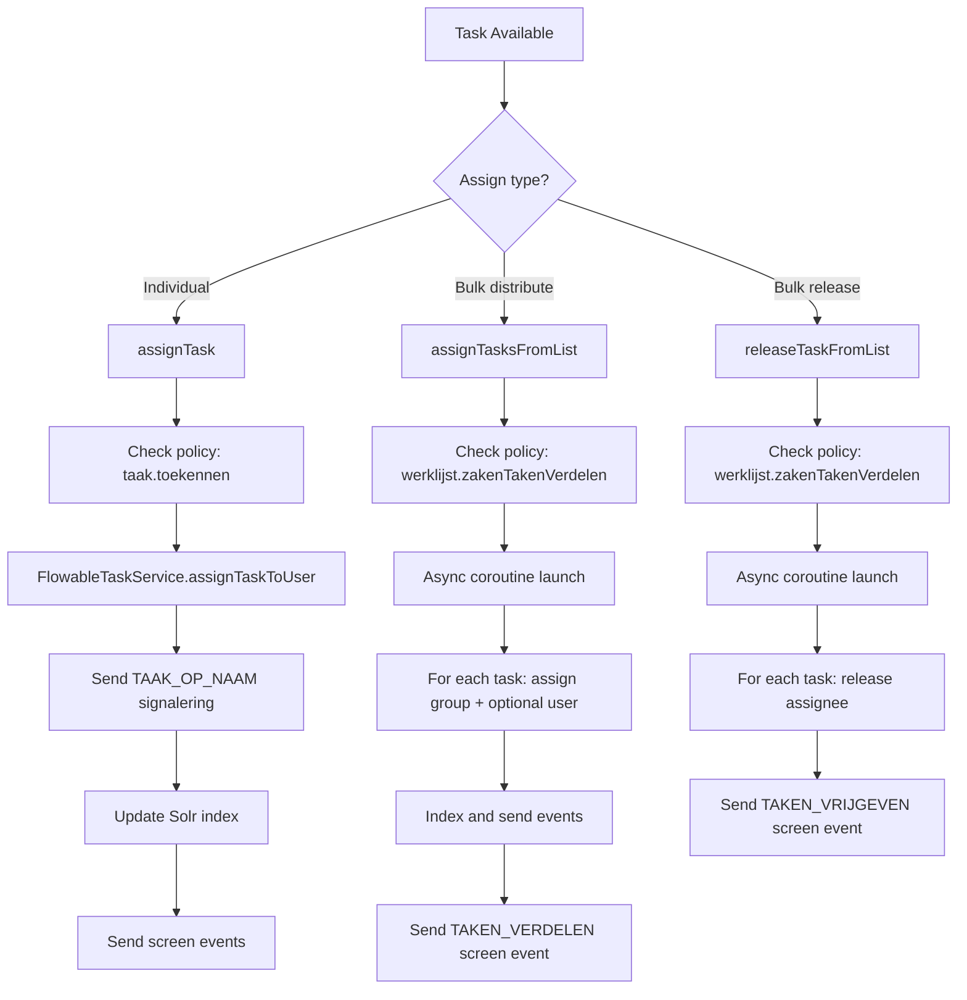
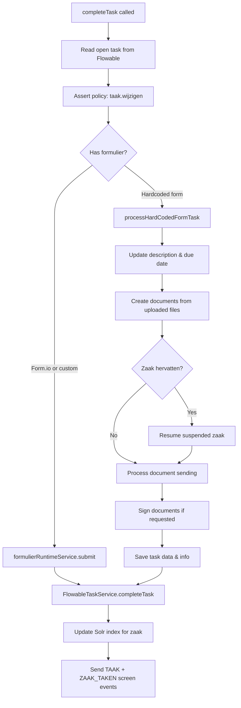

# Task Management Flow

## Task Lifecycle

```mermaid
stateDiagram-v2
    [*] --> Available: CMMN plan item or BPMN user task
    Available --> Assigned: toekennen (assign)
    Available --> InPool: group assignment
    InPool --> Assigned: claim / toekennen
    Assigned --> InPool: vrijgeven (release)
    Assigned --> Completed: complete with form data
    Completed --> [*]
```

## Task Assignment Flow

```mermaid
flowchart TD
    A[Task Available] --> B{Assign type?}

    B -->|Individual| C[assignTask]
    C --> D[Check policy: taak.toekennen]
    D --> E[FlowableTaskService.assignTaskToUser]
    E --> F[Send TAAK_OP_NAAM signalering]
    F --> G[Update Solr index]
    G --> H[Send screen events]

    B -->|Bulk distribute| I[assignTasksFromList]
    I --> J[Check policy: werklijst.zakenTakenVerdelen]
    J --> K[Async coroutine launch]
    K --> L[For each task: assign group + optional user]
    L --> M[Index and send events]
    M --> N[Send TAKEN_VERDELEN screen event]

    B -->|Bulk release| O[releaseTaskFromList]
    O --> P[Check policy: werklijst.zakenTakenVerdelen]
    P --> Q[Async coroutine launch]
    Q --> R[For each task: release assignee]
    R --> S[Send TAKEN_VRIJGEVEN screen event]
```

## Task Completion Flow

```mermaid
flowchart TD
    A[completeTask called] --> B[Read open task from Flowable]
    B --> C[Assert policy: taak.wijzigen]
    C --> D{Has formulier?}

    D -->|Form.io or custom| E[formulierRuntimeService.submit]
    D -->|Hardcoded form| F[processHardCodedFormTask]

    F --> G[Update description & due date]
    G --> H[Create documents from uploaded files]
    H --> I{Zaak hervatten?}
    I -->|Yes| J[Resume suspended zaak]
    I -->|No| K[Process document sending]
    J --> K
    K --> L[Sign documents if requested]
    L --> M[Save task data & info]

    E --> N[FlowableTaskService.completeTask]
    M --> N
    N --> O[Update Solr index for zaak]
    O --> P[Send TAAK + ZAAK_TAKEN screen events]
```
