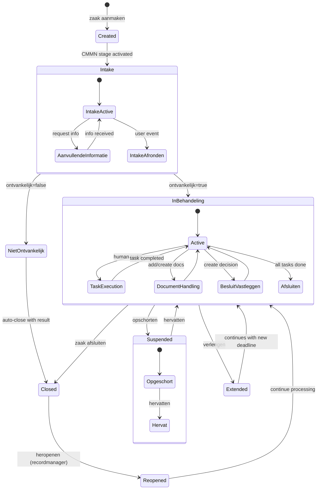
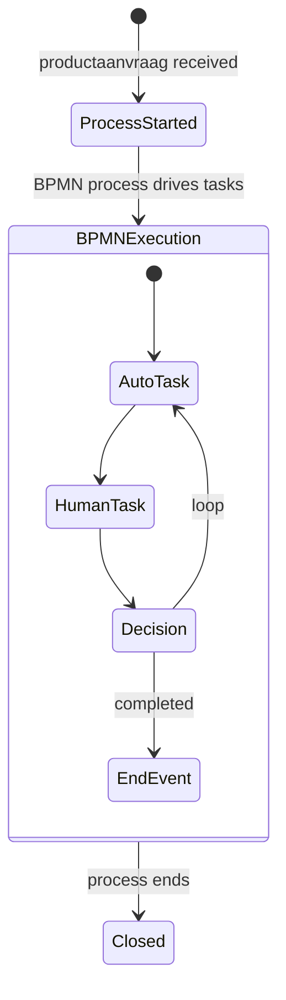
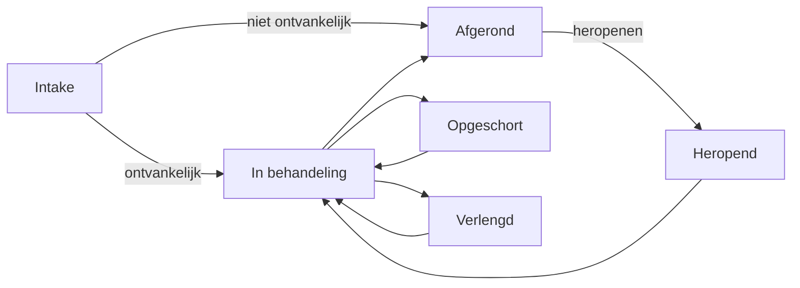
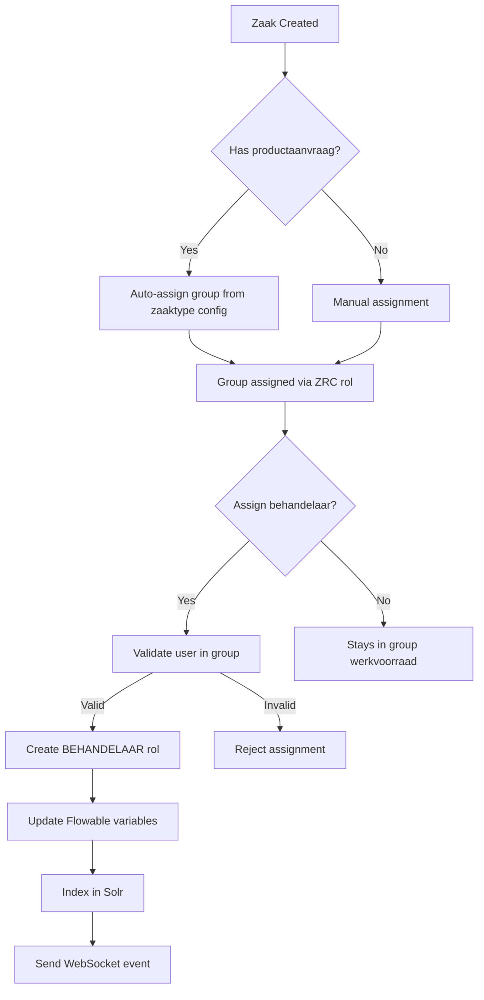

# Zaak (Case) Lifecycle Flow

## CMMN-based Case Lifecycle

```mermaid
stateDiagram-v2
    [*] --> Created: zaak aanmaken
    Created --> Intake: CMMN stage activated

    state Intake {
        [*] --> IntakeActive
        IntakeActive --> AanvullendeInformatie: request info
        AanvullendeInformatie --> IntakeActive: info received
        IntakeActive --> IntakeAfronden: user event
    }

    Intake --> InBehandeling: ontvankelijk=true
    Intake --> NietOntvankelijk: ontvankelijk=false
    NietOntvankelijk --> Closed: auto-close with result

    state InBehandeling {
        [*] --> Active
        Active --> TaskExecution: human tasks
        TaskExecution --> Active: task completed
        Active --> DocumentHandling: add/create docs
        DocumentHandling --> Active
        Active --> BesluitVastleggen: create decision
        BesluitVastleggen --> Active
        Active --> Afsluiten: all tasks done
    }

    InBehandeling --> Closed: zaak afsluiten

    state Suspended {
        [*] --> Opgeschort
        Opgeschort --> Hervat: hervatten
    }

    InBehandeling --> Suspended: opschorten
    Suspended --> InBehandeling: hervatten

    InBehandeling --> Extended: verlengen
    Extended --> InBehandeling: continues with new deadline

    Closed --> Reopened: heropenen (recordmanager)
    Reopened --> InBehandeling: continue processing
```

## BPMN-based Case Lifecycle

```mermaid
stateDiagram-v2
    [*] --> ProcessStarted: productaanvraag received
    ProcessStarted --> BPMNExecution: BPMN process drives tasks

    state BPMNExecution {
        [*] --> AutoTask
        AutoTask --> HumanTask
        HumanTask --> Decision
        Decision --> AutoTask: loop
        Decision --> EndEvent: completed
    }

    BPMNExecution --> Closed: process ends
```

## Status Transitions

```mermaid
graph LR
    A[Intake] -->|ontvankelijk| B[In behandeling]
    A -->|niet ontvankelijk| E[Afgerond]
    B --> C[Opgeschort]
    C --> B
    B --> D[Verlengd]
    D --> B
    B --> E
    E -->|heropenen| F[Heropend]
    F --> B
```

## Case Assignment Flow

```mermaid
flowchart TD
    A[Zaak Created] --> B{Has productaanvraag?}
    B -->|Yes| C[Auto-assign group from zaaktype config]
    B -->|No| D[Manual assignment]

    C --> E[Group assigned via ZRC rol]
    D --> E

    E --> F{Assign behandelaar?}
    F -->|Yes| G[Validate user in group]
    G -->|Valid| H[Create BEHANDELAAR rol]
    G -->|Invalid| I[Reject assignment]
    F -->|No| J[Stays in group werkvoorraad]

    H --> K[Update Flowable variables]
    K --> L[Index in Solr]
    L --> M[Send WebSocket event]
```
