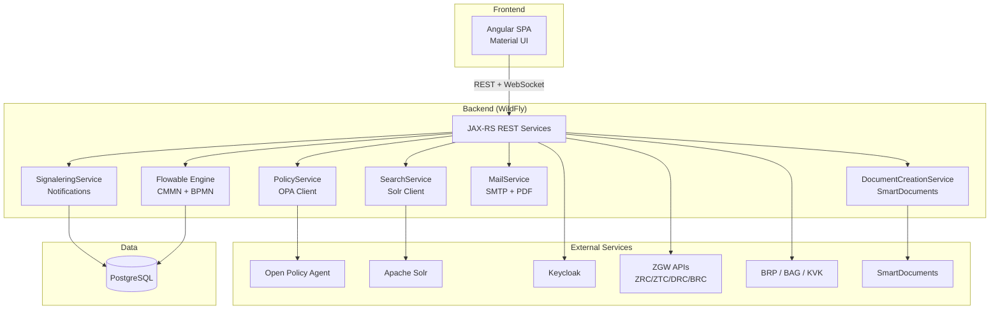

# Dimpact ZAC -- Architecture Overview

## Product Summary

Dimpact Zaakafhandelcomponent (ZAC) is an open-source, generic, workflow-based component for managing "zaken" (cases) in the Dutch "zaakgericht werken" (case-oriented work) paradigm. It is used by various Dutch municipalities. Originally developed by Atos, development was taken over by INFO.nl / Lifely in July 2023.

- **License**: EUPL-1.2+
- **Repository**: https://github.com/infonl/dimpact-zaakafhandelcomponent
- **Target users**: Dutch municipal case workers (behandelaars, coordinators, record managers)

## Technology Stack

### Backend
- **Language**: Kotlin (primary) + Java (legacy clients)
- **Application server**: WildFly (Jakarta EE / CDI)
- **Workflow engine**: Flowable (CMMN + BPMN)
- **Search**: Apache Solr
- **Database**: PostgreSQL (Flyway migrations, 89 versions as of analysis)
- **Authentication**: Keycloak (OpenID Connect)
- **Authorization**: Open Policy Agent (OPA) with Rego policies
- **Build**: Gradle + Maven (dual build system)
- **Observability**: OpenTelemetry instrumentation

### Frontend
- **Framework**: Angular (TypeScript)
- **UI Library**: Angular Material
- **Forms**: Form.io integration + custom form definitions
- **Real-time**: WebSocket for screen events
- **i18n**: Dutch-primary (with i18n asset files)

### External API Integrations (ZGW / Common Ground)
- **ZRC** (Zaken Registratie Component) -- case registry
- **ZTC** (Zaaktype Catalogus) -- case type catalog
- **DRC** (Documenten Registratie Component) -- document registry
- **BRC** (Besluiten Registratie Component) -- decision registry
- **BRP** (Basisregistratie Personen) -- citizen registry
- **BAG** (Basisregistratie Adressen en Gebouwen) -- address/building registry
- **KVK** (Kamer van Koophandel) -- business registry
- **Klanten API** -- customer contact details
- **SmartDocuments** -- document generation
- **Office Converter** -- document format conversion
- **PABC** -- new IAM authorization service (feature-flagged)

### Infrastructure
- Docker Compose with 10+ containers: Keycloak, PostgreSQL, Solr, OpenZaak, SmartDocuments, Office Converter, Open Policy Agent, OpenKlant, Objecten API, etc.
- Helm charts for Kubernetes deployment (`charts/zac/`)

## Architecture Diagram



## Directory Layout

```
src/
  main/
    app/                          # Angular frontend
      src/app/
        admin/                    # Admin panel (parameters, mail templates, reference tables)
        bag/                      # BAG (address) integration
        contactmomenten/          # Contact moments
        dashboard/                # Dashboard with cards
        documenten/               # Document lists (inbox, decoupled)
        formulieren/              # Form rendering (Form.io, custom)
        informatie-objecten/      # Document CRUD, versioning, signing
        klanten/                  # Customer (person/business) management
        mail/                     # Mail composition
        plan-items/               # CMMN plan item interactions
        signaleringen/            # Notification settings
        taken/                    # Task views (my tasks, work queue)
        zaken/                    # Case views (create, view, edit, decisions)
        zoeken/                   # Global search
        shared/                   # Shared components, dynamic tables, forms
    kotlin/
      nl/info/
        client/                   # API clients (BAG, BRP, KVK, Klant, OPA, SmartDocuments, ZGW)
        zac/
          admin/                  # Admin configuration services
          app/                    # REST API endpoints
          authentication/         # Keycloak authentication
          configuration/          # Application configuration
          documentcreation/       # SmartDocuments integration
          flowable/               # Flowable BPMN service
          health/                 # Health probes
          healthcheck/            # Zaaktype configuration check
          history/                # Audit trail
          identity/               # User/Group identity
          mail/                   # Mail service (SMTP, PDF generation)
          mailtemplates/          # Mail template management
          note/                   # Notes (notities)
          notification/           # Webhook notification receiver
          policy/                 # OPA policy evaluation
          productaanvraag/        # Product request handling
          search/                 # Solr search + indexing
          signalering/            # Signal/notification system
          smartdocuments/         # SmartDocuments template management
          task/                   # Task service layer
          zaak/                   # Case (zaak) service layer
    java/
      net/atos/                   # Legacy Java code (clients, Flowable CMMN, events)
    resources/
      cmmn/                       # CMMN model (Generiek_zaakafhandelmodel.cmmn.xml)
      policies/                   # OPA Rego policy files
      schemas/                    # Flyway SQL migrations (V1 through V89)
      api-specs/                  # OpenAPI specs for external APIs
```

## Core Concepts

### Zaak (Case)
The central entity. A zaak has a zaaktype (case type), status, result, handler (behandelaar), group assignment, involved parties (betrokkenen), documents, tasks, and decisions. Cases follow a lifecycle driven by either CMMN or BPMN models.

### Taak (Task)
Human tasks within a case, managed by Flowable. Tasks can be assigned to users or groups, distributed in bulk, and have associated form data.

### Besluit (Decision)
Formal decisions linked to a case, with publication dates, response periods, and withdrawal capabilities.

### Signalering (Notification)
Internal notification system tracking events like "case assigned to you", "task assigned to you", "document added to case". Supports email sending and in-app display.

### Informatieobject (Document)
Documents linked to cases, with versioning, locking, signing, confidentiality levels, and format conversion.

## Key Design Patterns

1. **ZGW-first**: All case data lives in external ZGW APIs (ZRC, ZTC, DRC, BRC). ZAC is a UI/orchestration layer.
2. **Policy-based authorization**: All permission checks delegate to OPA. Five policy domains: zaak, taak, document, werklijst, overige.
3. **Event-driven UI**: WebSocket screen events push updates to the Angular frontend in real time.
4. **Dual workflow**: Cases can be CMMN-driven (default generic model) or BPMN-driven (custom process definitions per zaaktype).
5. **Search via Solr**: All searchable data is indexed in Solr. Faceted search with date ranges, filters, and sorting.
6. **Converter pattern**: REST models use dedicated converters to map between API DTOs and domain/ZGW models.

## Application Roles

| Role | Dutch | Capabilities |
|------|-------|-------------|
| `raadpleger` | Viewer | Read cases, tasks, documents; search |
| `behandelaar` | Handler | Full CRUD on assigned cases/tasks; start cases; create documents |
| `coordinator` | Coordinator | Distribute/release tasks and cases; manage inbox |
| `recordmanager` | Record Manager | Reopen cases; manage documents on closed cases; delete decoupled docs |
| `beheerder` | Administrator | View case data; manage admin configuration; export |

## Zaak Lifecycle (CMMN)

The generic CMMN model defines two stages:
1. **Intake** -- initial assessment, may request additional information
2. **In behandeling** (In progress) -- active case handling with tasks

Transitions:
- Intake --> In behandeling (when "ontvankelijk" = admissible)
- Intake --> Closed (when "niet ontvankelijk" = inadmissible)
- In behandeling --> Closed (case completed/cancelled)

Cases can also be:
- **Suspended** (opgeschort) with a reason
- **Extended** (verlengd) with a new deadline
- **Reopened** (heropend) by a record manager

## Market Context (from Documentation Analysis)

### Dimpact Cooperative
- **42 municipalities** collaborate through Dimpact
- ZAC is the core of **PodiumD Zaak**, part of the broader PodiumD suite
- PodiumD suite: Portaal (citizen portal), Contact (KCC), Formulier (forms), Zaak (case handling)
- First municipality implementations started late 2024 / second half 2025
- GitHub: 6 stars, 2 forks -- limited community adoption

### Release Velocity
- v4.4.38 as of March 2026 (multiple releases per day)
- Automated CI/CD via GitHub Actions
- Conventional Commits workflow
- JIRA project: PodiumD Zaak (PZ-*)

### Common Ground Compliance
- EUPL 1.2 open source
- Data at the source (Open Zaak as single source of truth)
- Kubernetes with Helm charts
- **NOT compliant with NLX or Haven standards**
- **NO public API** -- BFF-only for Angular frontend

### Deployment Dependencies (v4.4.38)
Core: PostgreSQL 17.9, Keycloak 26.5.5, Solr 9.10.1, OPA 1.14.1, Redis 8.4.0, RabbitMQ 4.2.4
Common Ground: Open Zaak 1.26.0, Open Klant 2.14.0, Open Notificaties 1.13.0, Objects API 3.3.1, Open Archiefbeheer 1.1.1, PABC 1.0.0
Observability: OpenTelemetry 0.147.0, Grafana 12.4.1, Tempo 2.10.2, Prometheus v3.10.0

### Key Limitations
1. **No horizontal scaling** -- single instance only
2. **No public API** -- cannot be consumed by external systems
3. **15+ containers** required for full deployment
4. **Fixed CMMN model** -- cannot be customized without code changes

## Competitive Summary vs. Procest

### ZAC Strengths
- Mature case lifecycle management
- 51+ OPA permission model
- SmartDocuments integration
- BAG/BRP/KVK external service integrations
- Enterprise observability stack
- Active development (INFO.nl team)

### Procest Advantages
- Nextcloud-native (dramatically simpler deployment)
- Horizontal scalability (Nextcloud clusters)
- Public REST API via OpenRegister
- n8n workflows (more accessible than Flowable BPMN)
- Multi-app ecosystem (OpenCatalogi, OpenConnector, DocuDesk)
- Built-in document management via Nextcloud
- WebDAV document editing natively supported

### Gaps Procest Should Address
- ZAC's per-zaaktype role differentiation (PABC)
- Configuration validation (inrichtingscheck)
- Formal CMMN/BPMN compliance for procurement requirements
- Productaanvraag flow from citizen-facing forms
- Signaleringen system with email + dashboard delivery
