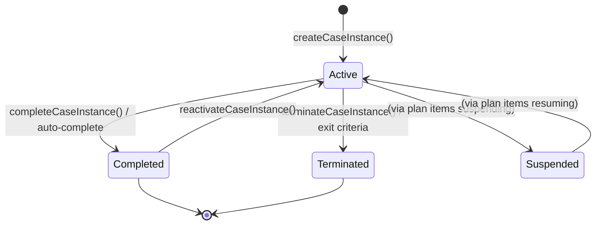
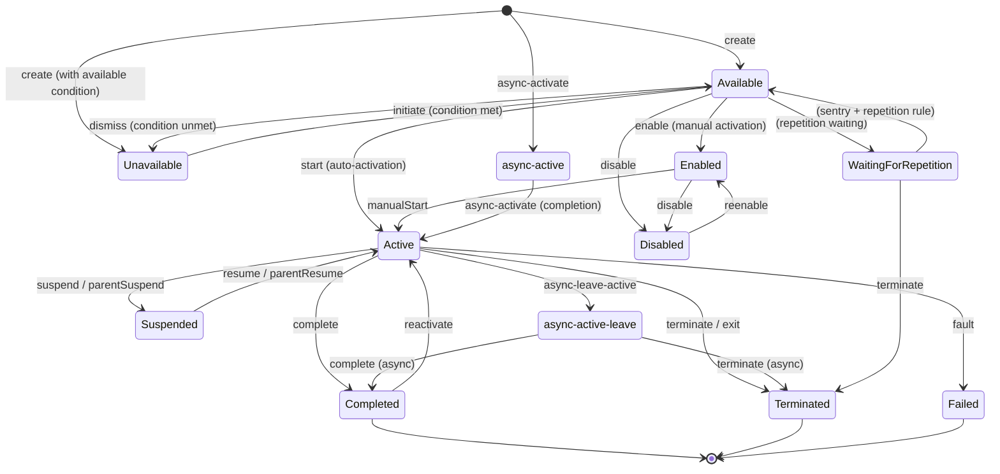
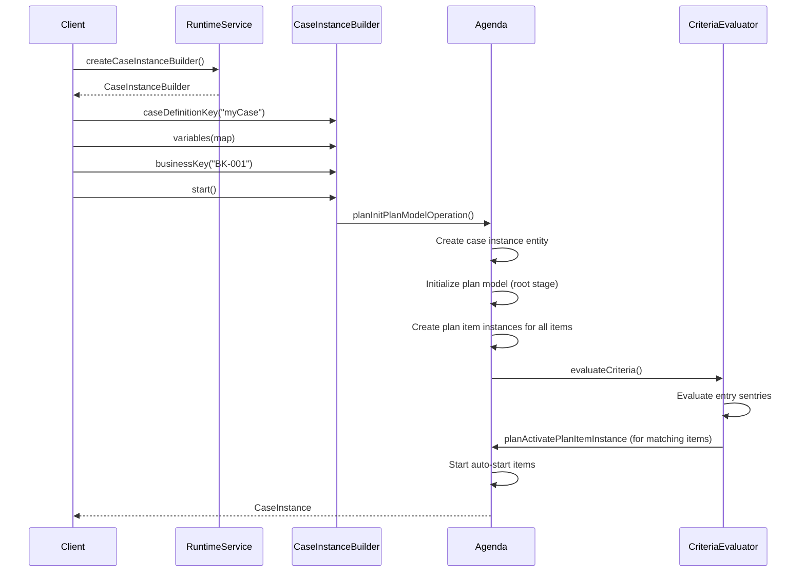
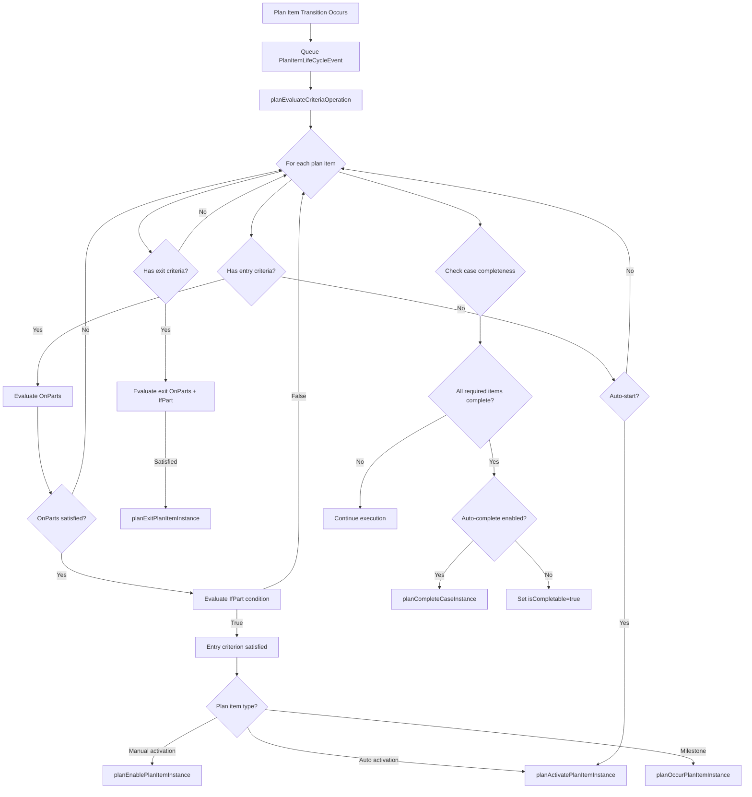
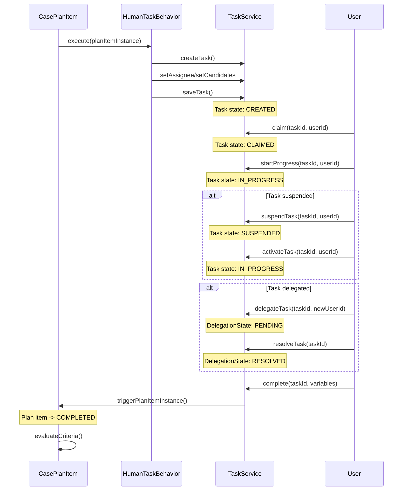

# CMMN Case Instance Lifecycle

## Case Instance State Machine

## Plan Item Instance State Machine (CMMN 1.1 + Flowable Extensions)

## Case Instance Creation Flow

## Sentry Evaluation Flow

## Task Lifecycle Flow

