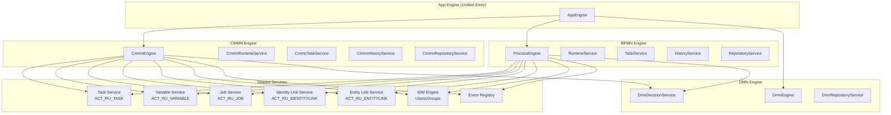
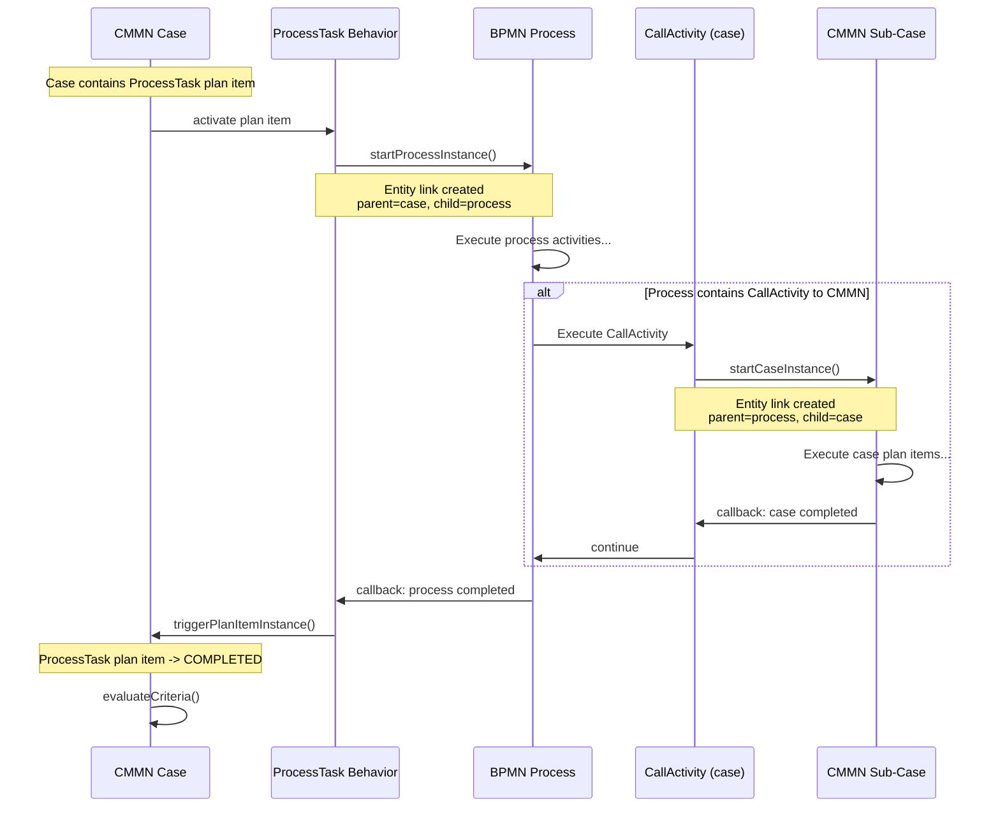
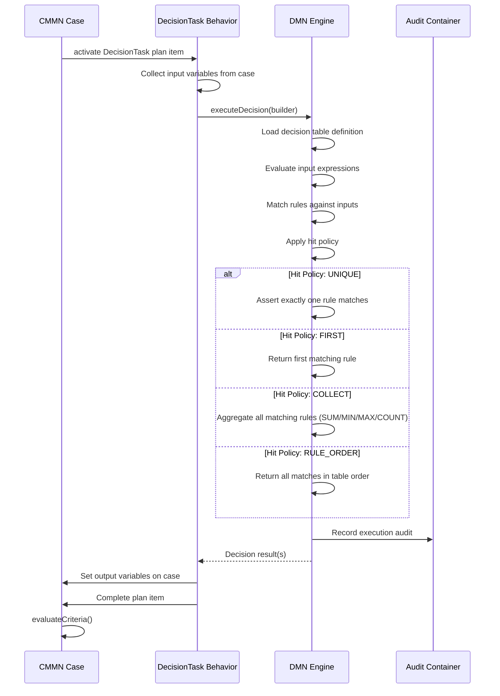
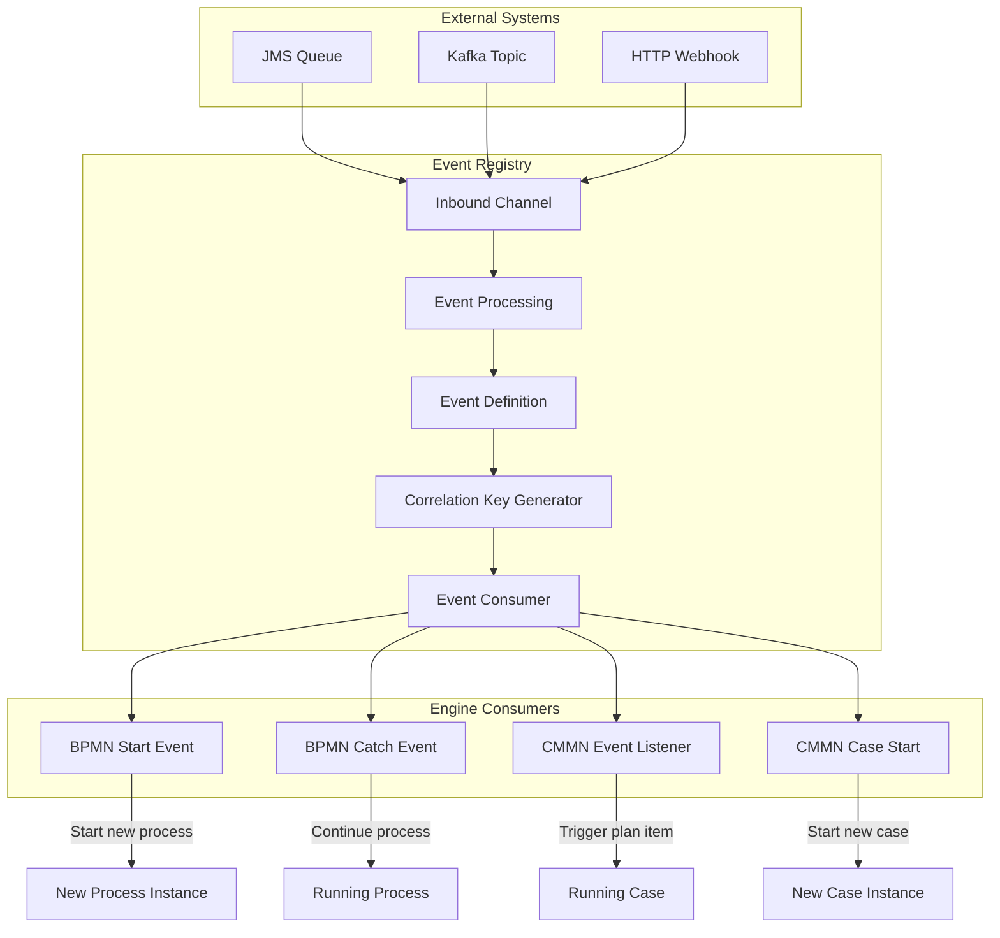
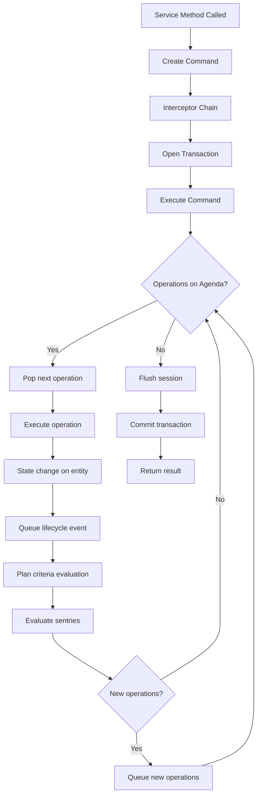

# Engine Integration Flows

## Multi-Engine Architecture

```mermaid
flowchart TB
    subgraph "App Engine (Unified Entry)"
        AE[AppEngine]
    end

    subgraph "CMMN Engine"
        CE[CmmnEngine]
        CRS[CmmnRuntimeService]
        CTS[CmmnTaskService]
        CHS[CmmnHistoryService]
        CRP[CmmnRepositoryService]
    end

    subgraph "BPMN Engine"
        BE[ProcessEngine]
        RS[RuntimeService]
        TS[TaskService]
        HS[HistoryService]
        RP[RepositoryService]
    end

    subgraph "DMN Engine"
        DE[DmnEngine]
        DS[DmnDecisionService]
        DR[DmnRepositoryService]
    end

    subgraph "Shared Services"
        TSvc[Task Service<br>ACT_RU_TASK]
        VSvc[Variable Service<br>ACT_RU_VARIABLE]
        JSvc[Job Service<br>ACT_RU_JOB]
        ISvc[Identity Link Service<br>ACT_RU_IDENTITYLINK]
        ESvc[Entity Link Service<br>ACT_RU_ENTITYLINK]
        IDM[IDM Engine<br>Users/Groups]
        ER[Event Registry]
    end

    AE --> CE
    AE --> BE
    AE --> DE

    CE --> TSvc
    BE --> TSvc
    CE --> VSvc
    BE --> VSvc
    CE --> JSvc
    BE --> JSvc
    CE --> ISvc
    BE --> ISvc
    CE --> ESvc
    BE --> ESvc
    CE --> IDM
    BE --> IDM
    CE --> ER
    BE --> ER
    CE --> DS
    BE --> DS
```

## CMMN-BPMN Bidirectional Integration

```mermaid
sequenceDiagram
    participant CmmnCase as CMMN Case
    participant ProcessTask as ProcessTask Behavior
    participant BpmnProcess as BPMN Process
    participant CaseTask as CallActivity (case)
    participant SubCase as CMMN Sub-Case

    Note over CmmnCase: Case contains ProcessTask plan item
    CmmnCase->>ProcessTask: activate plan item
    ProcessTask->>BpmnProcess: startProcessInstance()
    Note over ProcessTask,BpmnProcess: Entity link created<br/>parent=case, child=process

    BpmnProcess->>BpmnProcess: Execute process activities...

    alt Process contains CallActivity to CMMN
        BpmnProcess->>CaseTask: Execute CallActivity
        CaseTask->>SubCase: startCaseInstance()
        Note over CaseTask,SubCase: Entity link created<br/>parent=process, child=case
        SubCase->>SubCase: Execute case plan items...
        SubCase->>CaseTask: callback: case completed
        CaseTask->>BpmnProcess: continue
    end

    BpmnProcess->>ProcessTask: callback: process completed
    ProcessTask->>CmmnCase: triggerPlanItemInstance()
    Note over CmmnCase: ProcessTask plan item -> COMPLETED
    CmmnCase->>CmmnCase: evaluateCriteria()
```

## DMN Decision Task Integration

```mermaid
sequenceDiagram
    participant Case as CMMN Case
    participant DT as DecisionTask Behavior
    participant DMN as DMN Engine
    participant Audit as Audit Container

    Case->>DT: activate DecisionTask plan item
    DT->>DT: Collect input variables from case
    DT->>DMN: executeDecision(builder)
    DMN->>DMN: Load decision table definition
    DMN->>DMN: Evaluate input expressions
    DMN->>DMN: Match rules against inputs
    DMN->>DMN: Apply hit policy

    alt Hit Policy: UNIQUE
        DMN->>DMN: Assert exactly one rule matches
    else Hit Policy: FIRST
        DMN->>DMN: Return first matching rule
    else Hit Policy: COLLECT
        DMN->>DMN: Aggregate all matching rules (SUM/MIN/MAX/COUNT)
    else Hit Policy: RULE_ORDER
        DMN->>DMN: Return all matches in table order
    end

    DMN->>Audit: Record execution audit
    DMN-->>DT: Decision result(s)
    DT->>Case: Set output variables on case
    DT->>Case: Complete plan item
    Case->>Case: evaluateCriteria()
```

## Event Registry Flow

```mermaid
flowchart TB
    subgraph "External Systems"
        JMS[JMS Queue]
        KAFKA[Kafka Topic]
        HTTP[HTTP Webhook]
    end

    subgraph "Event Registry"
        IC[Inbound Channel]
        EP[Event Processing]
        ED[Event Definition]
        CK[Correlation Key Generator]
        EC[Event Consumer]
    end

    subgraph "Engine Consumers"
        BPMN_START[BPMN Start Event]
        BPMN_CATCH[BPMN Catch Event]
        CMMN_LISTENER[CMMN Event Listener]
        CMMN_START[CMMN Case Start]
    end

    JMS --> IC
    KAFKA --> IC
    HTTP --> IC

    IC --> EP
    EP --> ED
    ED --> CK
    CK --> EC

    EC --> BPMN_START
    EC --> BPMN_CATCH
    EC --> CMMN_LISTENER
    EC --> CMMN_START

    BPMN_START --> |"Start new process"| BP[New Process Instance]
    BPMN_CATCH --> |"Continue process"| BPC[Running Process]
    CMMN_LISTENER --> |"Trigger plan item"| CC[Running Case]
    CMMN_START --> |"Start new case"| NC[New Case Instance]
```

## Agenda-Based Execution Pattern

```mermaid
flowchart TD
    A[Service Method Called] --> B[Create Command]
    B --> C[Interceptor Chain]
    C --> D[Open Transaction]
    D --> E[Execute Command]
    E --> F{Operations on Agenda?}
    F -->|Yes| G[Pop next operation]
    G --> H[Execute operation]
    H --> I[State change on entity]
    I --> J[Queue lifecycle event]
    J --> K[Plan criteria evaluation]
    K --> L[Evaluate sentries]
    L --> M{New operations?}
    M -->|Yes| N[Queue new operations]
    N --> F
    M -->|No| F
    F -->|No| O[Flush session]
    O --> P[Commit transaction]
    P --> Q[Return result]
```
