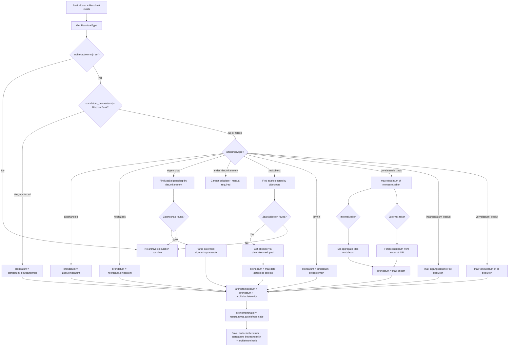
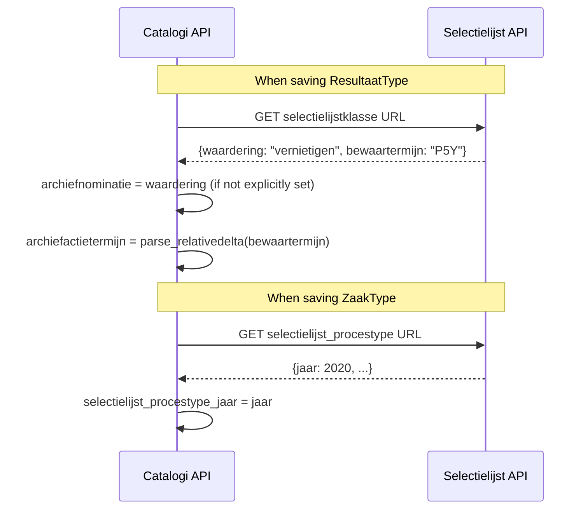
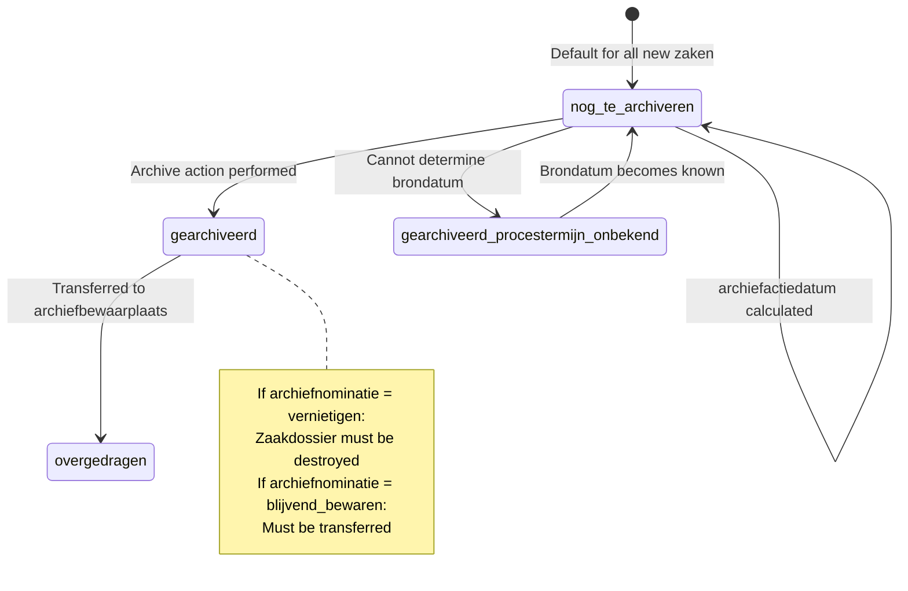

# Archiving Rules

## Archiefactiedatum Calculation

```mermaid
graph TD
    A[Zaak closed + Resultaat exists] --> B[Get ResultaatType]
    B --> C{archiefactietermijn set?}
    C -->|No| D[No archive calculation possible]
    C -->|Yes| E{startdatum_bewaartermijn filled on Zaak?}

    E -->|Yes, not forced| F[brondatum = startdatum_bewaartermijn]
    E -->|No or forced| G{afleidingswijze?}

    G -->|afgehandeld| H[brondatum = zaak.einddatum]
    G -->|hoofdzaak| I[brondatum = hoofdzaak.einddatum]
    G -->|eigenschap| J[Find zaakeigenschap by datumkenmerk]
    G -->|ander_datumkenmerk| K[Cannot calculate - manual required]
    G -->|zaakobject| L[Find zaakobjecten by objecttype]
    G -->|termijn| M[brondatum = einddatum + procestermijn]
    G -->|gerelateerde_zaak| N[max einddatum of relevante zaken]
    G -->|ingangsdatum_besluit| O[max ingangsdatum of all besluiten]
    G -->|vervaldatum_besluit| P[max vervaldatum of all besluiten]

    J --> J1{Eigenschap found?}
    J1 -->|Yes| J2[Parse date from eigenschap.waarde]
    J1 -->|No| D

    L --> L1{ZaakObjecten found?}
    L1 -->|Yes| L2[Get attribute via datumkenmerk path]
    L1 -->|No| D
    L2 --> L3[brondatum = max date across all objects]

    N --> N1{Internal zaken}
    N --> N2{External zaken}
    N1 --> N3[DB aggregate Max einddatum]
    N2 --> N4[Fetch einddatum from external API]
    N3 & N4 --> N5[brondatum = max of both]

    F & H & I & J2 & L3 & M & N5 & O & P --> Q[archiefactiedatum = brondatum + archiefactietermijn]
    Q --> R[archiefnominatie = resultaattype.archiefnominatie]
    R --> S[Save: archiefactiedatum + startdatum_bewaartermijn + archiefnominatie]
```

## Selectielijst Integration

```mermaid
sequenceDiagram
    participant ZTC as Catalogi API
    participant SL as Selectielijst API

    Note over ZTC,SL: When saving ResultaatType
    ZTC->>SL: GET selectielijstklasse URL
    SL-->>ZTC: {waardering: "vernietigen", bewaartermijn: "P5Y"}

    ZTC->>ZTC: archiefnominatie = waardering (if not explicitly set)
    ZTC->>ZTC: archiefactietermijn = parse_relativedelta(bewaartermijn)

    Note over ZTC,SL: When saving ZaakType
    ZTC->>SL: GET selectielijst_procestype URL
    SL-->>ZTC: {jaar: 2020, ...}
    ZTC->>ZTC: selectielijst_procestype_jaar = jaar
```

## Archive Status Transitions

```mermaid
stateDiagram-v2
    [*] --> nog_te_archiveren: Default for all new zaken

    nog_te_archiveren --> nog_te_archiveren: archiefactiedatum calculated
    nog_te_archiveren --> gearchiveerd: Archive action performed
    nog_te_archiveren --> gearchiveerd_procestermijn_onbekend: Cannot determine brondatum

    gearchiveerd_procestermijn_onbekend --> nog_te_archiveren: Brondatum becomes known
    gearchiveerd --> overgedragen: Transferred to archiefbewaarplaats

    note right of gearchiveerd
        If archiefnominatie = vernietigen:
          Zaakdossier must be destroyed
        If archiefnominatie = blijvend_bewaren:
          Must be transferred
    end note
```
