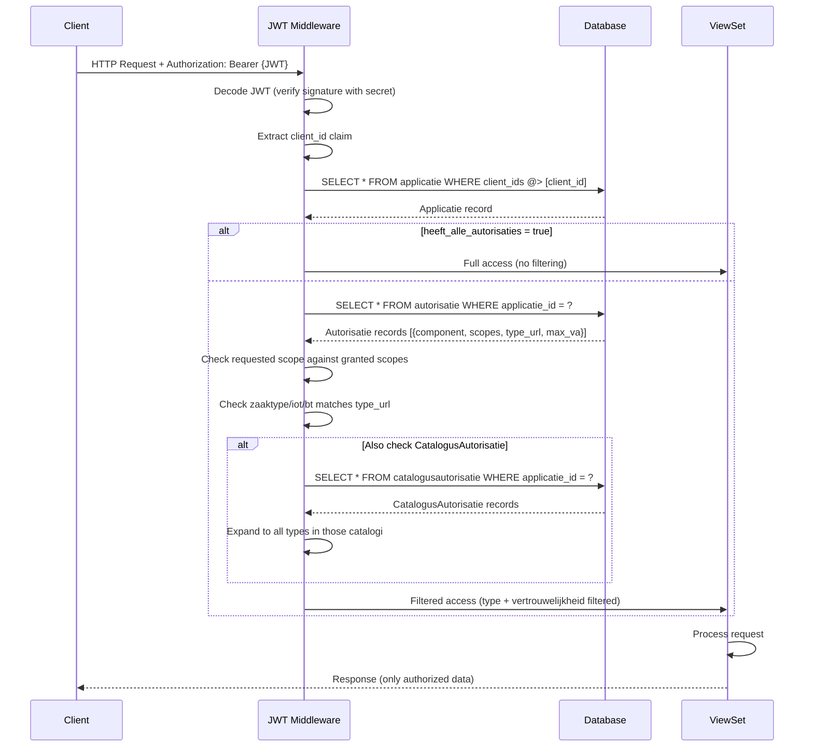
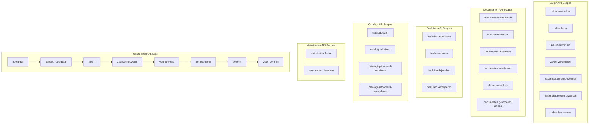
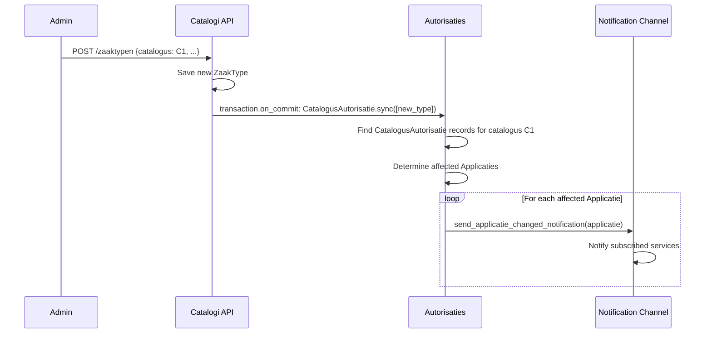

# Authorization Flow

## JWT Authentication + Scope Check

```mermaid
sequenceDiagram
    participant Client
    participant MW as JWT Middleware
    participant DB as Database
    participant API as ViewSet

    Client->>MW: HTTP Request + Authorization: Bearer {JWT}
    MW->>MW: Decode JWT (verify signature with secret)
    MW->>MW: Extract client_id claim

    MW->>DB: SELECT * FROM applicatie WHERE client_ids @> [client_id]
    DB-->>MW: Applicatie record

    alt heeft_alle_autorisaties = true
        MW->>API: Full access (no filtering)
    else
        MW->>DB: SELECT * FROM autorisatie WHERE applicatie_id = ?
        DB-->>MW: Autorisatie records [{component, scopes, type_url, max_va}]

        MW->>MW: Check requested scope against granted scopes
        MW->>MW: Check zaaktype/iot/bt matches type_url

        alt Also check CatalogusAutorisatie
            MW->>DB: SELECT * FROM catalogusautorisatie WHERE applicatie_id = ?
            DB-->>MW: CatalogusAutorisatie records
            MW->>MW: Expand to all types in those catalogi
        end

        MW->>API: Filtered access (type + vertrouwelijkheid filtered)
    end

    API->>API: Process request
    API-->>Client: Response (only authorized data)
```

## Scope Matrix

```mermaid
graph TD
    subgraph "Zaken API Scopes"
        ZA[zaken.aanmaken]
        ZL[zaken.lezen]
        ZB[zaken.bijwerken]
        ZV[zaken.verwijderen]
        ZS[zaken.statussen.toevoegen]
        ZG[zaken.geforceerd-bijwerken]
        ZH[zaken.heropenen]
    end

    subgraph "Documenten API Scopes"
        DA[documenten.aanmaken]
        DL[documenten.lezen]
        DB[documenten.bijwerken]
        DV[documenten.verwijderen]
        DK[documenten.lock]
        DG[documenten.geforceerd-unlock]
    end

    subgraph "Besluiten API Scopes"
        BA[besluiten.aanmaken]
        BL[besluiten.lezen]
        BB[besluiten.bijwerken]
        BV[besluiten.verwijderen]
    end

    subgraph "Catalogi API Scopes"
        CL[catalogi.lezen]
        CS[catalogi.schrijven]
        CG[catalogi.geforceerd-schrijven]
        CD[catalogi.geforceerd-verwijderen]
    end

    subgraph "Autorisaties API Scopes"
        AL[autorisaties.lezen]
        AB[autorisaties.bijwerken]
    end

    subgraph "Confidentiality Levels"
        VA1[openbaar]
        VA2[beperkt_openbaar]
        VA3[intern]
        VA4[zaakvertrouwelijk]
        VA5[vertrouwelijk]
        VA6[confidentieel]
        VA7[geheim]
        VA8[zeer_geheim]

        VA1 --> VA2 --> VA3 --> VA4 --> VA5 --> VA6 --> VA7 --> VA8
    end
```

## CatalogusAutorisatie Sync

```mermaid
sequenceDiagram
    participant Admin
    participant ZTC as Catalogi API
    participant AC as Autorisaties
    participant NC as Notification Channel

    Admin->>ZTC: POST /zaaktypen {catalogus: C1, ...}
    ZTC->>ZTC: Save new ZaakType
    ZTC->>AC: transaction.on_commit: CatalogusAutorisatie.sync([new_type])
    AC->>AC: Find CatalogusAutorisatie records for catalogus C1
    AC->>AC: Determine affected Applicaties

    loop For each affected Applicatie
        AC->>NC: send_applicatie_changed_notification(applicatie)
        NC->>NC: Notify subscribed services
    end
```
